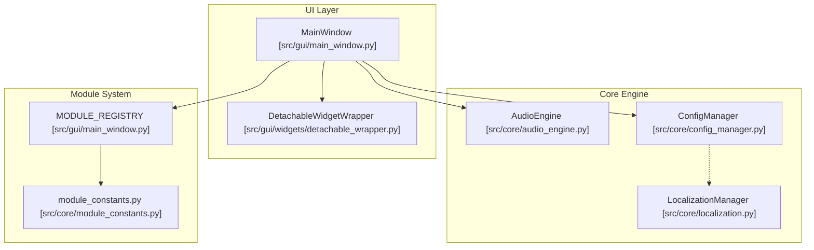
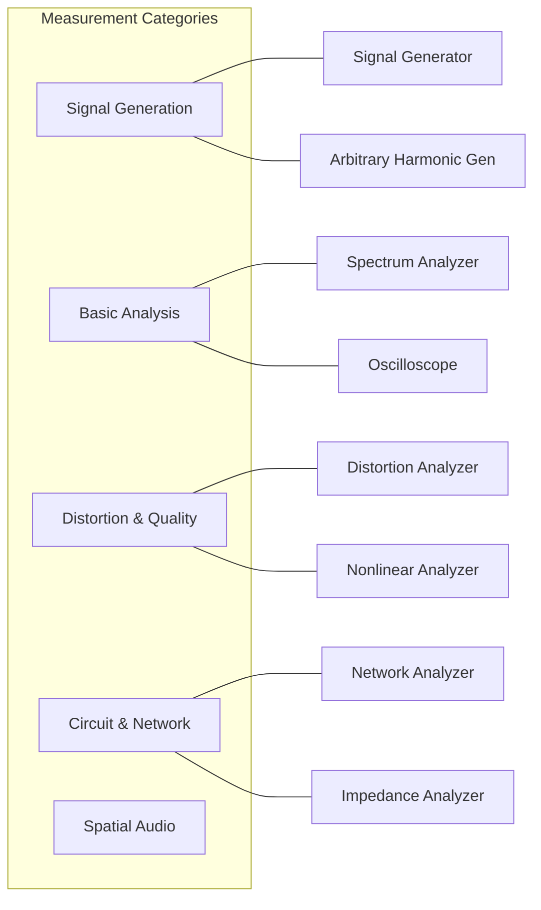

# MeasureLab Overview

Relevant source files

The following files were used as context for generating this wiki page:

- [CHANGELOG.md](../../CHANGELOG.md)
- [CURRENT_DIRECTION.md](../../CURRENT_DIRECTION.md)
- [README.ja.md](../../README.ja.md)
- [README.md](../../README.md)
- [constraints.txt](../../constraints.txt)
- [docs/PROPOSED_FEATURES.md](../../docs/PROPOSED_FEATURES.md)
- [docs/widget_guide.en.md](../../docs/widget_guide.en.md)
- [docs/widget_guide.md](../../docs/widget_guide.md)
- [mkdocs.yml](../../mkdocs.yml)
- [pyproject.toml](../../pyproject.toml)
- [src/assets/lang/en.json](../../src/assets/lang/en.json)
- [src/assets/lang/ja.json](../../src/assets/lang/ja.json)
- [src/core/module_constants.py](../../src/core/module_constants.py)
- [src/core/version.py](../../src/core/version.py)
- [src/gui/main_window.py](../../src/gui/main_window.py)
- [version.json](../../version.json)

MeasureLab is a high-precision, open-source DIY audio measurement and analysis suite built with Python and PyQt6 `README.md:17-19`. It provides a comprehensive set of tools for audio enthusiasts and researchers, serving as an accessible alternative to expensive professional hardware `README.md:21-23`.

The system integrates over 40 specialized modules for signal generation, real-time spectrum analysis, distortion measurement, and advanced nonlinear system modeling `README.md:32-76`.

## System Philosophy

MeasureLab follows a modular architecture where a central core manages audio I/O, configuration, and calibration, while independent widgets handle specific measurement tasks.

*   **Accuracy & Accessibility**: Provides professional-grade measurement capabilities (e.g., Lock-in detection, SSS sweeps) using standard consumer or pro-audio interfaces `README.md:17-21`.
*   **Performance**: Utilizes vectorized operations with NumPy, SciPy, and FFTW to maintain real-time performance even with high-order analysis `pyproject.toml:15-26`.
*   **Extensibility**: Features a dynamic module registry that allows for lazy-loading of heavy GUI components to ensure fast application startup `src/gui/main_window.py:119-134`.

## Architecture Overview

The following diagram illustrates the relationship between the high-level system components and their corresponding code entities.

### Core System Integration

Sources: `src/gui/main_window.py:23-71`, `src/gui/main_window.py:74-116`

## Module System

MeasureLab employs a dynamic loading strategy defined in `src/gui/main_window.py`. Modules are identified by unique keys and mapped to their respective classes in the `MODULE_REGISTRY`.

### Module Registry and Lazy Loading
The `MainWindow` uses `_load_module_class` to import heavy GUI modules only when requested by the user, reducing the initial memory footprint `src/gui/main_window.py:125-134`.

| Category | Key Code Entities |
| :--- | :--- |
| **Constants** | `ALL_MODULE_KEYS`, `EXPERIMENTAL_MODULE_KEYS` `src/core/module_constants.py:26-70` |
| **Registry** | `MODULE_REGISTRY` mapping keys to file paths and class names `src/gui/main_window.py:74-116` |
| **Base Class** | `MeasurementModule` (Inherited by all measurement widgets) |

### Functional Grouping
The modules are categorized into several functional groups to aid navigation:

Sources: `docs/widget_guide.en.md:35-175`, `src/gui/main_window.py:74-116`

## Supported Platforms

MeasureLab is cross-platform, supporting major operating systems with specific optimizations for audio backends (e.g., ASIO on Windows, CoreAudio on macOS) `README.ja.md:100-107`.

*   **Windows 10/11**: Full support via official binaries `README.ja.md:116-117`.
*   **Linux (x86_64)**: Verified on Ubuntu 22.04/24.04 `README.ja.md:104`.
*   **macOS**: Support for both Intel and Apple Silicon (arm64) `README.ja.md:106`.

## Wiki Navigation

This wiki is structured to guide you from basic setup to deep technical implementation details.

*   **[Getting Started](#1.1)**: Installation, first-run configuration, and hardware setup.
*   **[Module Registry and UI Layout](#1.2)**: Details on the UI lifecycle, module loading, and the detachable window system.
*   **Core Architecture (Section 2)**: Deep dives into the `AudioEngine`, `ConfigManager`, and FFT processing.
*   **Signal Analysis Modules (Section 3)**: Documentation for specific measurement tools like the `Lock-in Amplifier` and `Nonlinear Analyzer`.
*   **Technical Implementation (Section 5)**: Mathematical foundations of the SSS measurement and Hammerstein modeling.

For a complete list of terms and code pointers, see the **[Glossary](#8)**.

Sources: `README.md:32-76`, `src/gui/main_window.py:74-116`, `pyproject.toml:5-26`

---
