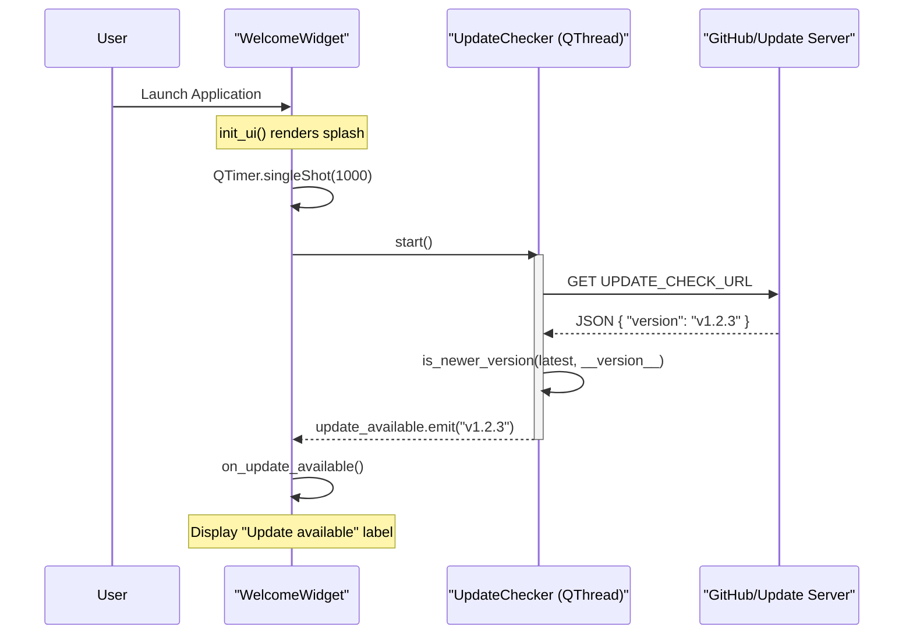

# Getting Started

<details>
<summary>Relevant source files</summary>

The following files were used as context for generating this wiki page:

- [docs/index.en.md](../../docs/index.en.md)
- [docs/index.md](../../docs/index.md)
- [docs/measurement_recipes/speaker_impedance.en.md](../../docs/measurement_recipes/speaker_impedance.en.md)
- [docs/measurement_recipes/speaker_impedance.md](../../docs/measurement_recipes/speaker_impedance.md)
- [docs/quickstart.en.md](../../docs/quickstart.en.md)
- [docs/quickstart.md](../../docs/quickstart.md)
- [download-site/.gitignore](../../download-site/.gitignore)
- [download-site/index.html](../../download-site/index.html)
- [download-site/main.js](../../download-site/main.js)
- [download-site/package-lock.json](../../download-site/package-lock.json)
- [download-site/package.json](../../download-site/package.json)
- [download-site/public/favicon.png](../../download-site/public/favicon.png)
- [download-site/style.css](../../download-site/style.css)
- [download-site/vite.config.js](../../download-site/vite.config.js)
- [requirements.txt](../../requirements.txt)
- [scripts/setup_dev_env.sh](../../scripts/setup_dev_env.sh)
- [src/core/constants.py](../../src/core/constants.py)
- [src/core/update_checker.py](../../src/core/update_checker.py)
- [src/core/utils.py](../../src/core/utils.py)
- [src/gui/widgets/welcome.py](../../src/gui/widgets/welcome.py)
- [tests/logic_verification/core/test_update_checker.py](../../tests/logic_verification/core/test_update_checker.py)
- [tests/security/test_update_xss.py](../../tests/security/test_update_xss.py)

</details>


This page provides the technical procedures for installing, configuring, and performing the first-run setup of MeasureLab. It covers hardware requirements, operating system specific instructions, and the internal mechanisms for update checking and FFT optimization.

## Installation and Requirements

MeasureLab is distributed as pre-compiled binaries for Windows, macOS, and Linux. The software requires a host computer and, for physical measurements, an external audio interface.

### System Requirements
*   **Operating Systems**: Windows 10/11, macOS 13+, or modern Linux distributions `download-site/main.js:196-210`.
*   **Python Dependencies**: If running from source, the system requires `numpy`, `scipy`, `sounddevice`, `PyQt6`, `pyqtgraph`, `soundfile`, `PyWavelets`, `netCDF4`, `pyfftw`, and `requests` `requirements.txt:3-14`.
*   **Hardware**: An external audio interface is strongly recommended for high-precision measurement, though built-in audio or Virtual Mode can be used for file analysis `docs/quickstart.en.md:142-144`.

### Download and OS Specifics

| Platform | Distribution Format | Execution Notes |
| :--- | :--- | :--- |
| **Windows** | `.zip` (onedir/onefile) | Extract and run `MeasureLab.exe` `docs/quickstart.en.md:27-29`. |
| **macOS** | `.dmg` (arm64/x64) | Bypass Gatekeeper via "Open" context menu or Privacy settings `docs/quickstart.en.md:49-55`. |
| **Linux** | `.AppImage` | Grant execution permissions: `chmod +x` `docs/quickstart.en.md:36-38`. |

**Sources:** `docs/quickstart.en.md:20-56`, `requirements.txt:1-15`, `download-site/main.js:196-216`

---

## First-Run Initialization

When MeasureLab is launched for the first time, it performs several critical background tasks before the UI becomes fully responsive.

### FFT Optimization (WISDOM)
MeasureLab uses `pyfftw` for high-performance signal processing. On the initial run, the system generates "WISDOM" (optimization plans) for the specific CPU architecture. This process can cause the application to appear frozen for several tens of seconds while heavy calculations are performed `docs/quickstart.en.md:58-62`.

### Update Checker Mechanism
The `WelcomeWidget` triggers an asynchronous update check 1000ms after the UI renders `src/gui/widgets/welcome.py:18-19`.

#### Data Flow: Update Verification
1.  `WelcomeWidget` instantiates `UpdateChecker` (a `QThread`) `src/gui/widgets/welcome.py:22`.
2.  `UpdateChecker` performs a GET request to the `UPDATE_CHECK_URL` defined in `src.core.constants` `src/core/update_checker.py:39-42`.
3.  The version comparison logic in `is_newer_version` splits the version strings (e.g., "0.4.4") into integers and pads them with zeros for accurate comparison `src/core/update_checker.py:11-25`.
4.  If a newer version is found, the `update_available` signal is emitted, updating the UI with a link to the release page `src/gui/widgets/welcome.py:26-30`.

#### Diagram: Startup and Update Check Logic
This diagram bridges the "Natural Language" setup process to the `UpdateChecker` and `WelcomeWidget` classes.



**Sources:** `src/gui/widgets/welcome.py:14-31`, `src/core/update_checker.py:11-56`, `docs/quickstart.en.md:58-62`

---

## Hardware Configuration

Correct audio driver selection is paramount for measurement accuracy.

### Audio Driver Selection
*   **Windows**: **ASIO** is the preferred driver for stability and low-level hardware access. **WASAPI** is the secondary choice. MME/DirectSound are discouraged due to high latency `docs/quickstart.en.md:91-97`.
*   **Linux**: **JACK** or **PipeWire** is strongly recommended. Users must enable "Jack/Pipewire mode" in the settings to prevent data intermittency `docs/quickstart.en.md:101-105`.

### Recommended Settings
*   **Sampling Rate**: 192kHz is recommended for high-resolution analysis if hardware supports it `docs/quickstart.en.md:111-112`.
*   **Buffer Size**: Set to "Long (STABLE)" or higher. Unlike low-latency music production, MeasureLab prioritizes data integrity and phase continuity over immediate response `docs/quickstart.en.md:113-116`.
*   **Dithering**: Should be enabled in the Audio settings when measuring low THD+N or using 16-bit output to improve linearity `docs/quickstart.en.md:118-120`.

**Sources:** `docs/quickstart.en.md:86-122`

---

## Virtual and Offline Mode

For users without an audio interface, MeasureLab provides a `Virtual / Offline Mode`.

### Implementation Details
When enabled via the **Settings > Audio** tab, the system bypasses physical hardware `docs/quickstart.en.md:144-147`.
*   **Simulation Rate**: Allows the user to set an arbitrary sampling rate (e.g., 192kHz) for internal processing `docs/quickstart.en.md:148-149`.
*   **Data Flow**: In this mode, signal generators and the `Player` widget serve as the primary audio sources. The data is routed internally to the analysis modules (Spectrum Analyzer, etc.) as if coming from an input buffer `docs/quickstart.en.md:151`.

**Sources:** `docs/quickstart.en.md:142-153`

---

## Quickstart Guide: The Loopback Test

The "Loopback Test" is the standard procedure to verify system integrity.

#### Diagram: Loopback Data Flow
This diagram maps the physical connection to the internal software components.

```mermaid
graph LR
    subgraph Software_Space ["Code Entity Space"]
        Gen["SignalGenerator"]
        Engine["AudioEngine"]
        Spec["SpectrumAnalyzer"]
    end

    subgraph Hardware_Space ["Physical Space"]
        Out["Audio Interface Output"]
        In["Audio Interface Input"]
        Cable["Loopback Cable"]
    end

    Gen -- "1000Hz Sine" --> Engine
    Engine -- "PCM Data" --> Out
    Out -- "Analog Signal" --> Cable
    Cable --> In
    In -- "Captured PCM" --> Engine
    Engine -- "Buffer Stream" --> Spec
    Note right of Spec: Peak observed at 1kHz
```

### Step-by-Step Procedure
1.  **Hardware**: Connect the Output of the interface to the Input via a physical cable `docs/quickstart.en.md:13`.
2.  **Signal Generation**: Open the `Signal Generator` widget, set frequency to `1000 Hz`, and press `Output` `docs/quickstart.en.md:130-132`.
3.  **Verification**: Open the `Spectrum Analyzer`. A sharp peak at 1kHz confirms the driver, hardware, and DSP pipeline are operational `docs/quickstart.en.md:136-138`.

**Sources:** `docs/quickstart.en.md:124-139`, `docs/index.en.md:39-43`

---
