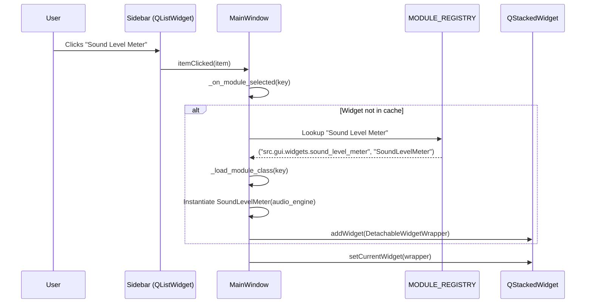
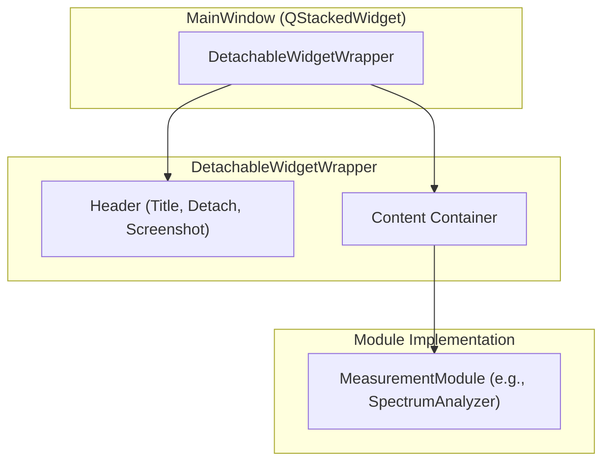

# Module Registry and UI Layout

Relevant source files

The following files were used as context for generating this wiki page:

- [main_gui.py](../../main_gui.py)
- [src/assets/lang/en.json](../../src/assets/lang/en.json)
- [src/assets/lang/ja.json](../../src/assets/lang/ja.json)
- [src/core/module_constants.py](../../src/core/module_constants.py)
- [src/gui/main_window.py](../../src/gui/main_window.py)
- [src/gui/startup.py](../../src/gui/startup.py)
- [src/gui/widgets/bnim_meter.py](../../src/gui/widgets/bnim_meter.py)
- [src/gui/widgets/detachable_wrapper.py](../../src/gui/widgets/detachable_wrapper.py)
- [src/gui/widgets/log_viewer.py](../../src/gui/widgets/log_viewer.py)
- [src/gui/widgets/raw_time_series.py](../../src/gui/widgets/raw_time_series.py)
- [src/gui/widgets/sound_level_meter.py](../../src/gui/widgets/sound_level_meter.py)
- [tests/logic_verification/gui/test_compact_modes.py](../../tests/logic_verification/gui/test_compact_modes.py)
- [tests/logic_verification/gui/test_lufs_meter_compact.py](../../tests/logic_verification/gui/test_lufs_meter_compact.py)

This page describes the structural foundation of the MeasureLab interface, focusing on how modules are registered, dynamically loaded, and managed within the main application window.

## Module Registry

MeasureLab utilizes a centralized registry to manage the vast collection of measurement instruments. This registry decouples the module definitions from the main window logic, allowing for easy extension and maintenance.

### MODULE_REGISTRY Implementation
The `MODULE_REGISTRY` is a dictionary located in `src/gui/main_window.py` `src/gui/main_window.py:74-116`. It maps a unique string key (defined in `module_constants.py`) to a tuple containing the filesystem path and the class name of the widget.

| Component | File Reference | Role |
| :--- | :--- | :--- |
| **Module Keys** | `src/core/module_constants.py` | Unique identifiers like `MODULE_SPECTRUM_ANALYZER`. |
| **Registry Map** | `src/gui/main_window.py` | Maps keys to `("module.path", "ClassName")`. |
| **Loader** | `src/gui/main_window.py` | `_load_module_class(module_key)` performs dynamic imports. |

### Lazy-Loading Strategy
To minimize startup time and memory footprint, MeasureLab employs a lazy-loading strategy. Heavy dependencies (such as `scipy`, `matplotlib`, or `pyfftw`) are only imported when a specific module is selected by the user `src/gui/main_window.py:125-135`. 

1.  **Startup**: Only core logic and the `MainWindow` shell are loaded.
2.  **Selection**: When a user clicks a sidebar item, `_load_module_class` uses `importlib.import_module` to bring the specific widget into memory `src/gui/main_window.py:119-122`.
3.  **PyInstaller Note**: Because dynamic imports are invisible to static analysis, explicit imports are maintained in `src/gui/pyinstaller_imports.py` to ensure all modules are bundled in the compiled executable `src/gui/main_window.py:129-130`.

**Sources:** `src/gui/main_window.py:74-135`, `src/core/module_constants.py:1-91`

---

## UI Layout and Navigation

The `MainWindow` `src/gui/main_window.py:151` follows a standard sidebar-content pattern, managed by a `QStackedWidget`.

### Layout Architecture
The interface is divided into three primary zones:
1.  **Sidebar (`QListWidget`)**: Displays the list of available modules defined in `ALL_MODULE_KEYS` `src/gui/main_window.py:270-275`.
2.  **Content Area (`QStackedWidget`)**: Holds the active module widget. Only one module is visible at a time to conserve GPU resources `src/gui/main_window.py:284`.
3.  **Status Bar**: Displays real-time engine stats like sample rate, CPU load, and peak levels `src/gui/main_window.py:330-335`.

### Navigation Data Flow
The following diagram illustrates how selecting a module in the sidebar triggers the instantiation and display of the measurement widget.

**Sidebar Selection to Widget Display**

**Sources:** `src/gui/main_window.py:265-310`, `src/gui/main_window.py:464-500`

---

## DetachableWidgetWrapper

Every module in MeasureLab is wrapped in a `DetachableWidgetWrapper` `src/gui/widgets/detachable_wrapper.py:93`. This component provides a standardized header and utility functions for all instruments.

### Key Features
*   **Window Detachment**: Users can pop a module out into an `IndependentWindow` `src/gui/widgets/detachable_wrapper.py:24`. This is useful for multi-monitor setups.
*   **Compact Mode**: Implements `CompactableWidgetInterface`. When enabled, it hides non-essential controls and sidebars to focus purely on the visualization `src/gui/widgets/detachable_wrapper.py:158-164`.
*   **Standard Utilities**: Provides buttons for "Screenshot", "Logs", and "Send to Comparer" `src/gui/widgets/detachable_wrapper.py:145-170`.

### Component Hierarchy

**Sources:** `src/gui/widgets/detachable_wrapper.py:93-189`, `tests/logic_verification/gui/test_compact_modes.py:155-184`

---

## MainWindow Lifecycle

The `MainWindow` manages the global application state and coordinates between the UI and the `AudioEngine`.

### Initialization and Startup
1.  **Environment Setup**: `main_gui.py` configures high DPI scaling and logging `main_gui.py:15-33`.
2.  **Splash Screen**: A `WrappingSplashScreen` is shown immediately while the main window initializes `main_gui.py:152-183`.
3.  **Engine Attachment**: The `MainWindow` receives the singleton `AudioEngine` instance and connects it to the status bar for real-time monitoring `src/gui/main_window.py:163-175`.

### Module Lifecycle Management
The `MainWindow` ensures that only one module is "Active" at a time to prevent audio callback collisions.
*   **Activation**: When a module is selected, the `MainWindow` calls `start_analysis()` on the module `src/gui/main_window.py:530`.
*   **Deactivation**: When switching away, the `MainWindow` calls `stop_analysis()` to unregister audio callbacks and free DSP resources `src/gui/main_window.py:510-520`.
*   **Cleanup**: On application close, `MainWindow` iterates through all cached modules to ensure every background thread and audio stream is terminated safely `src/gui/main_window.py:410-430`.

**Sources:** `main_gui.py:135-200`, `src/gui/main_window.py:151-220`, `src/gui/main_window.py:502-540`

---
