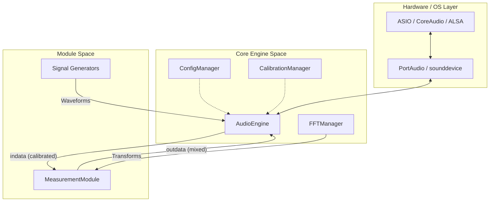
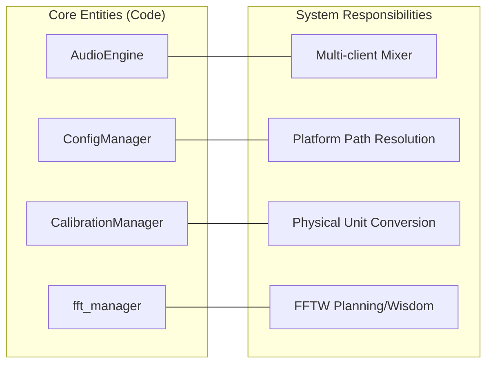

# Core Architecture

Relevant source files

The following files were used as context for generating this wiki page:

- [CHANGELOG.md](../../CHANGELOG.md)
- [constraints.txt](../../constraints.txt)
- [pyproject.toml](../../pyproject.toml)
- [src/core/audio_engine.py](../../src/core/audio_engine.py)
- [src/core/calibration.py](../../src/core/calibration.py)
- [src/core/config_manager.py](../../src/core/config_manager.py)
- [src/core/version.py](../../src/core/version.py)
- [src/gui/widgets/boxcar_averager.py](../../src/gui/widgets/boxcar_averager.py)
- [src/gui/widgets/settings.py](../../src/gui/widgets/settings.py)
- [tests/logic_verification/core/test_config_manager.py](../../tests/logic_verification/core/test_config_manager.py)
- [tests/logic_verification/core/test_config_manager_logic.py](../../tests/logic_verification/core/test_config_manager_logic.py)
- [version.json](../../version.json)

The foundational architecture of MeasureLab is built upon a modular, multi-threaded system designed for high-precision audio analysis. It centralizes critical DSP resources—such as the audio engine, FFT management, and calibration profiles—to ensure consistency across all measurement modules.

### System Overview

MeasureLab follows a "Centralized Core, Modular UI" philosophy. The core subsystems handle the complexities of real-time hardware interaction and mathematical transformations, while individual measurement modules consume these services through a unified API.

#### Architectural Relationships
The following diagram illustrates the relationship between the core managers and the data flow from hardware to the UI.

**Core System Data Flow**

**Sources:**
- `src/core/audio_engine.py:117-121` (AudioEngine class)
- `src/core/config_manager.py:75-79` (ConfigManager class)
- `src/core/calibration.py:10-14` (CalibrationManager class)

---

### Key Subsystems

#### Audio Engine and Mixer
The `AudioEngine` class is the heart of the application, managing the `sounddevice.Stream` `src/core/audio_engine.py:132`. It implements a multi-client mixer that allows multiple modules to register callbacks via `register_callback()` `src/core/audio_engine.py:157`. It supports high-precision 64-bit processing `src/core/audio_engine.py:143`, TPDF dithering `src/core/audio_engine.py:183`, and a `VirtualStream` mode for offline analysis without hardware `src/core/audio_engine.py:22-25`.

For details, see [Audio Engine](#2.1).

#### Configuration and Calibration
Persistence is handled by two primary managers:
*   **ConfigManager**: Manages application-wide settings (devices, sample rates, language) in `config.json` `src/core/config_manager.py:31-56`. It uses platform-specific paths like `AppData` on Windows and `Application Support` on macOS `src/core/config_manager.py:123-135`.
*   **CalibrationManager**: Stores V/FS sensitivity, SPL offsets, and frequency correction maps in `calibration.json` `src/core/calibration.py:33-44`. It ensures that raw ADC values are converted into physical units (Volts, Pascals) before reaching the analysis modules.

For details, see [Configuration and Calibration](#2.2).

#### FFT Management and Generators
To optimize performance, the `FFTManager` centralizes transform logic using `pyfftw` with wisdom persistence `src/gui/widgets/settings.py:31`. Signal generation is handled by specialized classes like `PinkNoise` `src/core/generators.py`, which provide thread-safe waveform production for the `AudioEngine` mixer.

For details, see [FFT Manager and Signal Generators](#2.3).

#### Localization and Theming
The UI supports a wide range of locales (en, ja, de, fr, es, zh, ko, pt, ru) through the `LocalizationManager` and a global `tr()` function `src/core/localization.py`. Visual consistency is maintained by the `ThemeManager`, which handles switching between Light, Dark, and High-Contrast modes.

For details, see [Localization and Theming](#2.4).

---

### Shared Data Structures

The architecture relies on several optimized data structures to handle high-throughput audio data between threads:

| Structure | Purpose | Location |
| :--- | :--- | :--- |
| `RingBuffer` | Thread-safe circular buffer for cross-thread data transfer. | `src/core/utils.py` |
| `Accumulator` | High-precision (int64) accumulation for synchronous averaging. | `src/gui/widgets/boxcar_averager.py:132-135` |
| `CalibrationProfile` | Named sets of sensitivity and correction data. | `src/core/calibration.py:45-46` |

**Core Entity Mapping**

**Sources:**
- `src/core/audio_engine.py:157-160` (Mixer state)
- `src/core/config_manager.py:123-136` (Path resolution)
- `src/core/calibration.py:33-44` (Sensitivity and SPL)
- `src/gui/widgets/boxcar_averager.py:131-147` (Accumulator logic)

---
