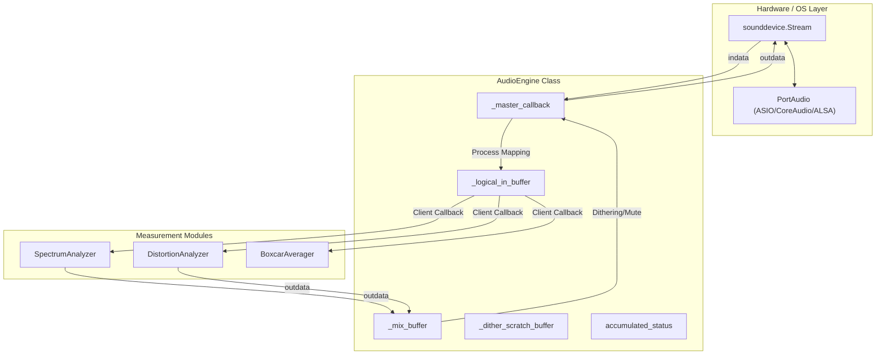
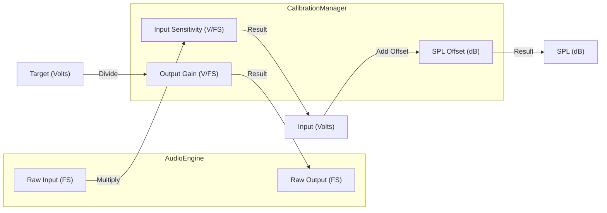

# Audio Engine

Relevant source files

The following files were used as context for generating this wiki page:

- [scripts/README_ASIO.txt](../../scripts/README_ASIO.txt)
- [scripts/disable_asio.bat](../../scripts/disable_asio.bat)
- [scripts/enable_asio.bat](../../scripts/enable_asio.bat)
- [src/core/audio_engine.py](../../src/core/audio_engine.py)
- [src/core/calibration.py](../../src/core/calibration.py)
- [src/core/config_manager.py](../../src/core/config_manager.py)
- [src/gui/widgets/boxcar_averager.py](../../src/gui/widgets/boxcar_averager.py)
- [src/gui/widgets/settings.py](../../src/gui/widgets/settings.py)
- [tests/logic_verification/core/test_audio_engine.py](../../tests/logic_verification/core/test_audio_engine.py)
- [tests/logic_verification/core/test_config_manager.py](../../tests/logic_verification/core/test_config_manager.py)
- [tests/logic_verification/core/test_config_manager_logic.py](../../tests/logic_verification/core/test_config_manager_logic.py)
- [tests/logic_verification/gui/test_recorder_player_race.py](../../tests/logic_verification/gui/test_recorder_player_race.py)
- [tests/logic_verification/gui/widgets/test_distortion_analyzer_widget.py](../../tests/logic_verification/gui/widgets/test_distortion_analyzer_widget.py)

The `AudioEngine` is the central hub for all audio I/O operations in MeasureLab. It manages the lifecycle of hardware streams via `sounddevice`, implements a multi-client mixer for simultaneous measurement modules, and provides high-precision signal paths with support for 64-bit processing and TPDF dithering.

## System Architecture

The `AudioEngine` operates as a singleton-like service that abstracts the complexities of different host APIs (ASIO, CoreAudio, ALSA) and provides a unified interface for measurement modules.

### Master Callback Pipeline
The engine uses a single master callback (`_master_callback`) to drive all active measurement modules. This ensures perfect synchronization between multiple analysis tools (e.g., running an Oscilloscope and Spectrum Analyzer simultaneously).

1.  **Hardware Input**: Receives raw buffers from the sound card.
2.  **Channel Mapping**: Applies input channel modes (Stereo, Left-only, Right-only) `src/core/audio_engine.py:151-155`.
3.  **Client Distribution**: Iterates through registered client callbacks, providing them with the processed input data `src/core/audio_engine.py:157-160`.
4.  **Mixing**: Collects output from clients into a mix buffer `src/core/audio_engine.py:173-175`.
5.  **Post-Processing**: Applies master volume, software loopback, and dithering `src/core/audio_engine.py:165-185`.

### Data Flow and Code Entities

The following diagram illustrates how the `AudioEngine` bridges hardware I/O with measurement modules.

**Audio Engine Data Flow**

Sources: `src/core/audio_engine.py:117-185`, `src/gui/widgets/boxcar_averager.py:122-127`

---

## Multi-Client Mixer

The `AudioEngine` supports multiple simultaneous clients through a registration system. Each client registers a callback that receives input data and provides output data.

*   **Registration**: Clients use `register_callback(callback)` which returns a unique ID `src/core/audio_engine.py:157-159`.
*   **Thread Safety**: A `threading.Lock` protects the callback registry during stream restarts or UI interactions `src/core/audio_engine.py:160`.
*   **Buffer Management**: To minimize GC pressure and latency, the engine uses pre-allocated buffers (`_mix_buffer`, `_client_buffer`) `src/core/audio_engine.py:172-176`.

---

## Precision and Signal Integrity

### TPDF Dithering
When outputting to hardware, MeasureLab can apply Triangular Probability Density Function (TPDF) dithering. This prevents quantization distortion when converting the internal floating-point representation to fixed-point bit depths (16 or 24-bit).
*   **Implementation**: Uses a NumPy random generator (`np.random.default_rng`) to generate the dither signal `src/core/audio_engine.py:185-186`.
*   **Configuration**: Users can toggle dithering and select target bit depth in the settings `src/core/config_manager.py:44-45`.

### 64-bit Audio Engine
For extreme precision requirements, the engine can be switched to `float64` mode.
*   **Logic**: The `_get_dtype()` method returns either `float32` or `float64` based on the `audio_engine_64bit` flag `src/core/audio_engine.py:197-199`.
*   **Impact**: This affects all internal buffer allocations and signal processing within the master callback `src/core/audio_engine.py:143-145`.

---

## VirtualStream (Offline Mode)

For testing and demonstration without hardware, MeasureLab includes a `VirtualStream` class.

| Feature | Implementation |
| :--- | :--- |
| **Timing** | Driven by a high-priority thread with drift correction `src/core/audio_engine.py:62-81`. |
| **Mocking** | Uses `_DummyTime` to simulate `sounddevice` time structures `src/core/audio_engine.py:13-21`. |
| **Loopback** | Automatically routes output back to input for self-measurement `src/core/audio_engine.py:102-109`. |

Sources: `src/core/audio_engine.py:22-116`, `tests/logic_verification/core/test_audio_engine.py:25-89`

---

## Platform-Specific Handling

### ASIO (Windows)
ASIO is considered experimental and is disabled by default for stability. It requires swapping PortAudio DLLs via specialized scripts `scripts/README_ASIO.txt:1-12`.
*   **Enablement**: `enable_asio.bat` replaces the standard `libportaudio64bit.dll` with an ASIO-enabled version `scripts/enable_asio.bat:18-34`.

### CoreAudio (macOS)
Specific settings for macOS ensure high-fidelity capture:
*   `coreaudio_fail_if_conversion_required`: Prevents the OS from silently resampling audio `src/core/audio_engine.py:193`.
*   `coreaudio_conversion_quality`: Set to `min` by default to reduce latency `src/core/audio_engine.py:195`.

### PipeWire/JACK Resident Mode
On Linux, the engine supports a "resident" mode where the PortAudio stream remains open for the entire application lifetime, preventing port flickering in the system patchbay `src/core/audio_engine.py:135-137`.

---

## Calibration Integration

The `AudioEngine` works closely with the `CalibrationManager` to ensure measurement accuracy.

**Calibration Mapping Logic**

Sources: `src/core/calibration.py:33-44`, `src/gui/widgets/settings.py:173-183`

*   **Sensitivity**: Defined in Volts per Full Scale (V/FS) `src/core/calibration.py:33`.
*   **SPL Calibration**: Maps C-weighted dBFS to absolute SPL values using a stored offset `src/core/calibration.py:42-44`.
*   **1PPS Sync**: Can use an external 1PPS signal to calibrate the sample clock frequency `src/core/calibration.py:39-40`.

Sources: `src/core/audio_engine.py:147`, `src/core/calibration.py:10-53`

---
