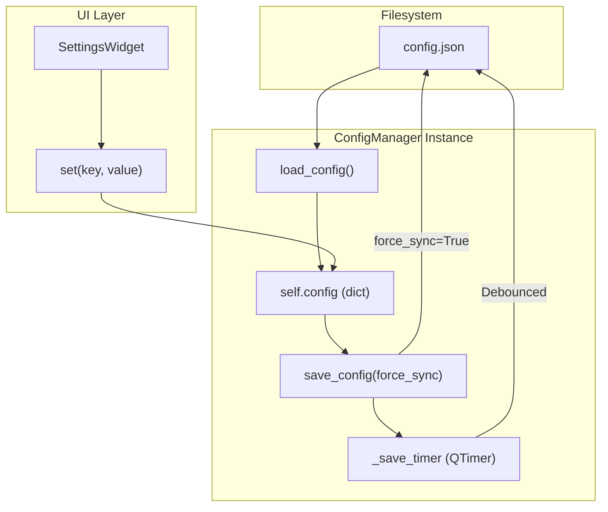
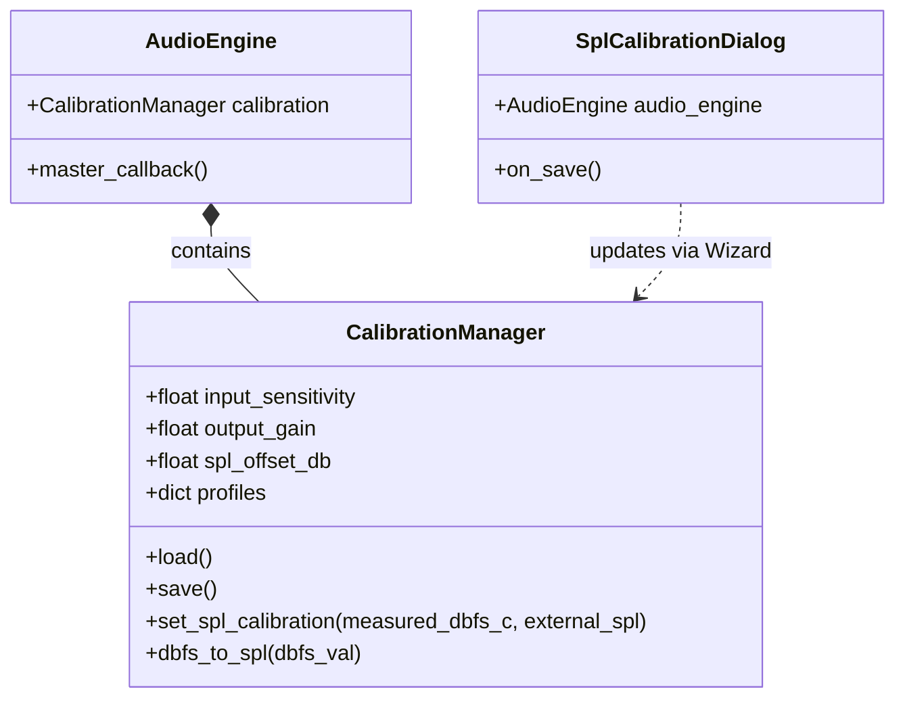
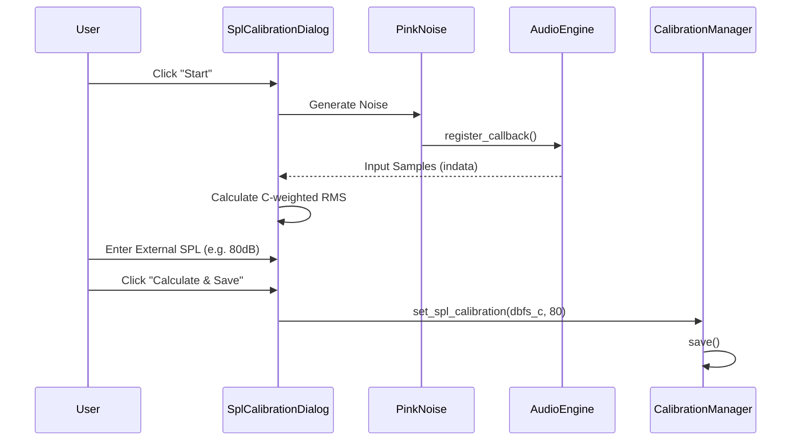

# Configuration and Calibration

Relevant source files

The following files were used as context for generating this wiki page:

- [docs/calibration.en.md](../../docs/calibration.en.md)
- [docs/calibration.md](../../docs/calibration.md)
- [docs/measurement_recipes/noise_measurement.en.md](../../docs/measurement_recipes/noise_measurement.en.md)
- [docs/measurement_recipes/noise_measurement.md](../../docs/measurement_recipes/noise_measurement.md)
- [docs/widgets/feedforward_compensator.en.md](../../docs/widgets/feedforward_compensator.en.md)
- [docs/widgets/feedforward_compensator.md](../../docs/widgets/feedforward_compensator.md)
- [docs/widgets/lockin_spectrum_finder.en.md](../../docs/widgets/lockin_spectrum_finder.en.md)
- [docs/widgets/lockin_spectrum_finder.md](../../docs/widgets/lockin_spectrum_finder.md)
- [docs/widgets/settings.en.md](../../docs/widgets/settings.en.md)
- [docs/widgets/settings.md](../../docs/widgets/settings.md)
- [src/core/audio_engine.py](../../src/core/audio_engine.py)
- [src/core/calibration.py](../../src/core/calibration.py)
- [src/core/config_manager.py](../../src/core/config_manager.py)
- [src/gui/widgets/boxcar_averager.py](../../src/gui/widgets/boxcar_averager.py)
- [src/gui/widgets/settings.py](../../src/gui/widgets/settings.py)
- [tests/core/test_core_hammerstein_model.py](../../tests/core/test_core_hammerstein_model.py)
- [tests/logic_verification/core/test_analysis.py](../../tests/logic_verification/core/test_analysis.py)
- [tests/logic_verification/core/test_calibration.py](../../tests/logic_verification/core/test_calibration.py)
- [tests/logic_verification/core/test_calibration_manager.py](../../tests/logic_verification/core/test_calibration_manager.py)
- [tests/logic_verification/core/test_config_manager.py](../../tests/logic_verification/core/test_config_manager.py)
- [tests/logic_verification/core/test_config_manager_logic.py](../../tests/logic_verification/core/test_config_manager_logic.py)

The configuration and calibration subsystems provide the foundational persistence and physical unit mapping for MeasureLab. The `ConfigManager` handles application-wide settings and platform-specific path resolution, while the `CalibrationManager` manages the conversion between digital decibels relative to full scale (dBFS) and physical units such as Volts (V), dBu, dBV, and Sound Pressure Level (dB SPL).

## ConfigManager

The `ConfigManager` class handles the lifecycle of the application's configuration file (`config.json`). It implements platform-specific path resolution to ensure settings are stored in appropriate locations (e.g., `AppData` on Windows or `Application Support` on macOS) while supporting a "Portable Mode" if a configuration file exists in the current working directory.

### Key Features
- **Platform-Specific Paths**: Uses `QLocale` and system environment variables to resolve user data directories `src/core/config_manager.py:123-136`.
- **Debounced Saves**: Implements a timer-based save mechanism to prevent excessive disk I/O during rapid setting changes `src/core/config_manager.py:88-89`.
- **Secure File Permissions**: Attempts to set file permissions to `0o600` (read/write by owner only) on Unix-like systems for security `src/core/config_manager.py:228-243`.
- **Automatic Language Detection**: Detects system language on first run to initialize the `language` setting `src/core/config_manager.py:182-185`.

### Configuration Data Flow
The following diagram illustrates how configuration is loaded, modified by the UI, and persisted to disk.

**Configuration Persistence Flow**

Sources: `src/core/config_manager.py:75-110`, `src/core/config_manager.py:173-205`, `src/core/config_manager.py:215-250`

---

## CalibrationManager

The `CalibrationManager` maintains the relationship between digital sample values and physical quantities. It is a core dependency of the `AudioEngine`, allowing the system to scale signals before they reach analysis modules.

### Calibration Parameters
| Parameter | Unit | Description |
| :--- | :--- | :--- |
| `input_sensitivity` | V/FS (Peak) | The peak voltage corresponding to a 0 dBFS digital signal. |
| `output_gain` | V/FS (Peak) | The peak voltage produced by the DAC for a 0 dBFS digital signal. |
| `spl_offset_db` | dB | Offset used to calculate SPL: $SPL = dBFS_C + spl\_offset\_db$. |
| `frequency_calibration` | Multiplier | Correction factor for the sample clock (ppm). |

### Profile Persistence
Calibration data is stored in `calibration.json`. Users can save multiple profiles (e.g., "Interface A + Mic B") which encapsulate sensitivity, gain, and SPL offsets `src/core/calibration.py:104-147`.

### Mathematical Conversions
- **dBFS to Voltage**: Calculated using `input_sensitivity`. A value of 1.0 FS maps to the sensitivity value `src/core/calibration.py:33-34`.
- **SPL Calculation**: MeasureLab uses C-weighted RMS levels (`dBFS_C`) as the basis for SPL measurement to align with standard sound level meter behaviors `src/core/calibration.py:42-44`.

**Calibration Entity Mapping**

Sources: `src/core/calibration.py:10-53`, `src/core/audio_engine.py:146-147`, `src/gui/widgets/settings.py:39-68`

---

## Calibration Wizards

MeasureLab provides interactive wizards in the `Settings` widget to simplify the calibration process. These wizards automate signal generation and measurement to calculate the necessary offsets.

### SPL Calibration Wizard
The `SplCalibrationDialog` implements a specific workflow for sound pressure calibration:
1. **Signal Generation**: Plays band-limited pink noise (Speaker: 500Hz–2kHz or Subwoofer: 30Hz–80Hz) `src/gui/widgets/settings.py:55-82`.
2. **Measurement**: Calculates the C-weighted RMS level of the input signal `src/gui/widgets/settings.py:51-63`.
3. **Reference Entry**: The user enters the reading from an external physical SPL meter `src/gui/widgets/settings.py:150-162`.
4. **Offset Calculation**: The manager stores the difference between the digital level and the physical reading `src/core/calibration.py:151-155`.

### Input/Output Voltage Wizard
Located within the `Settings` widget, these wizards guide the user through:
- **Output**: Outputting a 1kHz sine wave at a known dBFS level (e.g., -12 dBFS) and prompting the user to measure the AC voltage at the physical output `docs/calibration.en.md:55-64`.
- **Input**: Measuring a known external voltage source to determine the `input_sensitivity` `docs/calibration.en.md:43-53`.

**Wizard Logic Flow**

Sources: `src/gui/widgets/settings.py:163-165`, `src/core/calibration.py:151-155`, `src/gui/widgets/settings.py:284-310`

---

## Technical Implementation Notes

### Secure Persistence
When saving calibration data, MeasureLab uses `os.open` with `os.O_CREAT | os.O_TRUNC` and mode `0o600` to ensure that sensitive hardware calibration data is not world-readable on multi-user systems `src/core/calibration.py:131-143`.

### 1PPS and Frequency Correction
The `CalibrationManager` supports high-precision frequency correction via two sources:
1. **Basic**: Manual ppm correction `src/core/calibration.py:38`.
2. **1PPS**: Automated correction derived from the `1PPS Monitor` widget, which tracks sample clock drift against a GPS-disciplined reference `src/core/calibration.py:39-40`.

Sources: `src/core/calibration.py:10-53`, `src/core/config_manager.py:75-100`, `src/gui/widgets/settings.py:1-40`

---
