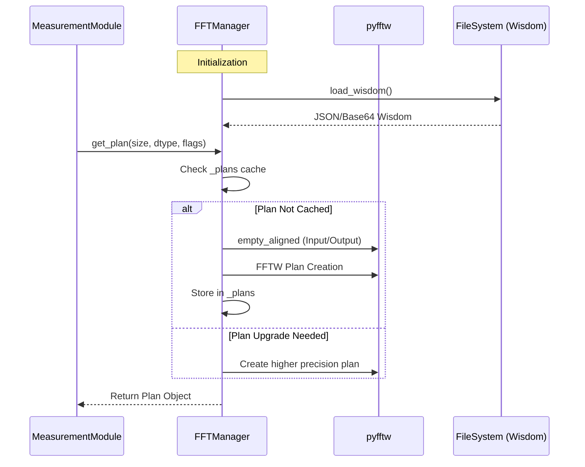
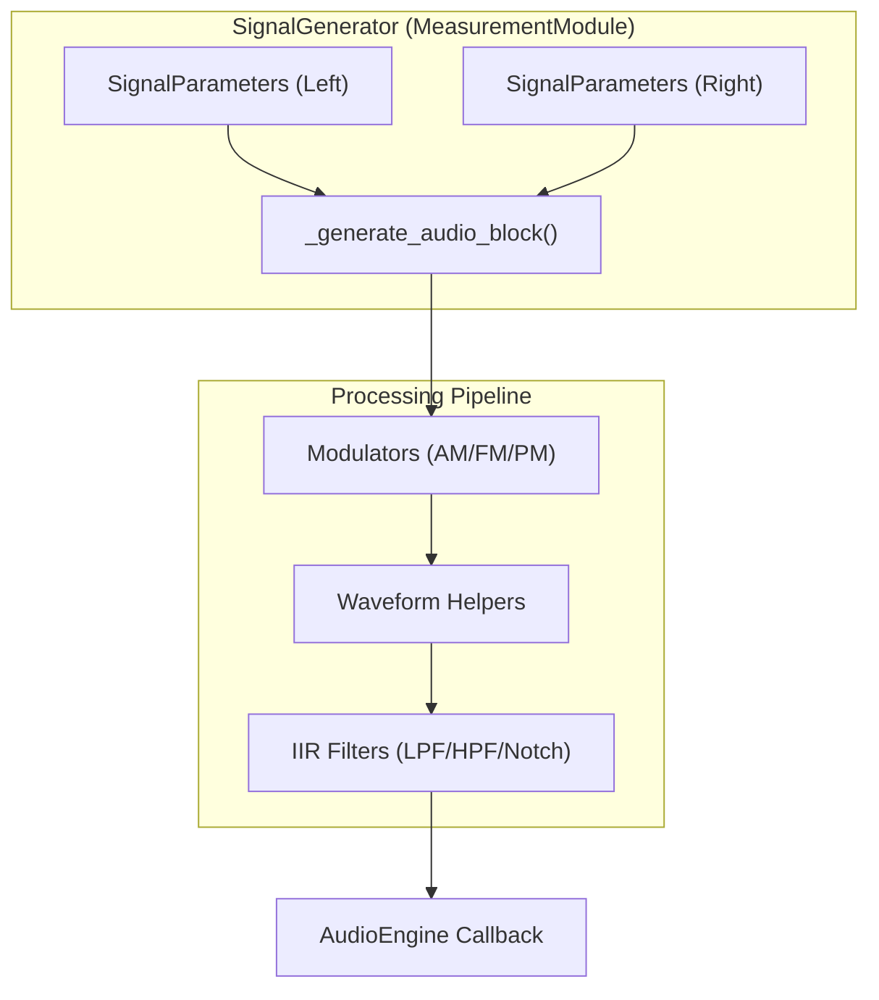

# FFT Manager and Signal Generators

Relevant source files

The following files were used as context for generating this wiki page:

- [docs/assets/widgets/export_dialog.png](../../docs/assets/widgets/export_dialog.png)
- [docs/assets/widgets/settings.png](../../docs/assets/widgets/settings.png)
- [docs/assets/widgets/welcome.png](../../docs/assets/widgets/welcome.png)
- [scripts/capture_widget_screenshots.py](../../scripts/capture_widget_screenshots.py)
- [src/core/fft_manager.py](../../src/core/fft_manager.py)
- [src/core/ring_buffer.py](../../src/core/ring_buffer.py)
- [src/gui/widgets/signal_generator.py](../../src/gui/widgets/signal_generator.py)
- [tests/logic_verification/core/test_ring_buffer_mismatch.py](../../tests/logic_verification/core/test_ring_buffer_mismatch.py)
- [tests/logic_verification/gui/widgets/test_signal_generator.py](../../tests/logic_verification/gui/widgets/test_signal_generator.py)

This section details the centralized FFT management system, the advanced signal generation capabilities, and the underlying thread-safe circular buffering used for high-performance audio data handling in MeasureLab.

## FFTManager

The `FFTManager` class serves as a centralized controller for Fast Fourier Transform operations. It is designed to optimize performance by leveraging `pyfftw` (Pythonic wrapper for FFTW) with persistent wisdom management and thread-safe plan caching.

### Implementation and Performance Optimization
*   **PyFFTW Wisdom:** The manager stores FFTW "wisdom" (pre-calculated plans for specific sizes) in an XDG-compliant user data directory `src/core/fft_manager.py:54-60`. This allows the system to skip expensive hardware-specific optimization on subsequent runs.
*   **Security:** Wisdom is serialized using JSON and Base64 instead of `pickle` to prevent arbitrary code execution vulnerabilities `src/core/fft_manager.py:49-50`.
*   **Threading:** The manager limits FFT computation to a maximum of 8 threads to minimize synchronization overhead on high-core-count processors during small 1D transforms `src/core/fft_manager.py:40-45`.
*   **Plan Caching:** Plans are cached in a dictionary keyed by size, dtype, and direction `src/core/fft_manager.py:122-128`. The manager supports "upgrading" a plan from `FFTW_ESTIMATE` to `FFTW_MEASURE` if higher precision is requested later `src/core/fft_manager.py:143-146`.

### Data Flow: FFT Plan Acquisition
The following diagram illustrates how modules request and receive optimized FFT plans.

**FFT Plan Lifecycle**

**Sources:** `src/core/fft_manager.py:31-152`

---

## Signal Generators

The `SignalGenerator` module `src/gui/widgets/signal_generator.py:150` provides high-precision excitation signals. It supports independent control for Left and Right channels, including complex modulations and filtered noise.

### Supported Waveforms
The generator distinguishes between two primary types of signals:
1.  **Periodic Waveforms:** Calculated in real-time per block (Sine, Square, Triangle, Sawtooth, Pulse) `src/gui/widgets/signal_generator.py:152`.
2.  **Buffered Waveforms:** Pre-generated for performance (Noise, Multitone, MLS, Golay, Burst, PRBS) `src/gui/widgets/signal_generator.py:151`.

### Key Features
*   **Phase Continuity:** For periodic signals, the generator maintains a `_phase` state across audio blocks, ensuring no "clicks" occur when changing frequencies `tests/logic_verification/gui/widgets/test_signal_generator.py:86-125`.
*   **Colored Noise:** Supports White, Pink (-3dB/oct), Brown (-6dB/oct), Blue (+3dB/oct), and Violet (+6dB/oct) noise via FFT-based frequency domain filtering `src/gui/widgets/signal_generator.py:192-230`.
*   **Frequency Snapping:** Can "snap" the output frequency to the exact center of an FFT bin to prevent spectral leakage in analysis modules `src/gui/widgets/signal_generator.py:114-116`.
*   **Calibration Integration:** Applies frequency calibration factors (PPM adjustments) retrieved from the `AudioEngine` calibration manager `src/gui/widgets/signal_generator.py:178-190`.

**Signal Generator Architecture**

**Sources:** `src/gui/widgets/signal_generator.py:43-148`, `src/gui/widgets/signal_generator.py:150-166`

---

## RingBuffer

The `RingBuffer` is a thread-safe, circular buffer implementation used to bridge the high-priority audio callback thread and the lower-priority UI/Analysis threads `src/core/ring_buffer.py:6-12`.

### Implementation Details
*   **Thread Safety:** Uses a `threading.Lock` to synchronize `read` and `write` indices `src/core/ring_buffer.py:27`.
*   **Broadcasting:** Supports writing mono data to a stereo buffer via NumPy broadcasting `src/core/ring_buffer.py:89-91`.
*   **Overflow Handling:** If the writer "laps" the reader, the buffer automatically jumps the read index to the start of the latest valid window to prevent reading corrupted data `src/core/ring_buffer.py:119-122`.
*   **Channel Mismatch:** Automatically handles input with fewer channels by zero-padding `src/core/ring_buffer.py:70-76` or ignoring extra channels `src/core/ring_buffer.py:68-69`.

### Data Interaction Table
| Function | Role | Thread Context |
| :--- | :--- | :--- |
| `write(data)` | Appends new audio frames to the buffer. | Audio Callback |
| `read(num)` | Retrieves requested number of frames. Returns copy to avoid race conditions. | UI / Analysis |
| `reset()` | Clears all data and resets indices. | Control Thread |
| `available()` | Returns the count of readable samples. | UI / Analysis |

**Sources:** `src/core/ring_buffer.py:41-153`, `tests/logic_verification/core/test_ring_buffer_mismatch.py:13-32`

---
