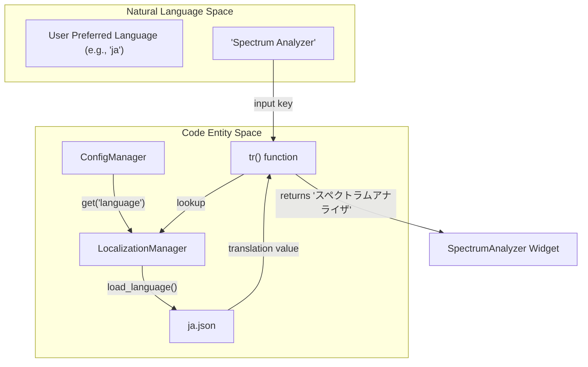
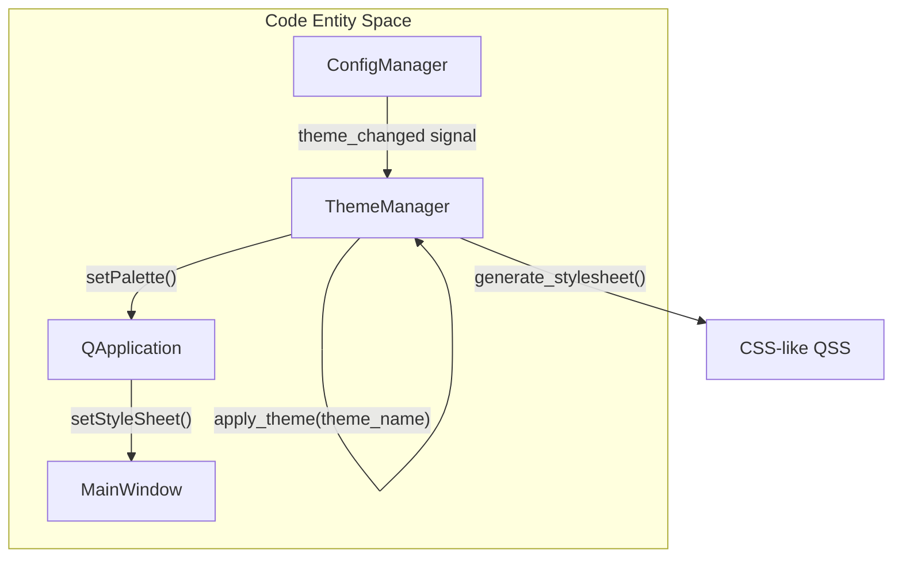

# Localization and Theming

Relevant source files

The following files were used as context for generating this wiki page:

- [scripts/check_trn_keys.py](../../scripts/check_trn_keys.py)
- [scripts/translation_whitelist.json](../../scripts/translation_whitelist.json)
- [scripts/update_translations.py](../../scripts/update_translations.py)
- [src/assets/lang/de.json](../../src/assets/lang/de.json)
- [src/assets/lang/en.json](../../src/assets/lang/en.json)
- [src/assets/lang/es.json](../../src/assets/lang/es.json)
- [src/assets/lang/fr.json](../../src/assets/lang/fr.json)
- [src/assets/lang/ja.json](../../src/assets/lang/ja.json)
- [src/assets/lang/ko.json](../../src/assets/lang/ko.json)
- [src/assets/lang/pt.json](../../src/assets/lang/pt.json)
- [src/assets/lang/ru.json](../../src/assets/lang/ru.json)
- [src/assets/lang/zh.json](../../src/assets/lang/zh.json)
- [src/core/localization.py](../../src/core/localization.py)
- [src/core/module_constants.py](../../src/core/module_constants.py)
- [src/core/session_manager.py](../../src/core/session_manager.py)
- [src/core/theme_manager.py](../../src/core/theme_manager.py)
- [src/gui/main_window.py](../../src/gui/main_window.py)
- [tests/logic_verification/core/test_localization_logic.py](../../tests/logic_verification/core/test_localization_logic.py)
- [tests/logic_verification/core/test_session_manager.py](../../tests/logic_verification/core/test_session_manager.py)
- [tests/logic_verification/core/test_theme_manager.py](../../tests/logic_verification/core/test_theme_manager.py)

This section details the internationalization (i18n) and visual customization frameworks within MeasureLab. The system supports multiple languages through a centralized translation manager and provides theme switching (Light, Dark, and High-Contrast) via a unified style management system.

## Localization Framework

MeasureLab uses a custom i18n implementation based on JSON language assets and a singleton manager. This approach allows for dynamic language switching without requiring application restarts in many components.

### LocalizationManager and tr() Function
The `LocalizationManager` handles the loading of translation files and state management of the current language. The global `tr()` function serves as the primary interface for string translation throughout the codebase `src/core/localization.py:25-25`.

**Key Components:**
- **`get_manager()`**: Returns the singleton instance of the `LocalizationManager`.
- **`tr(text, *args)`**: The standard translation function. It looks up the `text` key in the currently loaded language dictionary. If the key contains placeholders (e.g., `{0}`), it formats the string using `*args`.
- **Language Assets**: Located in `src/assets/lang/`, these are JSON files mapping English keys to localized values for:
    - English (`en.json`) `src/assets/lang/en.json:1-101392`
    - Japanese (`ja.json`) `src/assets/lang/ja.json:1-86780`
    - German (`de.json`) `src/assets/lang/de.json:1-106340`
    - French (`fr.json`) `src/assets/lang/fr.json:1-109359`
    - Spanish (`es.json`) `src/assets/lang/es.json:1-108211`
    - Chinese (`zh.json`) `src/assets/lang/zh.json:1-82538`
    - Korean (`ko.json`) `src/assets/lang/ko.json:1-86500`
    - Portuguese (`pt.json`) `src/assets/lang/pt.json:1-107124`
    - Russian (`ru.json`) `src/assets/lang/ru.json:1-107190`

### Translation Data Flow
The following diagram illustrates how a string in the UI is resolved to its localized version.

**Localization Resolution Flow**

*Sources: `src/core/localization.py:25-25`, `src/gui/main_window.py:25-25`, `src/assets/lang/ja.json:1-10`*

### Translation Whitelist and CI Checks
To prevent unnecessary translation of technical terms, units, or mathematical expressions, the system utilizes a whitelist.
- **`translation_whitelist.json`**: Contains keys that are identical across all languages (e.g., "dB", "Hz", "A + B") `scripts/translation_whitelist.json:1-263`.
- **`check_trn_keys.py`**: A CI script that ensures all `tr()` calls in the source code have corresponding entries in the language JSON files and verifies that the whitelist is respected.
- **`update_translations.py`**: A utility script to synchronize keys between the primary English template and other language assets.

## Theming System

The `ThemeManager` provides a centralized way to manage the application's visual appearance. It supports three primary modes: Light, Dark, and High-Contrast.

### Implementation Details
The `ThemeManager` manipulates the `QPalette` and application-level stylesheets. It is integrated with the `ConfigManager` to persist user preferences across sessions.

| Theme | Purpose | Palette Characteristics |
| :--- | :--- | :--- |
| **Light** | Standard daylight use | High brightness background, dark text. |
| **Dark** | Low-light environments | Low brightness background, light gray text. |
| **High-Contrast** | Accessibility | Pure black backgrounds, vibrant yellow/white text. |

**Theme Application Logic**

*Sources: `src/core/theme_manager.py`, `src/gui/main_window.py:163-170`*

### Integration with MainWindow
The `MainWindow` class initializes the theme during setup and listens for configuration changes to update the UI dynamically `src/gui/main_window.py:163-170`. This ensures that all dynamically loaded modules `src/gui/main_window.py:74-116` inherit the correct visual styles.

## Session and State Persistence
Localization and theme settings are managed as part of the application state.
- **`SessionManager`**: Tracks the current UI state, including selected language and theme `src/core/session_manager.py`.
- **`ConfigManager`**: Persists these settings to the local filesystem, ensuring that the user's preferred environment is restored upon launch.

*Sources: `src/core/localization.py:25-25`, `src/core/theme_manager.py`, `src/core/session_manager.py`, `src/gui/main_window.py:24-25`*

---
