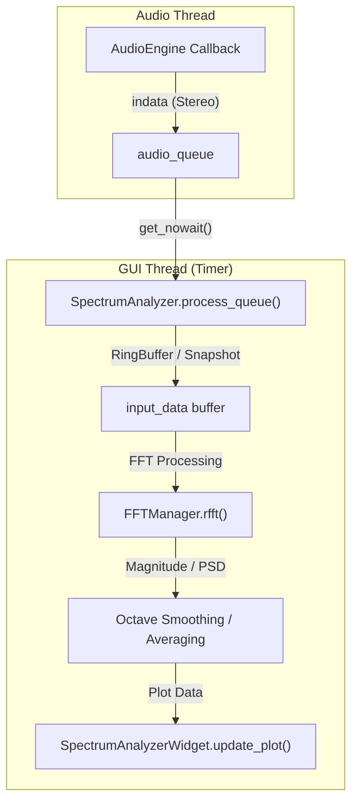
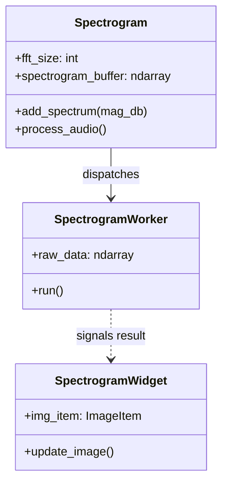

# Spectrum and Time-Domain Analyzers

Relevant source files

The following files were used as context for generating this wiki page:

- [docs/widgets/distortion_analyzer.en.md](../../docs/widgets/distortion_analyzer.en.md)
- [docs/widgets/distortion_analyzer.md](../../docs/widgets/distortion_analyzer.md)
- [docs/widgets/lockin_harmonic_analyzer.en.md](../../docs/widgets/lockin_harmonic_analyzer.en.md)
- [docs/widgets/lockin_harmonic_analyzer.md](../../docs/widgets/lockin_harmonic_analyzer.md)
- [docs/widgets/network_analyzer.en.md](../../docs/widgets/network_analyzer.en.md)
- [docs/widgets/network_analyzer.md](../../docs/widgets/network_analyzer.md)
- [docs/widgets/oscilloscope.en.md](../../docs/widgets/oscilloscope.en.md)
- [docs/widgets/oscilloscope.md](../../docs/widgets/oscilloscope.md)
- [docs/widgets/signal_generator.en.md](../../docs/widgets/signal_generator.en.md)
- [docs/widgets/signal_generator.md](../../docs/widgets/signal_generator.md)
- [docs/widgets/spectrogram.en.md](../../docs/widgets/spectrogram.en.md)
- [docs/widgets/spectrogram.md](../../docs/widgets/spectrogram.md)
- [docs/widgets/spectrum_analyzer.en.md](../../docs/widgets/spectrum_analyzer.en.md)
- [docs/widgets/spectrum_analyzer.md](../../docs/widgets/spectrum_analyzer.md)
- [src/gui/widgets/goniometer.py](../../src/gui/widgets/goniometer.py)
- [src/gui/widgets/oscilloscope.py](../../src/gui/widgets/oscilloscope.py)
- [src/gui/widgets/spectrogram.py](../../src/gui/widgets/spectrogram.py)
- [src/gui/widgets/spectrum_analyzer.py](../../src/gui/widgets/spectrum_analyzer.py)
- [src/gui/widgets/transient_analyzer.py](../../src/gui/widgets/transient_analyzer.py)
- [tests/logic_verification/generators/test_signal_generator_logic.py](../../tests/logic_verification/generators/test_signal_generator_logic.py)
- [tests/logic_verification/generators/test_signal_generator_update_bug.py](../../tests/logic_verification/generators/test_signal_generator_update_bug.py)
- [tests/logic_verification/gui/test_transient_ringing_analysis.py](../../tests/logic_verification/gui/test_transient_ringing_analysis.py)
- [tests/logic_verification/instruments/test_oscilloscope_logic.py](../../tests/logic_verification/instruments/test_oscilloscope_logic.py)
- [tests/logic_verification/instruments/test_spectrum_analyzer_refactor.py](../../tests/logic_verification/instruments/test_spectrum_analyzer_refactor.py)

This page covers the implementation and data flow of the real-time analysis widgets in MeasureLab, focusing on frequency-domain (Spectrum, Spectrogram) and time-domain (Oscilloscope, Transient Analyzer, Goniometer) visualization tools.

## Spectrum Analyzer

The `SpectrumAnalyzer` module provides real-time frequency analysis using Fast Fourier Transforms (FFT). It supports various estimation modes including Power Spectral Density (PSD) and cross-spectrum analysis.

### Technical Implementation
The analyzer utilizes a dual-mode buffering strategy based on the FFT size `src/gui/widgets/spectrum_analyzer.py:34-36`.
- **Rolling Mode**: For standard buffer sizes, it uses a high-performance ring buffer to maintain a continuous display `src/gui/widgets/spectrum_analyzer.py:154-173`.
- **Snapshot Mode**: When `buffer_size` exceeds `LARGE_BUFFER_THRESHOLD` (600,000 samples), the system switches to a linear capture mode to ensure phase coherency for ultra-high resolution FFTs `src/gui/widgets/spectrum_analyzer.py:138-152`.

### Signal Processing Chain
1. **Windowing**: Applies Hanning, Hamming, or Blackman windows via `get_cached_window` `src/gui/widgets/spectrum_analyzer.py:20`.
2. **FFT Execution**: Offloads transforms to the `FFTManager`, which utilizes `pyfftw` for optimized execution `src/core/fft_manager.py:22`.
3. **Multitaper Estimation**: Optionally uses Discrete Prolate Spheroidal Sequences (DPSS) to reduce variance in noise floor estimation `src/gui/widgets/spectrum_analyzer.py:55`.
4. **Smoothing**: Implements fractional-octave smoothing (1/3, 1/6, etc.) using a cached frequency-bin mapping `src/gui/widgets/spectrum_analyzer.py:66-69`.

### Data Flow Diagram
The following diagram illustrates the flow from the `AudioEngine` callback to the `SpectrumAnalyzerWidget`.

**Spectrum Analysis Data Flow**

**Sources:** `src/gui/widgets/spectrum_analyzer.py:114-130`, `src/gui/widgets/spectrum_analyzer.py:131-174`.

---

## Spectrogram

The `Spectrogram` module visualizes frequency components over time (waterfall display). It uses a dedicated worker thread to prevent UI blocking during heavy FFT computations.

### Implementation Details
- **Worker Pattern**: Uses `SpectrogramWorker` (inheriting `QRunnable`) to perform FFT, magnitude calculation, and dB conversion in the background `src/gui/widgets/spectrogram.py:33-41`.
- **In-place Optimization**: To minimize memory bandwidth, dB conversion and normalization are performed using in-place NumPy operations `src/gui/widgets/spectrogram.py:64-73`.
- **Variable Speed**: Supports "Meteor" and "Slow" modes. In these modes, the system uses a "Max Hold" mechanism to ensure transient peaks are not lost during downsampling `docs/widgets/spectrogram.en.md:71`.

**Spectrogram Class Structure**

**Sources:** `src/gui/widgets/spectrogram.py:29-77`, `src/gui/widgets/spectrogram.py:78-108`.

---

## Oscilloscope and Time-Domain Tools

### Oscilloscope
The `Oscilloscope` provides a real-time waveform monitor with advanced triggering and persistence modes.
- **Triggering**: Implements "Auto", "Normal", and "Single" modes with adjustable slope and level `src/gui/widgets/oscilloscope.py:69-71`.
- **Persistence**: Uses an optimized histogram accumulation method (`_accumulate_heatmap`) to render phosphor-like decay effects `src/gui/widgets/oscilloscope.py:117-151`.
- **Performance**: Utilizes a `RingBuffer` instead of a standard queue to avoid memory allocation in the audio callback `src/gui/widgets/oscilloscope.py:101-104`.

### Goniometer (Stereo Phase)
The `Goniometer` visualizes the phase relationship between two channels (Lissajous patterns).
- **Processing**: Captures stereo pairs and plots them as (L-R, L+R) coordinates to represent the stereo field `src/gui/widgets/goniometer.py`.
- **Persistence**: Similar to the Oscilloscope, it uses a decay buffer to maintain trace visibility over time.

### Transient Analyzer
The `TransientAnalyzer` is specialized for observing impulse responses and ringing.
- **Ringing Analysis**: Detects pre-ringing and post-ringing artifacts in digital filters `tests/logic_verification/gui/test_transient_ringing_analysis.py`.
- **Windowing**: Allows gating of transients to isolate specific reflections or filter taps.

---

## Technical Summary Table

| Feature | Entity Name | Implementation Detail |
| :--- | :--- | :--- |
| **FFT Engine** | `FFTManager` | Uses `pyfftw` with plan caching |
| **Buffering** | `RingBuffer` | Lock-free thread-safe circular buffer |
| **Spectrum Modes** | `SpectrumAnalyzer` | Magnitude, PSD, Cross-Spectrum |
| **Triggering** | `Oscilloscope` | Software-based zero-crossing/level detection |
| **Smoothing** | `SpectrumAnalyzer` | Fractional-octave (1/1 to 1/96) |
| **Persistence** | `_accumulate_heatmap` | 2D histogram accumulation for heatmaps |

**Sources:** `src/gui/widgets/spectrum_analyzer.py:34-71`, `src/gui/widgets/oscilloscope.py:49-106`, `src/core/fft_manager.py:1-25`.

---
