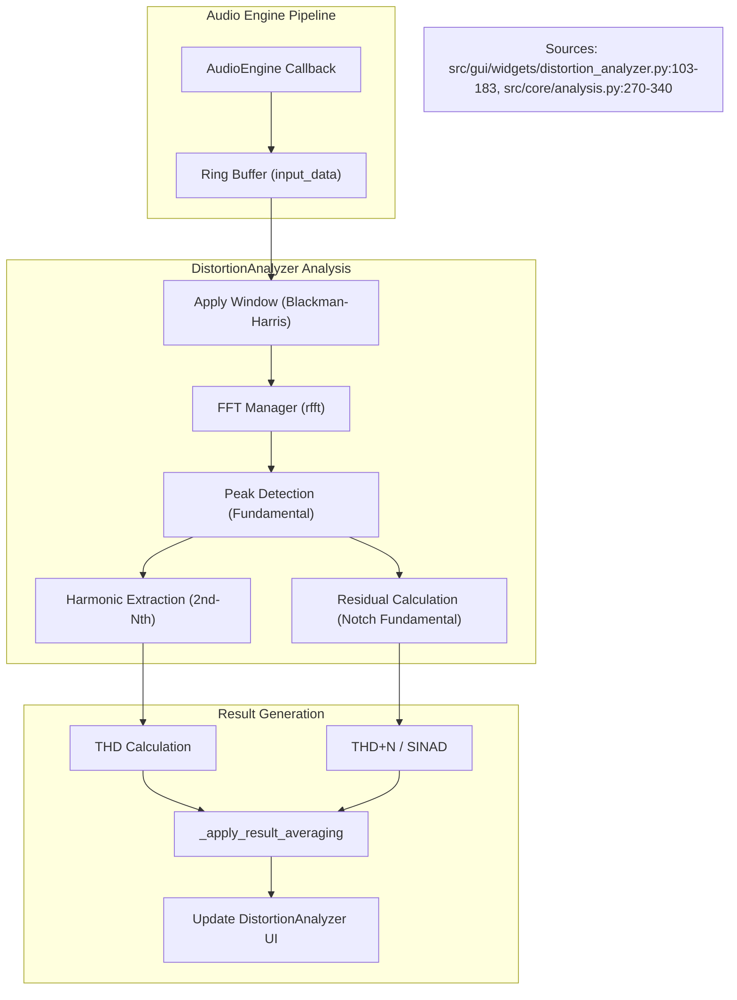
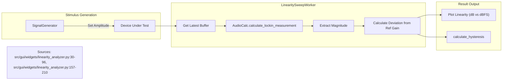

# Distortion and Linearity Analyzers

Relevant source files

The following files were used as context for generating this wiki page:

- [.agent/skills/ci_prechecker/SKILL.md](../../.agent/skills/ci_prechecker/SKILL.md)
- [docs/measurement_recipes/distortion_measurement.en.md](../../docs/measurement_recipes/distortion_measurement.en.md)
- [docs/measurement_recipes/distortion_measurement.md](../../docs/measurement_recipes/distortion_measurement.md)
- [docs/measurement_recipes/lockin_amplifier.en.md](../../docs/measurement_recipes/lockin_amplifier.en.md)
- [docs/measurement_recipes/lockin_amplifier.md](../../docs/measurement_recipes/lockin_amplifier.md)
- [docs/widgets/advanced_distortion_meter.en.md](../../docs/widgets/advanced_distortion_meter.en.md)
- [docs/widgets/advanced_distortion_meter.md](../../docs/widgets/advanced_distortion_meter.md)
- [docs/widgets/boxcar_averager.en.md](../../docs/widgets/boxcar_averager.en.md)
- [docs/widgets/boxcar_averager.md](../../docs/widgets/boxcar_averager.md)
- [docs/widgets/distortion_analyzer.en.md](../../docs/widgets/distortion_analyzer.en.md)
- [docs/widgets/distortion_analyzer.md](../../docs/widgets/distortion_analyzer.md)
- [docs/widgets/oscilloscope.en.md](../../docs/widgets/oscilloscope.en.md)
- [docs/widgets/oscilloscope.md](../../docs/widgets/oscilloscope.md)
- [docs/widgets/signal_generator.en.md](../../docs/widgets/signal_generator.en.md)
- [docs/widgets/signal_generator.md](../../docs/widgets/signal_generator.md)
- [src/core/analysis.py](../../src/core/analysis.py)
- [src/gui/widgets/advanced_distortion_meter.py](../../src/gui/widgets/advanced_distortion_meter.py)
- [src/gui/widgets/distortion_analyzer.py](../../src/gui/widgets/distortion_analyzer.py)
- [src/gui/widgets/frequency_counter.py](../../src/gui/widgets/frequency_counter.py)
- [src/gui/widgets/hrtf_player.py](../../src/gui/widgets/hrtf_player.py)
- [src/gui/widgets/impedance_analyzer.py](../../src/gui/widgets/impedance_analyzer.py)
- [src/gui/widgets/linearity_analyzer.py](../../src/gui/widgets/linearity_analyzer.py)
- [src/gui/widgets/lock_in_amplifier.py](../../src/gui/widgets/lock_in_amplifier.py)
- [src/gui/widgets/noise_profiler.py](../../src/gui/widgets/noise_profiler.py)
- [src/gui/widgets/one_pps_monitor.py](../../src/gui/widgets/one_pps_monitor.py)
- [tests/logic_verification/analysis/test_c_weighting_design.py](../../tests/logic_verification/analysis/test_c_weighting_design.py)
- [tests/logic_verification/analysis/test_imd.py](../../tests/logic_verification/analysis/test_imd.py)
- [tests/logic_verification/gui/widgets/test_impedance_analyzer.py](../../tests/logic_verification/gui/widgets/test_impedance_analyzer.py)
- [tests/logic_verification/gui/widgets/test_spatial_binaural_mixer.py](../../tests/logic_verification/gui/widgets/test_spatial_binaural_mixer.py)
- [tests/logic_verification/instruments/test_linearity_analyzer_logic.py](../../tests/logic_verification/instruments/test_linearity_analyzer_logic.py)
- [tests/logic_verification/instruments/test_linearity_buffer_optimization.py](../../tests/logic_verification/instruments/test_linearity_buffer_optimization.py)

This section covers the modules and core algorithms used for quantifying non-ideal behavior in audio systems, ranging from standard harmonic distortion (THD) and intermodulation (IMD) to complex multitone analysis and amplitude-dependent gain linearity.

## Distortion Analyzer

The `Distortion Analyzer` is the primary tool for measuring fundamental audio performance metrics including THD, THD+N, SINAD, and IMD. It supports real-time monitoring as well as automated frequency and amplitude sweeps.

### Core Analysis Logic
The analyzer relies on `AudioCalc.calculate_harmonic_distortion` to extract metrics from a captured time-domain buffer. The process follows these steps:
1.  **Fundamental Extraction**: Uses a high-precision sine fit or FFT bin peak detection to identify the fundamental frequency $f_0$.
2.  **Harmonic Analysis**: Measures the RMS levels of $2f_0, 3f_0, \dots, Nf_0$ `src/gui/widgets/distortion_analyzer.py:103-183`.
3.  **Residual Calculation**: Subtracts the fundamental from the signal to calculate the noise and distortion residue ($THD+N$) `src/core/analysis.py:270-340`.
4.  **Averaging**: Implements a moving average using raw RMS components (`raw_fund_rms`, `raw_res_rms`) rather than averaging the final percentage values to maintain mathematical accuracy during noise floor fluctuations `src/gui/widgets/distortion_analyzer.py:103-166`.

### Data Flow: Real-time Distortion Analysis
The following diagram illustrates the data flow from the `AudioEngine` through the analysis pipeline.

**Distortion Analysis Pipeline**

Sources: `src/gui/widgets/distortion_analyzer.py:103-183`, `src/core/analysis.py:270-340`

---

## Advanced Distortion Meter

The `Advanced Distortion Meter` handles complex stimulus signals that reveal nonlinearities not easily captured by single-tone tests.

### Supported Modes
*   **MIM (Multitone Intermodulation)**: Generates a "comb" of $N$ sine waves (typically 31 tones from 20Hz to 20kHz) with phases optimized to minimize the crest factor using Newman phases `src/gui/widgets/advanced_distortion_meter.py:57-61`. It measures the "grass" between tones to determine the Total Distortion Power.
*   **PIM (Phase Intermodulation)**: Uses two closely spaced high-frequency tones to measure sideband generation caused by phase/frequency modulation in the DUT `src/gui/widgets/advanced_distortion_meter.py:63-68`.
*   **J-Test**: A specific stimulus for measuring jitter-induced distortion in digital interfaces, particularly AES3 and S/PDIF `src/gui/widgets/advanced_distortion_meter.py:70-71`.

### Coherent Stimulus Generation
To prevent spectral leakage without requiring aggressive windowing, the `AdvancedDistortionMeter` uses **Coherent Multitone Generation**. Frequencies are snapped to exact FFT bin centers:
$f_{bin} = \text{round}\left(\frac{f_{target}}{\Delta f}\right) \cdot \Delta f$
where $\Delta f = \frac{f_s}{N_{FFT}}$ `src/gui/widgets/advanced_distortion_meter.py:206-215`.

Sources: `src/gui/widgets/advanced_distortion_meter.py:37-77`, `src/gui/widgets/advanced_distortion_meter.py:206-230`

---

## Linearity Analyzer

The `Linearity Analyzer` measures gain stability relative to signal amplitude. This is critical for detecting compression, expansion, or crossover distortion in amplifiers and DACs.

### Implementation: LinearitySweepWorker
The measurement is performed by a dedicated `LinearitySweepWorker` thread:
1.  **Stimulus**: Steps the `SignalGenerator` amplitude through a range (e.g., 0 dBFS down to -120 dBFS) `src/gui/widgets/linearity_analyzer.py:119-138`.
2.  **Lock-in Detection**: Uses `AudioCalc.calculate_lockin_measurement` at each step to extract the magnitude of the test frequency with extremely high narrow-band rejection `src/gui/widgets/linearity_analyzer.py:196-198`.
3.  **Hysteresis Analysis**: If enabled, the worker performs a bi-directional sweep (Low $\to$ High $\to$ Low). The function `calculate_hysteresis` compares the gain at identical amplitude points to detect thermal or memory effects in the DUT `src/gui/widgets/linearity_analyzer.py:30-96`.

**Linearity Measurement Logic**

Sources: `src/gui/widgets/linearity_analyzer.py:30-96`, `src/gui/widgets/linearity_analyzer.py:99-210`

---

## Core Algorithms (`analysis.py`)

The `analysis.py` module provides the mathematical foundation for all distortion and linearity metrics.

### Weighting Filters
Weighting filters are implemented as **Second-Order Sections (SOS)** to ensure numerical stability at high sampling rates.
*   **A-Weighting**: Implemented based on IEC 61672:2003 poles and zeros `src/core/analysis.py:15-26`.
*   **Weighting Application**: The `_calculate_ra_raw` function computes the analog response curve, which is then mapped to the digital domain using the bilinear transform or frequency-domain multiplication for FFT-based analysis `src/core/analysis.py:45-55`.

### Precision Frequency Tracking
For modules like the `Frequency Counter` and `1PPS Monitor`, high-precision frequency estimation is required:
*   **Sine Fitting**: Uses a four-parameter sine fit (amplitude, frequency, phase, DC offset) to estimate the signal parameters beyond FFT bin resolution `src/core/analysis.py:343-410`.
*   **Online Regression**: The `OnePPSMonitor` uses an **Online Least Squares Regression** to track sample clock drift (PPM) over time without storing the entire history in memory `src/gui/widgets/one_pps_monitor.py:78-87`.

### Table: Key Analysis Functions
| Function | File | Description |
| :--- | :--- | :--- |
| `calculate_harmonic_distortion` | `analysis.py` | Extracts THD, THD+N, and individual harmonics. |
| `calculate_lockin_measurement` | `analysis.py` | Dual-phase demodulation for linearity and impedance. |
| `calculate_noise_profile` | `analysis.py` | Computes PSD, 1/f noise, and integrated noise floor. |
| `calculate_allan_deviation` | `frequency_analysis.py` | Statistical measure of frequency stability. |

Sources: `src/core/analysis.py:15-55`, `src/core/analysis.py:343-410`, `src/gui/widgets/one_pps_monitor.py:78-87`

---
