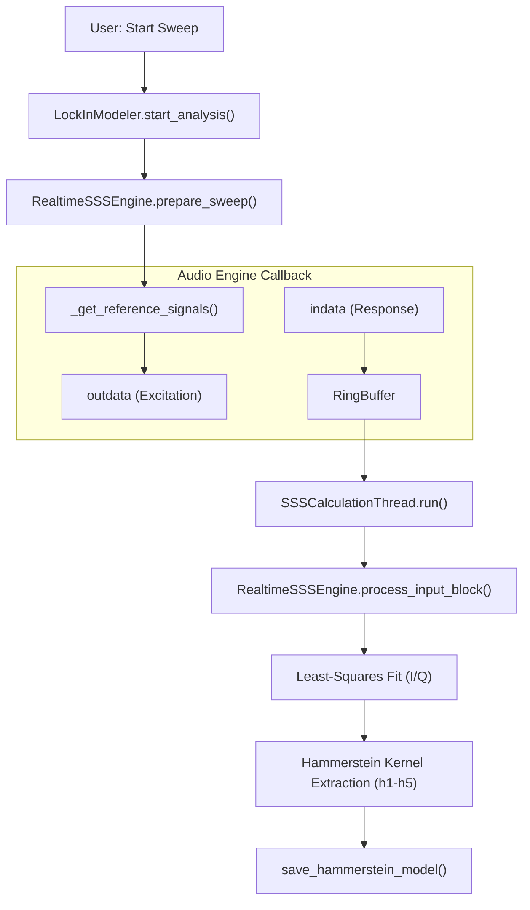

# Lock-in Suite

Relevant source files

The following files were used as context for generating this wiki page:

- [.agent/skills/ci_prechecker/SKILL.md](../../.agent/skills/ci_prechecker/SKILL.md)
- [docs/widgets/bnim_meter.en.md](../../docs/widgets/bnim_meter.en.md)
- [docs/widgets/bnim_meter.md](../../docs/widgets/bnim_meter.md)
- [docs/widgets/lock_in_amplifier.en.md](../../docs/widgets/lock_in_amplifier.en.md)
- [docs/widgets/lock_in_amplifier.md](../../docs/widgets/lock_in_amplifier.md)
- [docs/widgets/lock_in_modeler.en.md](../../docs/widgets/lock_in_modeler.en.md)
- [docs/widgets/lock_in_modeler.md](../../docs/widgets/lock_in_modeler.md)
- [docs/widgets/timecode_monitor.en.md](../../docs/widgets/timecode_monitor.en.md)
- [docs/widgets/timecode_monitor.md](../../docs/widgets/timecode_monitor.md)
- [src/core/analysis.py](../../src/core/analysis.py)
- [src/core/sonifier.py](../../src/core/sonifier.py)
- [src/gui/widgets/advanced_distortion_meter.py](../../src/gui/widgets/advanced_distortion_meter.py)
- [src/gui/widgets/arbitrary_harmonic_generator.py](../../src/gui/widgets/arbitrary_harmonic_generator.py)
- [src/gui/widgets/distortion_analyzer.py](../../src/gui/widgets/distortion_analyzer.py)
- [src/gui/widgets/frequency_counter.py](../../src/gui/widgets/frequency_counter.py)
- [src/gui/widgets/hrtf_player.py](../../src/gui/widgets/hrtf_player.py)
- [src/gui/widgets/lock_in_amplifier.py](../../src/gui/widgets/lock_in_amplifier.py)
- [src/gui/widgets/lock_in_frequency_counter.py](../../src/gui/widgets/lock_in_frequency_counter.py)
- [src/gui/widgets/lock_in_modeler.py](../../src/gui/widgets/lock_in_modeler.py)
- [src/gui/widgets/lockin_harmonic_analyzer.py](../../src/gui/widgets/lockin_harmonic_analyzer.py)
- [src/gui/widgets/lockin_spectrum_finder.py](../../src/gui/widgets/lockin_spectrum_finder.py)
- [src/gui/widgets/noise_profiler.py](../../src/gui/widgets/noise_profiler.py)
- [src/gui/widgets/one_pps_monitor.py](../../src/gui/widgets/one_pps_monitor.py)
- [src/gui/widgets/ultrasound_modulator.py](../../src/gui/widgets/ultrasound_modulator.py)
- [tests/logic_verification/analysis/test_c_weighting_design.py](../../tests/logic_verification/analysis/test_c_weighting_design.py)
- [tests/logic_verification/analysis/test_imd.py](../../tests/logic_verification/analysis/test_imd.py)
- [tests/logic_verification/core/test_sonifier.py](../../tests/logic_verification/core/test_sonifier.py)
- [tests/logic_verification/gui/widgets/test_arbitrary_harmonic_generator.py](../../tests/logic_verification/gui/widgets/test_arbitrary_harmonic_generator.py)
- [tests/logic_verification/gui/widgets/test_lock_in_modeler.py](../../tests/logic_verification/gui/widgets/test_lock_in_modeler.py)
- [tests/logic_verification/instruments/test_lockin_harmonic_analyzer.py](../../tests/logic_verification/instruments/test_lockin_harmonic_analyzer.py)
- [tests/logic_verification/instruments/test_lockin_spectrum_finder_sonification.py](../../tests/logic_verification/instruments/test_lockin_spectrum_finder_sonification.py)
- [tests/security/test_arbitrary_harmonic_generator_security.py](../../tests/security/test_arbitrary_harmonic_generator_security.py)

The Lock-in Suite provides a family of high-precision measurement tools based on synchronous demodulation and matrix projection. These modules allow for the extraction of extremely low-level signals buried in noise by leveraging a known reference frequency (either internally generated or externally tracked via hardware loopback).

## Lock-in Amplifier
The `LockInAmplifier` performs dual-phase demodulation to extract the magnitude and phase of a signal relative to a reference. Due to the lack of hardware-level clock synchronization in standard PC audio interfaces, this module typically requires a **hardware loopback** (reference channel) to maintain a stable phase relationship.

### Implementation Details
- **Dual-Phase Demodulation**: The input signal is multiplied by in-phase ($I$) and quadrature ($Q$) reference waves.
- **Post-mix LPF**: To achieve high dynamic reserve, the baseband result is passed through a cascade of up to 8 one-pole IIR sections `src/gui/widgets/lock_in_amplifier.py:79-82`.
- **Harmonic Ratios**: Supports arbitrary integer harmonic ratios ($N/D$) for the demodulation frequency `src/gui/widgets/lock_in_amplifier.py:94-118`.

### Data Flow
1. **Input Capture**: Signal and reference channels are captured into a ring buffer `src/gui/widgets/lock_in_amplifier.py:190-213`.
2. **Phase Tracking**: If in external mode, the reference channel is analyzed to track continuous phase `src/gui/widgets/lock_in_amplifier.py:175-175`.
3. **Complex Baseband**: Multiplication by $e^{-j\omega t}$ followed by IIR filtering `src/gui/widgets/lock_in_amplifier.py:80-86`.

**Sources:** `src/gui/widgets/lock_in_amplifier.py:40-180`, `tech_docs/implementation/lock_in_amplifier.md` (referenced).

---

## Lock-in Harmonic Analyzer
The `LockInHarmonicAnalyzer` provides ultra-precision Total Harmonic Distortion (THD) measurement. Unlike FFT-based analyzers, it uses parallel reference-locked matrix projection to extract up to 200 harmonics simultaneously.

### Key Features
- **Matrix Projection**: Projects the input signal onto a basis of sine/cosine pairs for each harmonic order `src/gui/widgets/lock_in_harmonic_analyzer.py:120-123`.
- **Distortion Compensation**: Features an iterative calibration system that generates anti-phase harmonics to cancel generator-side non-linearity `src/gui/widgets/lock_in_harmonic_analyzer.py:83-94`.
- **High Order**: Supports analysis up to the 200th harmonic `src/gui/widgets/lock_in_harmonic_analyzer.py:35-35`.

**Sources:** `src/gui/widgets/lock_in_harmonic_analyzer.py:40-95`

---

## Lock-in Frequency Counter
The `LockInFrequencyCounter` measures precision frequency and phase drift. It uses a Phase-Locked Loop (PLL) style architecture with a PID controller to track an incoming signal.

### Technical Components
- **PID Controller**: Adjusts the Numerically Controlled Oscillator (NCO) to minimize the phase error `src/gui/widgets/lock_in_frequency_counter.py:33-62`.
- **Kalman Filter**: A 1D Kalman filter smooths the frequency estimates, providing an uncertainty metric ($P$ covariance) `src/gui/widgets/lock_in_frequency_counter.py:65-102`.
- **Stability Metrics**: Calculates Allan Deviation and distribution statistics for long-term stability analysis `src/gui/widgets/lock_in_frequency_counter.py:175-181`.

**Sources:** `src/gui/widgets/lock_in_frequency_counter.py:108-209`

---

## Lock-in Spectrum Finder
The `LockInSpectrumFinder` is designed for identifying periodic interference (e.g., mains hum, SMPS noise, USB frame noise).

### Implementation
- **Matrix Projection**: Instead of a full FFT, it projects data onto specific target frequencies defined in a target dictionary `src/gui/widgets/lockin_spectrum_finder.py:68-104`.
- **Scan Targets**: Includes presets for mains harmonics, musical scales (12TET, 24TET, Just Intonation), and common switching power supply frequencies `src/gui/widgets/lockin_spectrum_finder.py:106-218`.
- **Sonification**: Uses the `Sonifier` class to map detected spectral components into the audible range for "listening" to electromagnetic interference `src/gui/widgets/lockin_spectrum_finder.py:37-38`.

**Sources:** `src/gui/widgets/lockin_spectrum_finder.py:57-220`

---

## Lock-in Modeler
The `LockInModeler` utilizes the Synchronized Swept Sine (SSS) method to identify system transfer functions and non-linear kernels.

### Architecture: Modeler to Core Engine
The Modeler widget acts as a frontend for the `RealtimeSSSEngine`, which handles the heavy DSP lifting in background threads.

| Logic Entity | Code Entity | Role |
| :--- | :--- | :--- |
| **Module Frontend** | `LockInModeler` | Manages UI state and audio callback registration `src/gui/widgets/lock_in_modeler.py:122` |
| **DSP Engine** | `RealtimeSSSEngine` | Implements SSS excitation and least-squares fitting `src/gui/widgets/lock_in_modeler.py:30` |
| **Worker Thread** | `SSSCalculationThread` | Prevents UI blocking during kernel extraction `src/gui/widgets/lock_in_modeler.py:64` |
| **Kernel Storage** | `HammersteinModel` | Saves extracted $h_1 \dots h_n$ kernels `src/gui/widgets/lock_in_modeler.py:31` |

### Workflow Diagram: SSS Kernel Extraction
This diagram illustrates how the system moves from "Natural Language" measurement goals to "Code Entity" execution.

Title: SSS Measurement Pipeline

**Sources:** `src/gui/widgets/lock_in_modeler.py:186-210`, `src/core/analysis.py:96-107`, `src/gui/widgets/lock_in_modeler.py:64-116`

---

## Technical Summary Table

| Module | Core Algorithm | Primary Use Case |
| :--- | :--- | :--- |
| **Amplifier** | Dual-phase I/Q Demodulation | Small signal recovery, phase measurement |
| **Harmonic Analyzer** | Parallel Matrix Projection | Ultra-low THD (< -120dB) verification |
| **Frequency Counter** | PID-tracked NCO + Kalman | Clock drift, Allan Deviation, jitter |
| **Spectrum Finder** | Target-based Projection | EMI/RFI identification, sonification |
| **Modeler** | Synchronized Swept Sine (SSS) | Non-linear system identification (Hammerstein) |

**Sources:** `src/gui/widgets/lock_in_amplifier.py`, `src/gui/widgets/lockin_harmonic_analyzer.py`, `src/gui/widgets/lock_in_frequency_counter.py`, `src/gui/widgets/lockin_spectrum_finder.py`, `src/gui/widgets/lock_in_modeler.py`

---
