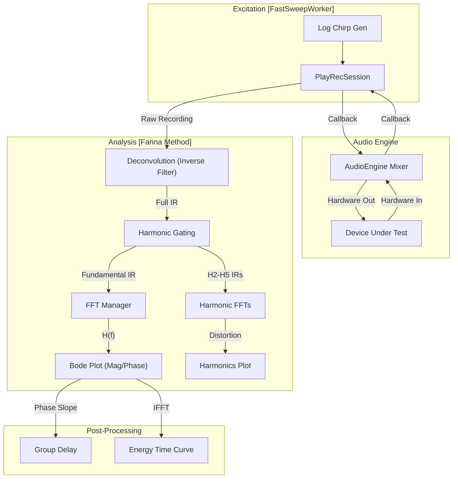
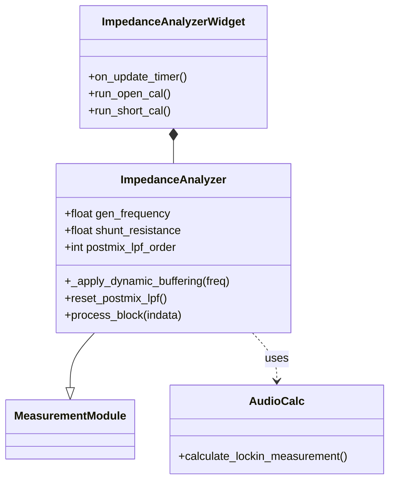

# Network and Impedance Analyzers

Relevant source files

The following files were used as context for generating this wiki page:

- [docs/widgets/impedance_analyzer.en.md](../../docs/widgets/impedance_analyzer.en.md)
- [docs/widgets/impedance_analyzer.md](../../docs/widgets/impedance_analyzer.md)
- [docs/widgets/network_analyzer.en.md](../../docs/widgets/network_analyzer.en.md)
- [docs/widgets/network_analyzer.md](../../docs/widgets/network_analyzer.md)
- [docs/widgets/spectrum_analyzer.en.md](../../docs/widgets/spectrum_analyzer.en.md)
- [docs/widgets/spectrum_analyzer.md](../../docs/widgets/spectrum_analyzer.md)
- [src/gui/widgets/impedance_analyzer.py](../../src/gui/widgets/impedance_analyzer.py)
- [src/gui/widgets/linearity_analyzer.py](../../src/gui/widgets/linearity_analyzer.py)
- [src/gui/widgets/network_analyzer.py](../../src/gui/widgets/network_analyzer.py)
- [tests/logic_verification/gui/test_network_analyzer.py](../../tests/logic_verification/gui/test_network_analyzer.py)
- [tests/logic_verification/gui/widgets/test_impedance_analyzer.py](../../tests/logic_verification/gui/widgets/test_impedance_analyzer.py)
- [tests/logic_verification/gui/widgets/test_spatial_binaural_mixer.py](../../tests/logic_verification/gui/widgets/test_spatial_binaural_mixer.py)
- [tests/logic_verification/instruments/test_linearity_analyzer_logic.py](../../tests/logic_verification/instruments/test_linearity_analyzer_logic.py)
- [tests/logic_verification/instruments/test_linearity_buffer_optimization.py](../../tests/logic_verification/instruments/test_linearity_buffer_optimization.py)

This section covers the implementation of the **Network Analyzer** (Frequency Response Analyzer) and the **Impedance Analyzer** (LCR Meter). These modules leverage high-precision DSP techniques including the Farina method for simultaneous harmonic extraction and dual-phase lock-in detection for complex impedance analysis.

## 1. Network Analyzer (FRA)

The Network Analyzer measures the Transfer Function $H(f)$ of a system, providing Magnitude, Phase, Group Delay, and Coherence. It primarily utilizes the **Fast Chirp** (Logarithmic Swept Sine) method.

### 1.1 Implementation Architecture
The `NetworkAnalyzer` class manages the measurement lifecycle, while `NetworkAnalyzerWidget` handles visualization. The system supports a specialized `XFER` (Transfer) mode where one channel acts as a reference to cancel out the audio interface's frequency response.

**Key Components:**
* **PlayRecSession**: A specialized audio callback handler that performs simultaneous playback of the excitation signal and recording of the response `src/gui/widgets/network_analyzer.py:62-74`.
* **FastSweepWorker**: A `QThread` that executes the measurement sequence, including signal generation, playback/record orchestration, and post-processing `src/gui/widgets/network_analyzer.py:143-159`.
* **Farina Method**: Used to extract the fundamental impulse response and harmonic distortion components (H2-H5) from a single exponential chirp `src/gui/widgets/network_analyzer.py:1001-1035`.

### 1.2 Data Flow and Signal Processing
The following diagram illustrates the measurement flow from chirp generation to the final Bode plot and harmonic extraction.

**Network Analyzer Data Flow**

*Sources: `src/gui/widgets/network_analyzer.py:143-159`, `src/gui/widgets/network_analyzer.py:62-132`, `src/gui/widgets/network_analyzer.py:1001-1035`*

### 1.3 Group Delay and Phase Slope
Group Delay $\tau_g$ is calculated as the negative derivative of the phase $\phi$ with respect to angular frequency $\omega$:
$$\tau_g(\omega) = -\frac{d\phi}{d\omega}$$
In the implementation, this is achieved by unwrapping the phase and calculating the slope between adjacent frequency bins `src/gui/widgets/network_analyzer.py:862-875`.

### 1.4 Coarse Delay Compensation
To ensure accurate phase measurements, the system provides "Auto (Align to Peak)" delay compensation. It identifies the primary peak in the Impulse Response (IR) and shifts the time-domain signal to $t=0$ before calculating the Transfer Function `src/gui/widgets/network_analyzer.py:1042-1055`.

---

## 2. Impedance Analyzer (LCR Meter)

The Impedance Analyzer calculates complex impedance $Z = R + jX$ using the I-V (Current-Voltage) method via a known shunt resistor.

### 2.1 Dual Lock-in Detection
The module uses two parallel lock-in detectors to extract the complex amplitudes of Voltage ($V_{meas}$) and Current ($I_{meas}$).
* **Voltage Channel**: Measures the potential across the Device Under Test (DUT).
* **Current Channel**: Measures the potential across a known shunt resistor ($R_{shunt}$) to derive $I = V_{shunt} / R_{shunt}$ `src/gui/widgets/impedance_analyzer.py:51-54`.

**Impedance Analyzer Class Structure**

*Sources: `src/gui/widgets/impedance_analyzer.py:44-104`, `src/core/analysis.py:22-30`*

### 2.2 Dynamic Buffering and Low-Frequency Precision
To maintain accuracy at low frequencies, the analyzer implements **Dynamic Buffering**. As the test frequency drops below a threshold (default 100 Hz), the internal buffer size is automatically increased to capture a minimum number of cycles (default 8 cycles) `src/gui/widgets/impedance_analyzer.py:134-152`.

| Parameter | Logic | Code Reference |
| :--- | :--- | :--- |
| **Buffer Multiplier** | `ceil((min_cycles * sr) / (freq * base_size))` | `src/gui/widgets/impedance_analyzer.py:148-151` |
| **Max Multiplier** | Capped at 16x (typically 262,144 samples) | `src/gui/widgets/impedance_analyzer.py:49` |
| **LPF Cascade** | 8-pole IIR cascade for complex baseband | `src/gui/widgets/impedance_analyzer.py:90-97` |

### 2.3 OSL Calibration (Open-Short-Load)
The analyzer supports OSL calibration to compensate for test lead impedance and parasitic capacitance:
1. **Open**: Compensates for parallel admittance ($Y_{open}$).
2. **Short**: Compensates for series impedance ($Z_{short}$).
3. **Load**: Uses a known standard to scale the magnitude accurately `src/gui/widgets/impedance_analyzer.py:65-70`.

The calibrated impedance $Z_{cal}$ is derived from the raw measurement $Z_{raw}$ using the standard formula:
$$Z_{cal} = Z_{load} \cdot \frac{(Z_{raw} - Z_{short})(Z_{open} - Z_{load})}{(Z_{open} - Z_{raw})(Z_{load} - Z_{short})}$$
*Sources: `src/gui/widgets/impedance_analyzer.py:65-71`, `docs/widgets/impedance_analyzer.en.md:68-75`*

### 2.4 Equivalent Circuits
The module calculates both Series and Parallel equivalent models:
* **Series**: $Z = R_s + j \omega L_s$ or $Z = R_s - j \frac{1}{\omega C_s}$
* **Parallel**: $Y = \frac{1}{R_p} + j \omega C_p$ or $Y = \frac{1}{R_p} - j \frac{1}{\omega L_p}$
The choice between models depends on the component's impedance magnitude (Series for low $Z$, Parallel for high $Z$) `docs/widgets/impedance_analyzer.en.md:103-115`.

---

## 3. Summary of Key Files

| File | Role |
| :--- | :--- |
| `src/gui/widgets/network_analyzer.py` | Core logic for Chirp sweeps, Farina IR extraction, and Bode plotting. |
| `src/gui/widgets/impedance_analyzer.py` | Implementation of I-V impedance measurement, OSL calibration, and dynamic buffering. |
| `src/core/analysis.py` | Contains `AudioCalc.calculate_lockin_measurement` used by the analyzers. |
| `tests/logic_verification/gui/test_network_analyzer.py` | Unit tests for smoothing, ETC calculation, and harmonic plotting. |
| `tests/logic_verification/gui/widgets/test_impedance_analyzer.py` | Verification of phase continuity and UI-to-module synchronization. |

*Sources: `src/gui/widgets/network_analyzer.py:1-46`, `src/gui/widgets/impedance_analyzer.py:1-41`, `tests/logic_verification/gui/test_network_analyzer.py:1-30`*

---
