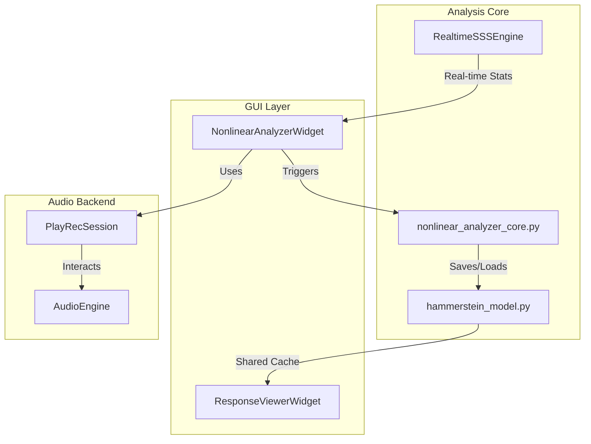
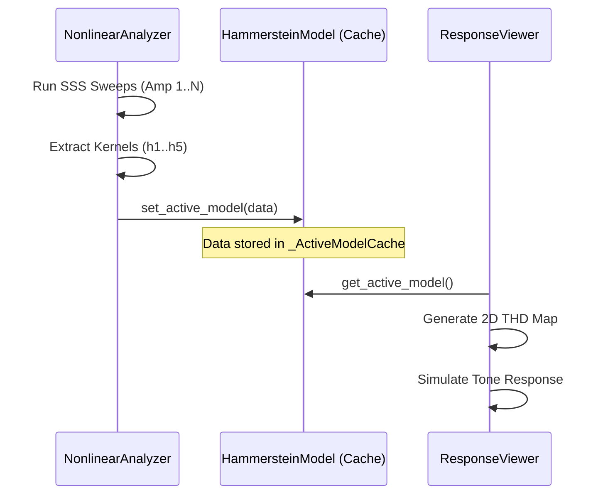

# Nonlinear System Identification

Relevant source files

The following files were used as context for generating this wiki page:

- [.gitignore](../../.gitignore)
- [.vscode/launch.json](../../.vscode/launch.json)
- [.vscode/tasks.json](../../.vscode/tasks.json)
- [.zed/settings.json](../../.zed/settings.json)
- [.zed/tasks.json](../../.zed/tasks.json)
- [docs/widgets/nonlinear_analyzer.en.md](../../docs/widgets/nonlinear_analyzer.en.md)
- [docs/widgets/nonlinear_analyzer.md](../../docs/widgets/nonlinear_analyzer.md)
- [docs/widgets/nonlinear_response_analyzer.en.md](../../docs/widgets/nonlinear_response_analyzer.en.md)
- [docs/widgets/nonlinear_response_analyzer.md](../../docs/widgets/nonlinear_response_analyzer.md)
- [docs/widgets/response_viewer.en.md](../../docs/widgets/response_viewer.en.md)
- [docs/widgets/response_viewer.md](../../docs/widgets/response_viewer.md)
- [docs/widgets/transmission_analyzer.en.md](../../docs/widgets/transmission_analyzer.en.md)
- [docs/widgets/transmission_analyzer.md](../../docs/widgets/transmission_analyzer.md)
- [scripts/optimize_hammerstein_real_device.py](../../scripts/optimize_hammerstein_real_device.py)
- [scripts/verify_lock_in_modeler_hammerstein_real_device.py](../../scripts/verify_lock_in_modeler_hammerstein_real_device.py)
- [scripts/verify_lockin_vs_nonlinear_real_device.py](../../scripts/verify_lockin_vs_nonlinear_real_device.py)
- [src/core/hammerstein_model.py](../../src/core/hammerstein_model.py)
- [src/core/nonlinear_analyzer_core.py](../../src/core/nonlinear_analyzer_core.py)
- [src/core/realtime_sss_core.py](../../src/core/realtime_sss_core.py)
- [src/gui/widgets/nonlinear_analyzer.py](../../src/gui/widgets/nonlinear_analyzer.py)
- [src/gui/widgets/response_viewer.py](../../src/gui/widgets/response_viewer.py)
- [tests/core/test_realtime_sss_core.py](../../tests/core/test_realtime_sss_core.py)
- [tests/logic_verification/core/test_hammerstein_model.py](../../tests/logic_verification/core/test_hammerstein_model.py)
- [tests/logic_verification/gui/test_nonlinear_analyzer_gui.py](../../tests/logic_verification/gui/test_nonlinear_analyzer_gui.py)
- [tests/logic_verification/measurement_modules/test_lockin_vs_nonlinear.py](../../tests/logic_verification/measurement_modules/test_lockin_vs_nonlinear.py)
- [tests/logic_verification/measurement_modules/test_nonlinear_analyzer.py](../../tests/logic_verification/measurement_modules/test_nonlinear_analyzer.py)

The Nonlinear System Identification module provides tools for characterizing nonlinearities in audio systems using the **Parallel Hammerstein Model (PHM)**. By utilizing **Synchronized Swept Sine (SSS)** excitation, the system extracts isolated kernels representing the linear fundamental response ($h_1$) and higher-order harmonic distortions ($h_2$ through $h_5$).

## Architecture and Data Flow

The identification process is split between high-precision offline analysis (for detailed modeling) and a real-time engine (for live monitoring).

### Nonlinear Analysis Pipeline
The identification follows a multi-step DSP pipeline:
1.  **Excitation Generation**: A phase-synchronized exponential sine sweep is generated according to Novak et al. (2015) constraints `src/core/nonlinear_analyzer_core.py:111-168`.
2.  **Synchronous Capture**: The signal is played and recorded across multiple amplitude steps (typically 5-10) `src/gui/widgets/nonlinear_analyzer.py:161-167`.
3.  **Clock Drift & Latency Compensation**: If input/output devices differ, the system performs sub-sample peak detection and windowed sinc resampling to correct for clock drift `src/core/nonlinear_analyzer_core.py:9-108`.
4.  **Deconvolution**: The recorded signal is deconvolved with the excitation signal in the frequency domain using Tikhonov regularization `src/core/nonlinear_analyzer_core.py:171-192`.
5.  **Kernel Extraction**: Harmonic responses are isolated and converted into Parallel Hammerstein kernels via Chebyshev inversion `src/core/nonlinear_analyzer_core.py:194-250`.

### Nonlinear Identification Logic
The following diagram illustrates the relationship between the GUI, the core analysis logic, and the real-time engine.

**System Identification Component Map**

Sources: `src/gui/widgets/nonlinear_analyzer.py:156-193`, `src/core/nonlinear_analyzer_core.py:1-6`, `src/core/realtime_sss_core.py:16-41`, `src/core/hammerstein_model.py:85-112`

---

## Core Components

### RealtimeSSSEngine
The `RealtimeSSSEngine` provides low-latency harmonic extraction. It uses a local least-squares (LS) extractor to estimate harmonic coefficients $h_1 \dots h_5$ block-by-block during a sweep `src/core/realtime_sss_core.py:16-31`.

| Feature | Implementation Detail |
| :--- | :--- |
| **Phase Trajectory** | Calculated using Novak's constraints for perfect phase sync `src/core/realtime_sss_core.py:73-109`. |
| **LS Extractor** | Fits complex harmonics to a sliding history of signal samples `src/core/realtime_sss_core.py:190-210`. |
| **Decimation** | Optimized by processing history in decimated chunks to save CPU `src/core/realtime_sss_core.py:220-250`. |

Sources: `src/core/realtime_sss_core.py:16-250`

### Parallel Hammerstein Model (PHM) Extraction
The `process_amplitude_responses` function is the primary entry point for extracting the full model. It takes responses at different amplitudes and solves the Chebyshev inversion matrix `src/core/nonlinear_analyzer_core.py:194-250`.

*   **Amplitude Steps**: Multiple sweeps at different levels allow the system to differentiate between power-series components (e.g., $x^2$ vs $x^4$) that both contribute to the 2nd harmonic `src/gui/widgets/nonlinear_analyzer.py:167`.
*   **Chebyshev Inversion**: This mathematical transform ensures that the extracted kernels $h_n$ are independent of amplitude, allowing for accurate simulation at any input level `src/core/nonlinear_analyzer_core.py:210-240`.

Sources: `src/core/nonlinear_analyzer_core.py:194-250`, `src/gui/widgets/nonlinear_analyzer.py:156-170`

---

## Visualization and Simulation

### Response Viewer
The `Response Viewer` module consumes the output of the Nonlinear Analyzer. It visualizes the 1D kernels and generates 2D "Distortion Maps" `src/gui/widgets/response_viewer.py:48-61`.

**Data Flow: Identification to Visualization**

Sources: `src/core/hammerstein_model.py:85-112`, `src/gui/widgets/response_viewer.py:119-122`

### 2D Harmonic Mapping
The `ResponseViewerWidget` can generate a 2D surface representing THD or specific harmonics ($h_2 \dots h_5$) across both frequency and amplitude axes `src/gui/widgets/response_viewer.py:152-185`. This is achieved by interpolating the complex kernels and calculating the predicted response for a virtual input signal `src/core/hammerstein_model.py:115-138`.

| Visualization Mode | Description |
| :--- | :--- |
| **Bode Magnitude** | Frequency response of individual kernels in dB `src/gui/widgets/nonlinear_analyzer.py:57-61`. |
| **Impulse Response** | Time-domain view of kernels $h_1 \dots h_5$ `src/gui/widgets/nonlinear_analyzer.py:66-69`. |
| **THD Map** | 2D color map of Total Harmonic Distortion vs. Frequency and Level `src/gui/widgets/response_viewer.py:157-160`. |

Sources: `src/gui/widgets/nonlinear_analyzer.py:53-70`, `src/gui/widgets/response_viewer.py:152-185`

---

## Technical Implementation Details

### Clock Drift Compensation
When the input and output clocks are not synchronized (e.g., two different USB devices), the sweep will "smear," causing phase errors. The system detects this by comparing the measured duration to the expected duration `src/core/nonlinear_analyzer_core.py:72-108`.
*   **Function**: `sinc_resample`
*   **Method**: Kaiser-windowed sinc interpolation applied in chunks to manage memory footprint `src/core/nonlinear_analyzer_core.py:81-102`.

### Sub-sample Alignment
To ensure accurate phase for high-order harmonics, the impulse response peak must be found with precision higher than one sample `src/core/nonlinear_analyzer_core.py:9-56`.
*   **Function**: `find_subsample_peak`
*   **Method**: Performs 100x FFT-based upsampling around the integer peak to find the true fractional maximum `src/core/nonlinear_analyzer_core.py:37-50`.

Sources: `src/core/nonlinear_analyzer_core.py:9-108`

---
