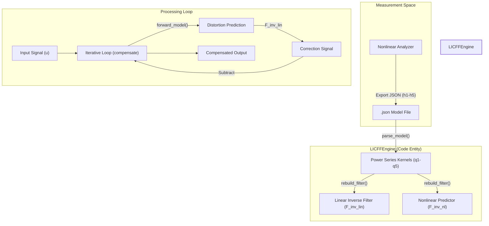
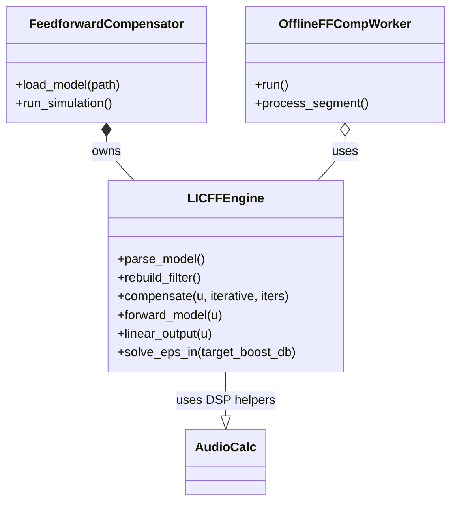

# Feedforward Compensator

Relevant source files

The following files were used as context for generating this wiki page:

- [.gitignore](../../.gitignore)
- [docs/calibration.en.md](../../docs/calibration.en.md)
- [docs/calibration.md](../../docs/calibration.md)
- [docs/measurement_recipes/noise_measurement.en.md](../../docs/measurement_recipes/noise_measurement.en.md)
- [docs/measurement_recipes/noise_measurement.md](../../docs/measurement_recipes/noise_measurement.md)
- [docs/widgets/feedforward_compensator.en.md](../../docs/widgets/feedforward_compensator.en.md)
- [docs/widgets/feedforward_compensator.md](../../docs/widgets/feedforward_compensator.md)
- [scripts/optimize_hammerstein_real_device.py](../../scripts/optimize_hammerstein_real_device.py)
- [scripts/verify_lock_in_modeler_hammerstein_real_device.py](../../scripts/verify_lock_in_modeler_hammerstein_real_device.py)
- [src/core/hammerstein_model.py](../../src/core/hammerstein_model.py)
- [src/gui/widgets/feedforward_compensator.py](../../src/gui/widgets/feedforward_compensator.py)
- [tests/logic_verification/core/test_hammerstein_model.py](../../tests/logic_verification/core/test_hammerstein_model.py)
- [tests/logic_verification/gui/widgets/test_feedforward_compensator.py](../../tests/logic_verification/gui/widgets/test_feedforward_compensator.py)

The **Feedforward Compensator** is a high-performance signal processing module designed to apply real-time or offline nonlinear distortion compensation to audio signals. It utilizes a **Parallel Hammerstein Model** (consisting of 1st to 5th order impulse response kernels) to generate an inverse-distorted signal that actively cancels the physical distortion produced by audio hardware `docs/widgets/feedforward_compensator.en.md:3-7`.

## Iterative LICFF Algorithm

The module implements the **Linear-Inverse Compensated Feedforward (LICFF)** algorithm. This method assumes the system under test follows a Hammerstein structure, where a static nonlinearity is followed by a linear filter `docs/widgets/feedforward_compensator.en.md:11-13`.

### 1. Linear Inverse Filter Design
The frequency response of the 1st-order (linear) kernel $h_1$ is denoted as $Q_1(f)$. The linear inverse response $F_{inv}(f)$ is calculated using Tikhonov regularization to prevent extreme amplification in stopbands `docs/widgets/feedforward_compensator.en.md:15-22`:

$$F_{inv}(f) = \frac{Q_1^*(f)}{|Q_1(f)|^2 + \epsilon_f} \cdot bp\_filter(f)$$

*   **Regularization ($\epsilon_f$):** A frequency-dependent parameter. It is kept small ($\epsilon_{in} \approx 10^{-6}$) within the active band and large ($\epsilon_{out} \approx 0.5$) outside `docs/widgets/feedforward_compensator.en.md:26`.
*   **Bandpass Filter ($bp\_filter$):** Applies a smooth cosine roll-off outside the user-defined $f_{min}$ and $f_{max}$ to protect the system from subsonic and ultrasonic noise `docs/widgets/feedforward_compensator.en.md:27`.

### 2. Iterative Distortion Cancellation
To compensate for nonlinearities, the engine performs the following steps `docs/widgets/feedforward_compensator.en.md:29-42`:
1.  **Baseline:** Initialize $u_{comp}^{(0)}$ by band-limiting the input signal.
2.  **Prediction:** Predict the distortion spectrum $Y_{nl}(f)$ by running the current compensated signal through the 2nd–5th order Hammerstein kernels.
3.  **Subtraction:** Apply the linear inverse filter to the predicted distortion and subtract it from the input side:
    $$u_{comp}^{(k+1)} = u_{comp}^{(0)} - \text{IFFT}(Y_{nl}(f) \cdot F_{inv}(f))$$
4.  **Convergence:** Repeat for a specified number of iterations (typically 3–5).

Sources: `src/gui/widgets/feedforward_compensator.py:36-52`, `docs/widgets/feedforward_compensator.en.md:11-43`

## System Architecture

The compensation logic is split between the `LICFFEngine` (mathematical core) and the `FeedforwardCompensator` (GUI and management).

### Logic and Data Flow
The following diagram illustrates how a Hammerstein model flows from measurement to the compensation engine.

**Hammerstein Model Integration**

Sources: `src/gui/widgets/feedforward_compensator.py:36-134`, `src/gui/widgets/feedforward_compensator.py:331-364`

## Key Implementation Details

### Kernel Mapping and Thresholding
The `LICFFEngine` maps measured Hammerstein kernels ($h_1 \dots h_5$) directly to power-series coefficients ($q_1 \dots q_5$) `src/gui/widgets/feedforward_compensator.py:98-104`. It includes a `threshold_db` feature to zero out high-order kernels that fall below the noise floor relative to the linear peak `src/gui/widgets/feedforward_compensator.py:107-121`.

### Instability Detection
During iterative compensation, the engine monitors the signal for "runaway" oscillations. If the amplitude exceeds a safety limit (e.g., 5.0 FS), the `LICFFEngine` can abort the process to prevent hardware damage or software crashes `src/gui/widgets/feedforward_compensator.py:350-360`.

### Out-of-Band Handling Modes
The module supports three modes for handling frequencies outside the active band ($f_{min} \sim f_{max}$) `src/gui/widgets/feedforward_compensator.py:59`:
*   **Cut:** Frequencies outside the band are completely attenuated.
*   **Bypass (Pure):** Original signal is passed through without any filtering.
*   **Bypass (Aligned):** Original signal is passed through but delayed to match the group delay of the inverse filter, preventing phase misalignment at the crossover `docs/widgets/feedforward_compensator.en.md:62`.

### Offline Processing
The `OfflineFFCompWorker` handles batch processing of `.wav` files `src/gui/widgets/feedforward_compensator.py:700-705`. It utilizes a segmented approach with overlapping blocks to prevent boundary artifacts (spectral leakage) during the IFFT/FFT cycles `docs/widgets/feedforward_compensator.md:122`.

Sources: `src/gui/widgets/feedforward_compensator.py:36-150`, `src/gui/widgets/feedforward_compensator.py:700-750`

## Code Entity Map

The following diagram maps natural language compensation concepts to specific classes and methods in the codebase.

**Compensation Entity Mapping**

Sources: `src/gui/widgets/feedforward_compensator.py:36-40`, `src/gui/widgets/feedforward_compensator.py:700-710`, `src/gui/widgets/feedforward_compensator.py:850-860`

## User Controls and Simulation

The module provides extensive simulation tools before applying compensation to live hardware:
*   **Simulation Tab:** Displays the predicted THD reduction for various test signals (1kHz, Multi-tone, etc.) `docs/widgets/feedforward_compensator.en.md:71-83`.
*   **Transient Simulation:** Visualizes the step and impulse response to check for Gibbs ringing caused by the active band filter `docs/widgets/feedforward_compensator.en.md:90-101`.
*   **Linear Response Tab:** Shows the magnitude and phase of the designed inverse filter. Phase rotation is automatically corrected to the $h_1$ peak position to make physical phase changes easier to observe `docs/widgets/feedforward_compensator.md:112`.

Sources: `src/gui/widgets/feedforward_compensator.py:900-1100`, `docs/widgets/feedforward_compensator.en.md:71-112`

---
