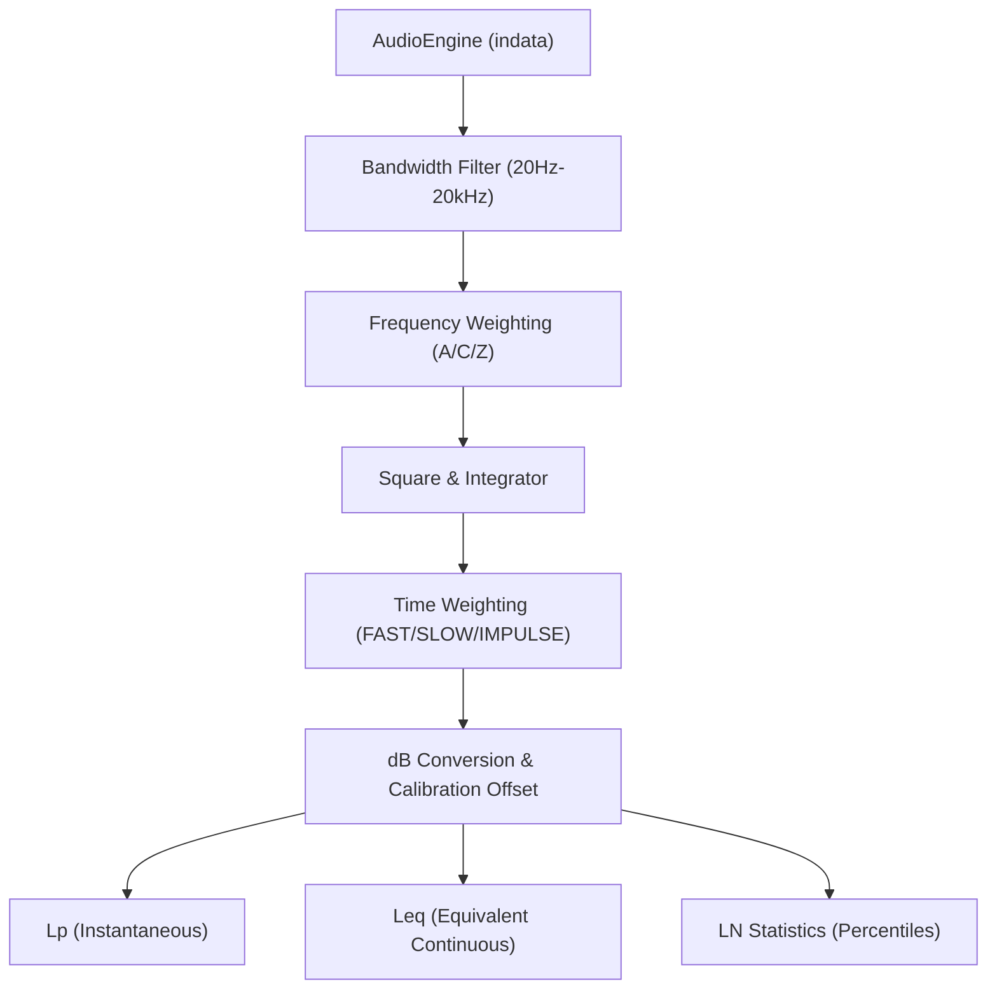
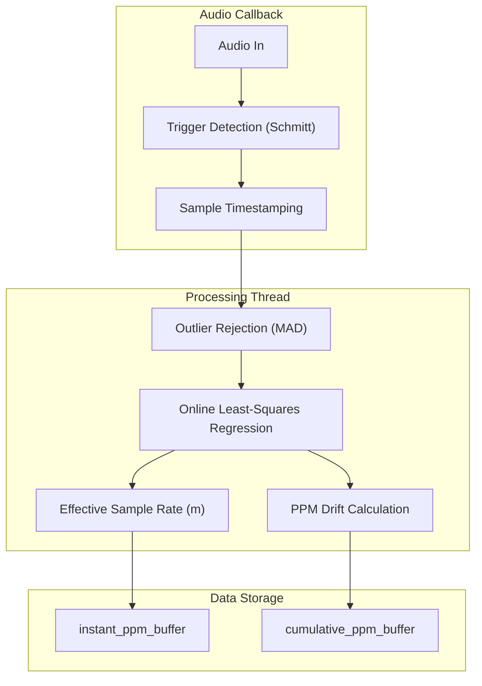

# Acoustic and Loudness Meters

Relevant source files

The following files were used as context for generating this wiki page:

- [.agent/skills/ci_prechecker/SKILL.md](../../.agent/skills/ci_prechecker/SKILL.md)
- [docs/widgets/frequency_counter.en.md](../../docs/widgets/frequency_counter.en.md)
- [docs/widgets/frequency_counter.md](../../docs/widgets/frequency_counter.md)
- [docs/widgets/goniometer.en.md](../../docs/widgets/goniometer.en.md)
- [docs/widgets/goniometer.md](../../docs/widgets/goniometer.md)
- [docs/widgets/lufs_meter.en.md](../../docs/widgets/lufs_meter.en.md)
- [docs/widgets/lufs_meter.md](../../docs/widgets/lufs_meter.md)
- [docs/widgets/noise_profiler.en.md](../../docs/widgets/noise_profiler.en.md)
- [docs/widgets/noise_profiler.md](../../docs/widgets/noise_profiler.md)
- [docs/widgets/one_pps_monitor.en.md](../../docs/widgets/one_pps_monitor.en.md)
- [docs/widgets/one_pps_monitor.md](../../docs/widgets/one_pps_monitor.md)
- [docs/widgets/raw_time_series.en.md](../../docs/widgets/raw_time_series.en.md)
- [docs/widgets/raw_time_series.md](../../docs/widgets/raw_time_series.md)
- [docs/widgets/sound_level_meter.en.md](../../docs/widgets/sound_level_meter.en.md)
- [docs/widgets/sound_level_meter.md](../../docs/widgets/sound_level_meter.md)
- [src/core/analysis.py](../../src/core/analysis.py)
- [src/gui/widgets/advanced_distortion_meter.py](../../src/gui/widgets/advanced_distortion_meter.py)
- [src/gui/widgets/bnim_meter.py](../../src/gui/widgets/bnim_meter.py)
- [src/gui/widgets/detachable_wrapper.py](../../src/gui/widgets/detachable_wrapper.py)
- [src/gui/widgets/distortion_analyzer.py](../../src/gui/widgets/distortion_analyzer.py)
- [src/gui/widgets/frequency_counter.py](../../src/gui/widgets/frequency_counter.py)
- [src/gui/widgets/hrtf_player.py](../../src/gui/widgets/hrtf_player.py)
- [src/gui/widgets/lock_in_amplifier.py](../../src/gui/widgets/lock_in_amplifier.py)
- [src/gui/widgets/lufs_meter.py](../../src/gui/widgets/lufs_meter.py)
- [src/gui/widgets/noise_profiler.py](../../src/gui/widgets/noise_profiler.py)
- [src/gui/widgets/one_pps_monitor.py](../../src/gui/widgets/one_pps_monitor.py)
- [src/gui/widgets/raw_time_series.py](../../src/gui/widgets/raw_time_series.py)
- [src/gui/widgets/sound_level_meter.py](../../src/gui/widgets/sound_level_meter.py)
- [tests/logic_verification/analysis/test_c_weighting_design.py](../../tests/logic_verification/analysis/test_c_weighting_design.py)
- [tests/logic_verification/analysis/test_imd.py](../../tests/logic_verification/analysis/test_imd.py)
- [tests/logic_verification/gui/test_compact_modes.py](../../tests/logic_verification/gui/test_compact_modes.py)

This page details the implementation of MeasureLab's acoustic, loudness, and precision timing instruments. These modules provide real-time monitoring of Sound Pressure Level (SPL), EBU R128/ITU-R BS.1770 loudness, noise floor characterization, and high-precision frequency/clock stability analysis.

## 1. Sound Level Meter (SPL)

The `SoundLevelMeter` provides real-time SPL monitoring with standardized frequency and time weightings. It supports A, C, and Z (Linear) frequency weightings and FAST (125ms), SLOW (1s), and IMPULSE time constants.

### Technical Implementation
*   **Filtering Pipeline**: Input samples are processed through a cascaded IIR filter topology. A high-pass filter (20Hz) is always applied to remove DC and sub-sonics `src/gui/widgets/sound_level_meter.py:181-189`. Frequency weighting (A/C) is applied using SOS (Second-Order Section) filters designed via `AudioCalc` `src/gui/widgets/sound_level_meter.py:196-202`.
*   **Time Weighting**: Uses an exponential moving average (EMA) on the squared pressure values. The impulse weighting is unique, featuring a fast rise time (35ms) and a slow decay (1.5s) `src/gui/widgets/sound_level_meter.py:79-82`.
*   **LN Statistics**: Maintains a circular buffer of 0.1s samples to calculate percentile-based statistics (L5, L10, L50, L90, L95) `src/gui/widgets/sound_level_meter.py:53-59`.

### Sound Level Meter Data Flow

**Sources**: `src/gui/widgets/sound_level_meter.py:32-105`, `src/core/analysis.py:15-26`

---

## 2. LUFS Meter (BS.1770)

The `LufsMeter` implements the ITU-R BS.1770-4 standard for loudness measurement, providing Momentary (400ms), Short-term (3s), and Integrated loudness metrics.

### Key Components
*   **K-Weighting**: A two-stage filter consisting of a "Pre-filter" (high-frequency shelf) and a "RLB filter" (high-pass) `src/gui/widgets/lufs_meter.py:105-120`.
*   **Gated Integration**: The Integrated Loudness uses a dual-gate approach. An absolute gate at -70 LUFS is followed by a relative gate 10 dB below the ungated mean `src/gui/widgets/lufs_meter.py:75-76`.
*   **Loudness Range (LRA)**: Calculated using the 10th and 95th percentiles of gated 3-second blocks `src/gui/widgets/lufs_meter.py:171-186`.

**Sources**: `src/gui/widgets/lufs_meter.py:29-93`, `src/gui/widgets/lufs_meter.py:140-190`

---

## 3. Noise Profiler

The `NoiseProfiler` characterizes the noise floor of a system, calculating Power Spectral Density (PSD) and identifying noise types (e.g., 1/f pink noise vs. white noise).

### Implementation Details
*   **PSD Calculation**: Computes the magnitude spectrum in $V/\sqrt{Hz}$ using a Hanning window and appropriate scaling factors to ensure power conservation `src/gui/widgets/noise_profiler.py:113-127`.
*   **Averaging Modes**:
    *   **Exponential**: Fixed alpha smoothing for real-time responsiveness `src/gui/widgets/noise_profiler.py:84-88`.
    *   **Cumulative**: Linear average of $N$ spectra for high-precision stationary noise measurement `src/gui/widgets/noise_profiler.py:68-77`.
*   **LNA Compensation**: Allows users to input external LNA gain (dB) to refer noise measurements back to the DUT input `src/gui/widgets/noise_profiler.py:151-154`.

**Sources**: `src/gui/widgets/noise_profiler.py:32-91`, `src/gui/widgets/noise_profiler.py:111-166`

---

## 4. Frequency Counter and Allan Deviation

The `FrequencyCounter` provides sub-Hz precision frequency tracking and stability analysis.

### Algorithms
*   **Frequency Estimation**: Uses `calculate_frequency_metrics` from `core.frequency_analysis` to perform high-precision estimation (likely via zero-crossing interpolation or phase slope) `src/gui/widgets/frequency_counter.py:114-115`.
*   **Allan Deviation**: Measures frequency stability over time. A `QRunnable` worker (`AllanWorker`) computes the deviation across multiple observation intervals ($\tau$) `src/gui/widgets/frequency_counter.py:43-91`.
*   **Warmup Handling**: Discards the first few valid points to prevent transients (e.g., DC blocking filter settling) from polluting long-term statistics `src/gui/widgets/frequency_counter.py:139-140`.

**Sources**: `src/gui/widgets/frequency_counter.py:122-162`, `src/core/frequency_analysis.py:27-28`

---

## 5. 1PPS Monitor

The `OnePPSMonitor` is an experimental tool designed to measure the drift of an audio interface's sample clock relative to a 1PPS (Pulse Per Second) reference (e.g., from a GPSDO).

### Online Regression Engine
To estimate the sample rate with extreme precision, the module implements an online least-squares regression:
$$SampleIndex = m \cdot PulseCount + c$$
Where $m$ represents the actual sample rate.

*   **Trigger Logic**: Uses a Schmitt trigger (Threshold + Hysteresis) to detect pulse edges in the audio stream `src/gui/widgets/one_pps_monitor.py:44-45`.
*   **Robust Statistics**: Employs Median Absolute Deviation (MAD) for outlier rejection to ignore pulses corrupted by electrical noise `src/gui/widgets/one_pps_monitor.py:50-52`.
*   **Latency Compensation**: Can automatically subtract the hardware input latency reported by the `AudioEngine` `src/gui/widgets/one_pps_monitor.py:51-53`.

### Precision Monitoring Architecture

**Sources**: `src/gui/widgets/one_pps_monitor.py:30-101`, `src/gui/widgets/one_pps_monitor.py:113-174`, `docs/widgets/one_pps_monitor.md:7-22`

---

## Summary of Key Classes

| Class | File | Responsibility |
| :--- | :--- | :--- |
| `SoundLevelMeter` | `src/gui/widgets/sound_level_meter.py:32` | SPL, A/C weighting, FAST/SLOW integration. |
| `LufsMeter` | `src/gui/widgets/lufs_meter.py:29` | BS.1770-4 Loudness (M, S, I), LRA. |
| `NoiseProfiler` | `src/gui/widgets/noise_profiler.py:32` | PSD, noise floor characterization, LNA gain. |
| `FrequencyCounter` | `src/gui/widgets/frequency_counter.py:122` | Precision frequency tracking, Allan Deviation. |
| `OnePPSMonitor` | `src/gui/widgets/one_pps_monitor.py:30` | Clock drift measurement via 1PPS pulse timing. |

**Sources**: `src/gui/widgets/sound_level_meter.py`, `src/gui/widgets/lufs_meter.py`, `src/gui/widgets/noise_profiler.py`, `src/gui/widgets/frequency_counter.py`, `src/gui/widgets/one_pps_monitor.py`

---
