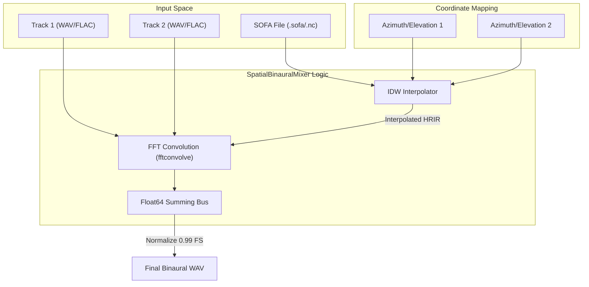
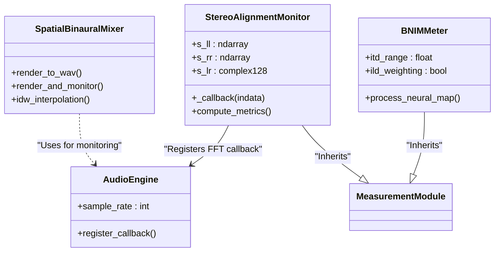

# Spatial Audio and Binaural Tools

Relevant source files

The following files were used as context for generating this wiki page:

- [docs/widgets/bnim_meter.en.md](../../docs/widgets/bnim_meter.en.md)
- [docs/widgets/bnim_meter.md](../../docs/widgets/bnim_meter.md)
- [docs/widgets/lock_in_amplifier.en.md](../../docs/widgets/lock_in_amplifier.en.md)
- [docs/widgets/lock_in_amplifier.md](../../docs/widgets/lock_in_amplifier.md)
- [docs/widgets/processor_benchmark.en.md](../../docs/widgets/processor_benchmark.en.md)
- [docs/widgets/processor_benchmark.md](../../docs/widgets/processor_benchmark.md)
- [docs/widgets/spatial_binaural_mixer.en.md](../../docs/widgets/spatial_binaural_mixer.en.md)
- [docs/widgets/spatial_binaural_mixer.md](../../docs/widgets/spatial_binaural_mixer.md)
- [docs/widgets/timecode_monitor.en.md](../../docs/widgets/timecode_monitor.en.md)
- [docs/widgets/timecode_monitor.md](../../docs/widgets/timecode_monitor.md)
- [src/gui/widgets/impedance_analyzer.py](../../src/gui/widgets/impedance_analyzer.py)
- [src/gui/widgets/linearity_analyzer.py](../../src/gui/widgets/linearity_analyzer.py)
- [src/gui/widgets/spatial_binaural_mixer.py](../../src/gui/widgets/spatial_binaural_mixer.py)
- [src/gui/widgets/stereo_alignment_monitor.py](../../src/gui/widgets/stereo_alignment_monitor.py)
- [tests/logic_verification/gui/widgets/test_impedance_analyzer.py](../../tests/logic_verification/gui/widgets/test_impedance_analyzer.py)
- [tests/logic_verification/gui/widgets/test_spatial_binaural_mixer.py](../../tests/logic_verification/gui/widgets/test_spatial_binaural_mixer.py)
- [tests/logic_verification/instruments/test_linearity_analyzer_logic.py](../../tests/logic_verification/instruments/test_linearity_analyzer_logic.py)
- [tests/logic_verification/instruments/test_linearity_buffer_optimization.py](../../tests/logic_verification/instruments/test_linearity_buffer_optimization.py)

This section covers the specialized modules in MeasureLab designed for 3D audio rendering, binaural perception visualization, and stereo field analysis. These tools leverage Head-Related Transfer Functions (HRTF), psychoacoustic models, and cross-correlation techniques to process or visualize spatial information.

## HRTF and Spatial Rendering Architecture

The spatial audio suite relies on the SOFA (Spatially Oriented Format for Acoustics) standard to define how sound interacts with human anatomy. The system implements high-precision interpolation and convolution to render point sources in a virtual 3D sphere.

### Spatial Binaural Mixer
The `SpatialBinauralMixer` is an offline rendering module specialized for multi-track stem processing `docs/widgets/spatial_binaural_mixer.md:5-7`. Unlike real-time engines that use block-based Overlap-Add (OLA) which can introduce windowing artifacts, this mixer performs full-track FFT convolution using `scipy.signal.fftconvolve` `docs/widgets/spatial_binaural_mixer.md:13-15`.

**Key Implementation Details:**
*   **IDW Interpolation:** Uses Inverse Distance Weighting to synthesize Head-Related Impulse Responses (HRIR) for arbitrary Azimuth and Elevation coordinates by blending the nearest measured points from a SOFA file `docs/widgets/spatial_binaural_mixer.md:11-12`.
*   **Precision:** Internal mixing occurs in `Float64` to prevent clipping during summation `docs/widgets/spatial_binaural_mixer.md:14-14`.
*   **Resampling:** Uses Polyphase Sinc interpolation (`resample_poly`) to match source audio sample rates to the SOFA dataset rate `docs/widgets/spatial_binaural_mixer.md:15-15`.

### Data Flow: Multi-Track Spatial Rendering
The following diagram illustrates how tracks are processed from raw audio files to a binaural mix.

**Diagram: Spatial Rendering Pipeline**

**Sources:** `docs/widgets/spatial_binaural_mixer.md:21-62`, `src/gui/widgets/spatial_binaural_mixer.py`

---

## Binaural Perception Visualization

### BNIM Meter (Neural Map)
The BNIM (Binaural Neural Information Mapping) Meter simulates how the human brain processes Interaural Time Differences (ITD) and Interaural Level Differences (ILD) `docs/widgets/bnim_meter.md:7-9`.

*   **Visualization:** A heat map where the X-axis represents ITD (Direction) and the Y-axis represents Frequency `docs/widgets/bnim_meter.md:19-23`.
*   **Psychoacoustic Weights:** The `Enable ILD weighting` feature incorporates level differences, which are critical for directional perception at high frequencies where ITD becomes ambiguous `docs/widgets/bnim_meter.md:46-49`.
*   **Interaction:** The "Click-to-play" feature allows users to click the neural map to generate a burst signal at a specific ITD/Frequency coordinate, facilitating auditory training `docs/widgets/bnim_meter.md:53-61`.

**Sources:** `docs/widgets/bnim_meter.md:1-83`

---

## Stereo Alignment and Phase Analysis

### Stereo Alignment Monitor
The `StereoAlignmentMonitor` provides real-time analysis of the relationship between Left and Right channels. It utilizes a smoothed cross-power spectrum to derive metrics `src/gui/widgets/stereo_alignment_monitor.py:28-57`.

| Metric | Calculation / Purpose |
| :--- | :--- |
| **L/R Balance** | Ratio of total energy between $S_{LL}$ and $S_{RR}$ in dB `src/gui/widgets/stereo_alignment_monitor.py:175-177`. |
| **Center Focus** | Derived from Mid/Side (M/S) energy ratios to determine "phantom center" strength `src/gui/widgets/stereo_alignment_monitor.py:179-183`. |
| **Phase Issue %** | Percentage of energy in frequency bins where the cross-correlation $C_f$ is negative `src/gui/widgets/stereo_alignment_monitor.py:185-196`. |
| **Volume Gang Error** | Logs $L-R$ differences across levels to detect tracking errors in analog potentiometers `src/gui/widgets/stereo_alignment_monitor.py:122-138`. |

**Sources:** `src/gui/widgets/stereo_alignment_monitor.py:106-202`

---

## Technical Mapping: Logic to Code

This diagram maps the high-level spatial and alignment concepts to the specific classes and methods in the codebase.

**Diagram: Spatial Audio Code Entity Map**

**Sources:** `src/gui/widgets/stereo_alignment_monitor.py:28-106`, `src/gui/widgets/spatial_binaural_mixer.py`, `docs/widgets/bnim_meter.md:7-15`

## Precision Impedance and Linearity
While often used for general audio, the `ImpedanceAnalyzer` and `LinearityAnalyzer` provide the foundational precision required for calibrating spatial audio hardware (e.g., matching headphone drivers).

*   **Impedance Analyzer:** Uses a dual-lock-in approach to measure voltage and current simultaneously, employing a post-mix IIR LPF (up to 8 poles) to achieve high dynamic reserve `src/gui/widgets/impedance_analyzer.py:90-97`. It features dynamic buffering to ensure at least 8 cycles are captured even at low frequencies `src/gui/widgets/impedance_analyzer.py:51-53`.
*   **Linearity Analyzer:** Sweeps levels (dBFS) to detect gain compression or expansion. It includes a `calculate_hysteresis` function to compare forward and reverse sweeps, identifying memory effects in transducers `src/gui/widgets/linearity_analyzer.py:30-60`.

**Sources:** `src/gui/widgets/impedance_analyzer.py:44-103`, `src/gui/widgets/linearity_analyzer.py:30-96`

---
