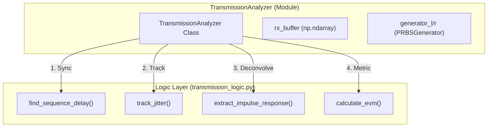
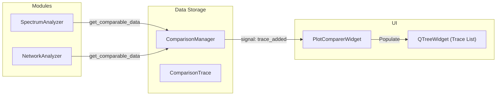

# Utility and Auxiliary Widgets

Relevant source files

The following files were used as context for generating this wiki page:

- [AGENTS.md](../../AGENTS.md)
- [docs/widgets/advanced_distortion_meter.en.md](../../docs/widgets/advanced_distortion_meter.en.md)
- [docs/widgets/advanced_distortion_meter.md](../../docs/widgets/advanced_distortion_meter.md)
- [docs/widgets/boxcar_averager.en.md](../../docs/widgets/boxcar_averager.en.md)
- [docs/widgets/boxcar_averager.md](../../docs/widgets/boxcar_averager.md)
- [docs/widgets/hrtf_player.en.md](../../docs/widgets/hrtf_player.en.md)
- [docs/widgets/hrtf_player.md](../../docs/widgets/hrtf_player.md)
- [docs/widgets/linearity_analyzer.en.md](../../docs/widgets/linearity_analyzer.en.md)
- [docs/widgets/linearity_analyzer.md](../../docs/widgets/linearity_analyzer.md)
- [docs/widgets/recorder_player.en.md](../../docs/widgets/recorder_player.en.md)
- [docs/widgets/recorder_player.md](../../docs/widgets/recorder_player.md)
- [docs/widgets/sound_quality_analyzer.en.md](../../docs/widgets/sound_quality_analyzer.en.md)
- [docs/widgets/sound_quality_analyzer.md](../../docs/widgets/sound_quality_analyzer.md)
- [docs/widgets/ultrasound_modulator.en.md](../../docs/widgets/ultrasound_modulator.en.md)
- [docs/widgets/ultrasound_modulator.md](../../docs/widgets/ultrasound_modulator.md)
- [docs/widgets/waveform_loop_player.en.md](../../docs/widgets/waveform_loop_player.en.md)
- [docs/widgets/waveform_loop_player.md](../../docs/widgets/waveform_loop_player.md)
- [scripts/check_ui_size_limits.py](../../scripts/check_ui_size_limits.py)
- [scripts/test_lockin_dynamic_reserve.py](../../scripts/test_lockin_dynamic_reserve.py)
- [src/core/bit_depth_estimator.py](../../src/core/bit_depth_estimator.py)
- [src/core/comparison_manager.py](../../src/core/comparison_manager.py)
- [src/core/ltc.py](../../src/core/ltc.py)
- [src/core/transmission_logic.py](../../src/core/transmission_logic.py)
- [src/gui/styles.py](../../src/gui/styles.py)
- [src/gui/widgets/loopback_finder.py](../../src/gui/widgets/loopback_finder.py)
- [src/gui/widgets/plot_comparer.py](../../src/gui/widgets/plot_comparer.py)
- [src/gui/widgets/processor_benchmark.py](../../src/gui/widgets/processor_benchmark.py)
- [src/gui/widgets/recorder_player.py](../../src/gui/widgets/recorder_player.py)
- [src/gui/widgets/sound_quality_analyzer.py](../../src/gui/widgets/sound_quality_analyzer.py)
- [src/gui/widgets/timecode_monitor.py](../../src/gui/widgets/timecode_monitor.py)
- [src/gui/widgets/transmission_analyzer.py](../../src/gui/widgets/transmission_analyzer.py)
- [tests/logic_verification/analysis/test_antigravity_fixes.py](../../tests/logic_verification/analysis/test_antigravity_fixes.py)
- [tests/logic_verification/analysis/test_distortion_averaging.py](../../tests/logic_verification/analysis/test_distortion_averaging.py)
- [tests/logic_verification/core/test_bit_depth_estimator.py](../../tests/logic_verification/core/test_bit_depth_estimator.py)
- [tests/logic_verification/core/test_comparison_manager.py](../../tests/logic_verification/core/test_comparison_manager.py)
- [tests/logic_verification/core/test_ltc.py](../../tests/logic_verification/core/test_ltc.py)
- [tests/logic_verification/core/test_ring_buffer.py](../../tests/logic_verification/core/test_ring_buffer.py)
- [tests/logic_verification/core/test_transmission.py](../../tests/logic_verification/core/test_transmission.py)
- [tests/logic_verification/gui/test_loopback_finder.py](../../tests/logic_verification/gui/test_loopback_finder.py)
- [tests/logic_verification/gui/test_noise_profiler_widget_logic.py](../../tests/logic_verification/gui/test_noise_profiler_widget_logic.py)
- [tests/logic_verification/gui/test_plot_comparer.py](../../tests/logic_verification/gui/test_plot_comparer.py)
- [tests/logic_verification/instruments/test_allan_worker.py](../../tests/logic_verification/instruments/test_allan_worker.py)
- [tests/security/test_recorder_memory.py](../../tests/security/test_recorder_memory.py)

The Utility and Auxiliary widgets in MeasureLab provide essential support functions that extend beyond standard signal analysis. These include tools for signal recording/playback, transmission path verification, system benchmarking, and specialized signal generation.

## Recorder / Player
The `RecorderPlayer` module provides high-performance audio recording and playback with disk-streaming capabilities. It is designed to handle large files without exhausting system memory by utilizing a background writer thread and chunked I/O.

### Implementation Details
- **Disk Streaming**: Unlike simple buffer-based recorders, this module uses a `_writer_thread` and a `queue.Queue` to stream recorded samples to a temporary file on disk `src/gui/widgets/recorder_player.py:132-136`.
- **Resampling**: When loading files with a sample rate different from the `AudioEngine`, the `FileLoadWorker` performs polyphase resampling via `AudioCalc.resample` `src/gui/widgets/recorder_player.py:63-66`.
- **Safety**: The `FileLoadWorker` validates file sizes before loading to prevent OOM (Out of Memory) errors `src/gui/widgets/recorder_player.py:49-53`.

### Data Flow: Recording
1. The `AudioEngine` master callback provides input samples.
2. `RecorderPlayer` pushes these samples into the `_write_queue`.
3. The background thread pulls from the queue and writes to a `soundfile` object `src/gui/widgets/recorder_player.py:97-109`.

**Sources:** `src/gui/widgets/recorder_player.py:39-115`, `src/gui/widgets/recorder_player.py:116-214`

---

## Transmission Analyzer
The `Transmission Analyzer` is a sophisticated tool for validating digital and analog signal paths using Pseudo-Random Binary Sequences (PRBS). It measures Bit Error Rate (BER), Error Vector Magnitude (EVM), and impulse response.

### Core Logic: PRBS and Synchronization
The system uses an LFSR (Linear Feedback Shift Register) to generate standard patterns (PRBS-7 through PRBS-31) `src/core/transmission_logic.py:14-58`.

| Feature | Implementation |
| :--- | :--- |
| **Initial Sync** | Sliding Pearson correlation against a reference cycle `src/core/transmission_logic.py:146-184`. |
| **Jitter Tracking** | Neighborhood search around the last known offset to track sample slips `src/core/transmission_logic.py:187-205`. |
| **Digital Mode** | Bit-by-bit comparison to diagnose bit-perfection and active bit depth `src/gui/widgets/transmission_analyzer.py:87-90`. |
| **Analog Mode** | Fractional delay estimation and Equalized EVM to remove linear frequency response errors `src/core/transmission_logic.py:240-275`. |

### Entity Mapping: Transmission Logic

**Sources:** `src/gui/widgets/transmission_analyzer.py:43-145`, `src/core/transmission_logic.py:8-205`, `tests/logic_verification/core/test_transmission.py:26-144`

---

## Timecode Monitor (LTC)
The `TimecodeMonitor` handles Longitudinal Timecode (LTC) encoding and decoding. It supports "Jam Syncing," where the generator can be slaved to an incoming external timecode signal.

- **Encoder**: Implements Bi-phase Mark Encoding (BPM). Transitions occur at every bit boundary; a '1' bit adds a transition in the middle `src/core/ltc.py:102-157`.
- **Decoder**: Uses zero-crossing detection and pulse-width discrimination to identify "short" vs "long" pulses, reconstructing the 80-bit LTC frame `src/core/ltc.py:160-214`.
- **Precision**: The encoder uses a global sample accumulator (`samples_generated`) to prevent drift over long durations `src/core/ltc.py:21-23`.

**Sources:** `src/gui/widgets/timecode_monitor.py:99-210`, `src/core/ltc.py:10-157`

---

## Sound Quality Analyzer
This module performs offline psychoacoustic analysis based on human hearing models. It calculates metrics that correlate with subjective perception rather than just physical SPL.

### Key Metrics
- **Sharpness**: Measures high-frequency content in `acum` units `src/gui/widgets/sound_quality_analyzer.py:120-129`.
- **Roughness**: Analyzes modulation in the 70Hz range to quantify "grating" sounds in `asper` `src/gui/widgets/sound_quality_analyzer.py:131-139`.
- **Tonality**: Identifies pure tones against a noise floor `src/gui/widgets/sound_quality_analyzer.py:141-149`.
- **Articulation Index**: Estimates speech intelligibility `src/gui/widgets/sound_quality_analyzer.py:162-170`.

The analysis is performed by `AnalysisWorker` (a `QThread`), which resamples audio to a fixed 48kHz internal rate optimized for the psychoacoustic filters `src/gui/widgets/sound_quality_analyzer.py:80-88`.

**Sources:** `src/gui/widgets/sound_quality_analyzer.py:37-180`, `docs/widgets/sound_quality_analyzer.md:15-20`

---

## Processor Benchmark
The `ProcessorBenchmark` evaluates the host system's capability to handle real-time DSP at various FFT sizes and sample rates.

- **FFT Performance**: Measures the execution time of `fft_manager.forward()` across sizes from 4096 to 16M samples `src/gui/widgets/processor_benchmark.py:195-200`.
- **UI Rendering**: Benchmarks `pyqtgraph` update speeds to ensure the display does not lag the audio processing `src/gui/widgets/processor_benchmark.py:73-78`.
- **Safety Factor**: Calculates the maximum sustainable FPS by comparing processing time against the hardware buffer duration `src/gui/widgets/processor_benchmark.py:126-132`.

**Sources:** `src/gui/widgets/processor_benchmark.py:68-202`

---

## Plot Comparer
The `PlotComparer` serves as a centralized hub for overlaying data from different modules (e.g., comparing a Spectrum Analyzer trace with a Network Analyzer sweep).

### Data Integration
It interacts with the `ComparisonManager` singleton to retrieve `ComparisonTrace` objects `src/gui/widgets/plot_comparer.py:61-62`.

### Advanced Plotting Features
- **Dual Y-Axis**: Supports simultaneous display of different units (e.g., dB for Magnitude and Degrees for Phase) using a secondary `ViewBox` `src/gui/widgets/plot_comparer.py:174-180`.
- **Trace Normalization**: Allows applying `offset_db` or time-shifts to individual traces for alignment `src/gui/widgets/plot_comparer.py:66-68`.
- **Interactive Readout**: A Dash-style cursor provides precise X/Y values for all visible traces `src/gui/widgets/plot_comparer.py:185-191`.

**Sources:** `src/gui/widgets/plot_comparer.py:59-200`, `tests/logic_verification/gui/test_plot_comparer.py:35-142`

---

## Loopback Finder
A diagnostic utility that detects physical or virtual routing paths between output and input channels.

- **Method**: Sequentially outputs a 440Hz test tone on each output channel while monitoring all input channels `src/gui/widgets/loopback_finder.py:131-135`.
- **Detection**: Uses FFT to look for the specific `target_bin` corresponding to the test frequency `src/gui/widgets/loopback_finder.py:146-148`.
- **Concurrency**: The scan runs in a `LoopbackWorker` thread to keep the UI responsive during the hardware polling process `src/gui/widgets/loopback_finder.py:26-58`.

**Sources:** `src/gui/widgets/loopback_finder.py:66-155`

---
