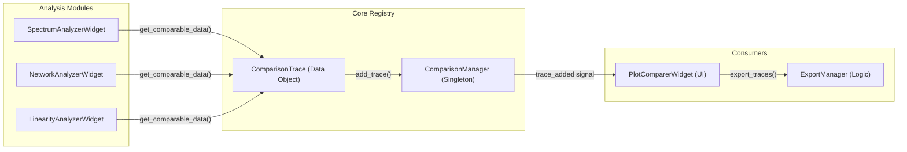
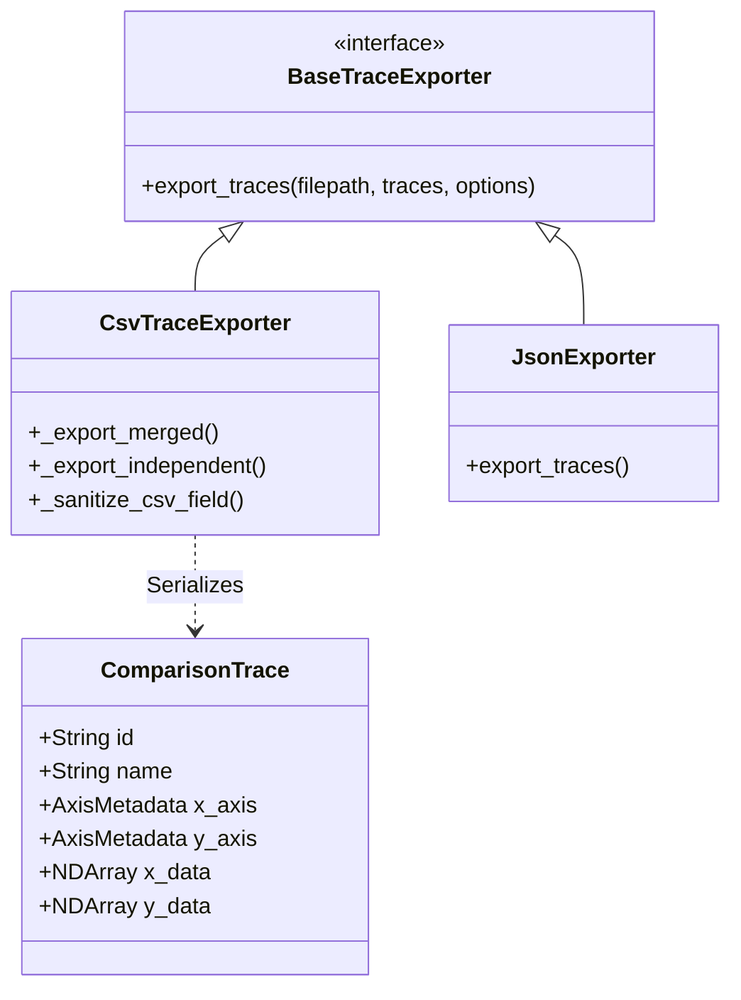

# Data Export and Comparison

Relevant source files

The following files were used as context for generating this wiki page:

- [AGENTS.md](../../AGENTS.md)
- [scripts/check_ui_size_limits.py](../../scripts/check_ui_size_limits.py)
- [src/core/comparison_manager.py](../../src/core/comparison_manager.py)
- [src/core/export/csv_exporter.py](../../src/core/export/csv_exporter.py)
- [src/gui/widgets/plot_comparer.py](../../src/gui/widgets/plot_comparer.py)
- [tests/core/export/__init__.py](../../tests/core/export/__init__.py)
- [tests/core/export/test_csv_exporter.py](../../tests/core/export/test_csv_exporter.py)
- [tests/logic_verification/core/test_comparison_manager.py](../../tests/logic_verification/core/test_comparison_manager.py)
- [tests/logic_verification/gui/test_plot_comparer.py](../../tests/logic_verification/gui/test_plot_comparer.py)

MeasureLab provides a centralized infrastructure for capturing, comparing, and exporting measurement data. This system allows users to aggregate results from disparate modules—such as the **Spectrum Analyzer** and **Network Analyzer**—into a single visual environment for overlay analysis and high-fidelity export to external formats.

The architecture relies on a shared registry for data traces and a dedicated module for visual comparison.

### Data Flow Overview

The following diagram illustrates how measurement data originates in analysis modules and flows through the `ComparisonManager` to either the `PlotComparer` for visualization or the `ExportManager` for file generation.

**Measurement Data Pipeline**

**Sources:** `src/core/comparison_manager.py:154-185`, `src/gui/widgets/plot_comparer.py:62-90`, `tests/logic_verification/gui/test_plot_comparer.py:144-170`

---

## Comparison Infrastructure

The comparison system is built around a "Snapshot" philosophy. Instead of live-streaming data between widgets, modules package their current state into a standardized `ComparisonTrace` object.

### ComparisonManager
The `ComparisonManager` is a singleton registry `src/core/comparison_manager.py:154-170` that acts as the central hub for all traces. It manages the lifecycle of measurement data, providing methods to add, remove, and retrieve traces `src/core/comparison_manager.py:181-190`. It also handles native `.mlcomp` file serialization for saving and loading measurement sessions `src/core/comparison_manager.py:126-151`.

### ComparisonTrace
The `ComparisonTrace` class is the primary data structure for cross-module exchange. It encapsulates:
*   **Metadata**: Source module name, timestamp, and plot type (e.g., `frequency_response`, `spectrum`) `src/core/comparison_manager.py:55-60`.
*   **Axis Information**: `AxisMetadata` defining units (V, Hz, dB), dimensions, and whether the axis is logarithmic `src/core/comparison_manager.py:35-51`.
*   **Data Arrays**: NumPy-backed arrays for X, Y1, and optional Y2 (secondary axis) data `src/core/comparison_manager.py:68-71`.
*   **Calibration**: `CalibrationInfo` containing sensitivity and offsets applied at the time of measurement `src/core/comparison_manager.py:12-31`.

For details on the comparison registry and interface, see [Plot Comparer and Comparison Manager](#4.2).

---

## Plot Comparer

The **Plot Comparer** is a specialized `MeasurementModule` `src/gui/widgets/plot_comparer.py:38-52` designed for visual overlay and delta analysis.

| Feature | Implementation |
|:---|:---|
| **Multi-Domain Support** | Filters traces by domain (Frequency vs. Time) using `filter_combo` `src/gui/widgets/plot_comparer.py:135-142`. |
| **Trace Management** | Uses a `QTreeWidget` to manage visibility, colors, and Y-axis assignments `src/gui/widgets/plot_comparer.py:19-21`. |
| **Interactive Readout** | Provides crosshair cursors and a `readout_label` for precise value inspection `src/gui/widgets/plot_comparer.py:127-141`. |
| **Normalization** | Supports per-trace gain offsets and time shifts via inline spin boxes `src/gui/widgets/plot_comparer.py:88-95`. |
| **Dual Y-Axes** | Synchronizes a secondary `ViewBox` for comparing mixed units (e.g., Magnitude vs. Phase) `src/gui/widgets/plot_comparer.py:174-184`. |

For details on the comparison UI, see [Plot Comparer and Comparison Manager](#4.2).

---

## Export System

The export subsystem handles the transformation of `ComparisonTrace` data into industry-standard formats. It uses a plugin-based architecture where different formats are handled by specific exporter classes.

### Export Architecture
*   **ExportManager**: Orchestrates the export process and manages available plugins.
*   **BaseTraceExporter**: The abstract base class defining the interface for all exporters `src/core/export/csv_exporter.py:12`.
*   **CsvTraceExporter**: Implements CSV and TXT export with support for "merged" (common X-axis) or "independent" (multi-column) layouts `src/core/export/csv_exporter.py:37-59`.
*   **Sanitization**: Includes security measures like `_sanitize_csv_field` to prevent CSV formula injection attacks `src/core/export/csv_exporter.py:29-35`.

**Data Export Mapping**

**Sources:** `src/core/export/csv_exporter.py:12-60`, `src/core/comparison_manager.py:55-77`

For details on the export plugins and sanitization, see [Export System](#4.1).

---

## Child Pages
*   [Export System](#4.1) — Detailed look at the `ExportManager`, `CsvTraceExporter`, and security protocols.
*   [Plot Comparer and Comparison Manager](#4.2) — Technical breakdown of the singleton registry and the interactive comparison widget.

---
