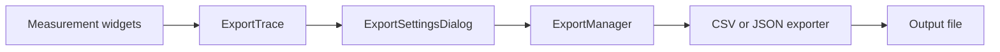

# Data Export

MeasureLab exports measurement results through a shared `ExportTrace` data model and format-specific exporters. Analyzer widgets provide traces to the export dialog, where users select data, choose CSV or JSON, and configure file output.

## Export Flow

`ExportTrace` carries the source, timestamp, plot type, axis metadata, measurement arrays, calibration information, and additional settings. The export dialog can combine selected traces in one file or write them to individual files.

The [Export System](4.1-export-system.md) page describes the trace model, CSV and JSON exporters, and the dialog integration.
