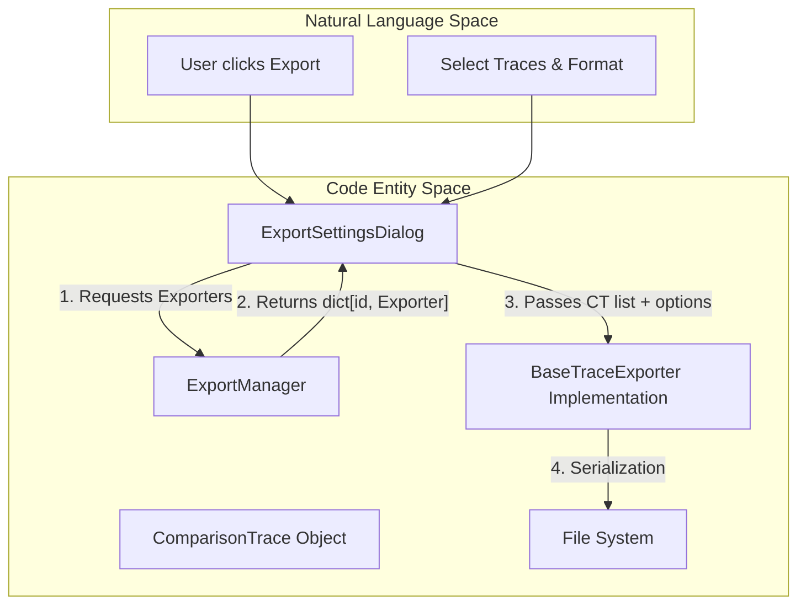
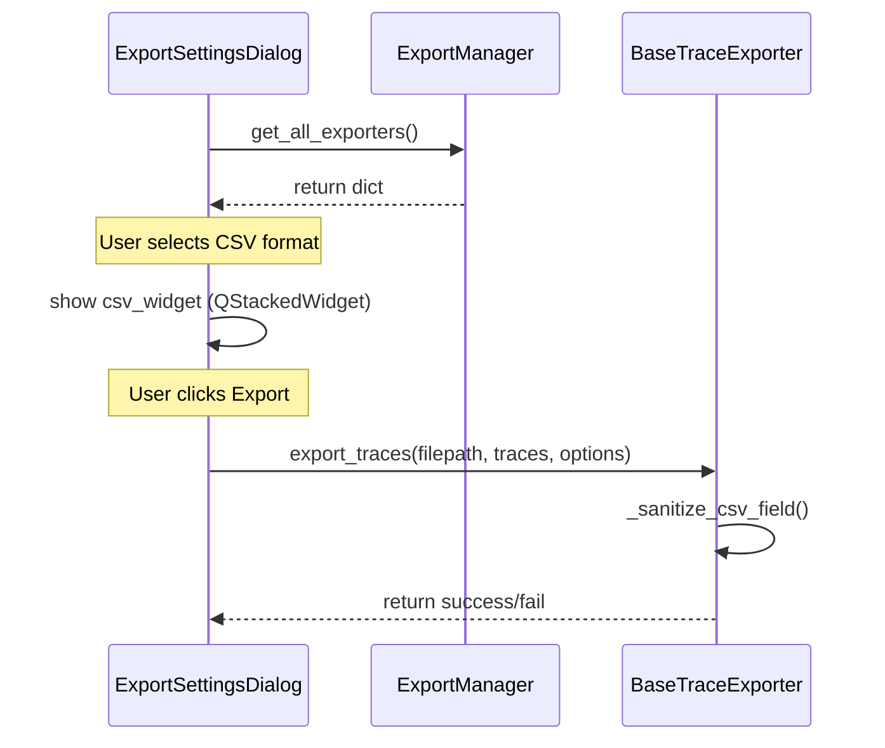

# Export System

Relevant source files

The following files were used as context for generating this wiki page:

- [src/core/export/__init__.py](../../src/core/export/__init__.py)
- [src/core/export/base.py](../../src/core/export/base.py)
- [src/core/export/csv_exporter.py](../../src/core/export/csv_exporter.py)
- [src/core/export/json_exporter.py](../../src/core/export/json_exporter.py)
- [src/core/export/manager.py](../../src/core/export/manager.py)
- [src/gui/widgets/export_dialog.py](../../src/gui/widgets/export_dialog.py)
- [tests/core/export/__init__.py](../../tests/core/export/__init__.py)
- [tests/core/export/test_csv_exporter.py](../../tests/core/export/test_csv_exporter.py)
- [tests/core/export/test_manager.py](../../tests/core/export/test_manager.py)

The Export System in MeasureLab provides a modular plugin architecture for serializing measurement data from the `ComparisonManager` into various file formats. It supports advanced features such as CSV injection sanitization, automated X-axis interpolation for merged exports, and proprietary `.mlcomp` serialization for cross-session data persistence.

## Architecture Overview

The system is built around a centralized manager that handles the registration and retrieval of specialized exporter plugins. All data exported through this system originates as `ComparisonTrace` objects, which contain the raw measurement arrays and associated metadata (axes, units, timestamps).

### Core Components

| Component | Class/Entity | Responsibility |
|:---|:---|:---|
| **Export Manager** | `ExportManager` | Singleton registry for exporter plugins. `src/core/export/manager.py:10-11` |
| **Plugin Base** | `BaseTraceExporter` | Abstract base class defining the interface for new formats. `src/core/export/base.py:6` |
| **CSV Exporter** | `CsvTraceExporter` | Handles tabular data with interpolation and sanitization. `src/core/export/csv_exporter.py:12` |
| **JSON Exporter** | `JsonTraceExporter` | Handles `.mlcomp` proprietary JSON serialization. `src/core/export/json_exporter.py:11` |
| **Export Dialog** | `ExportSettingsDialog` | UI for selecting targets, formats, and layout options. `src/gui/widgets/export_dialog.py:31` |

### Data Flow Diagram
This diagram illustrates the flow from raw `ComparisonTrace` objects through the `ExportManager` to the filesystem.

**Export System Data Flow**

**Sources:** `src/core/export/manager.py:10-39`, `src/gui/widgets/export_dialog.py:32-40`, `src/core/export/base.py:31-34`

---

## Export Plugins

### BaseTraceExporter
The `BaseTraceExporter` is an abstract base class (ABC) that enforces a consistent interface for all file formats. Every exporter must provide:
*   `format_id`: A unique string identifier (e.g., `"csv"`). `src/core/export/base.py:9`
*   `name`: A localized display name for the UI. `src/core/export/base.py:17`
*   `file_filter`: The string used by `QFileDialog`. `src/core/export/base.py:22`
*   `export_traces()`: The method implementing the actual file writing logic. `src/core/export/base.py:32`

### CsvTraceExporter
The CSV exporter is the most complex plugin, supporting multiple layout modes and security features.

#### CSV Injection Sanitization
To prevent Formula Injection (CSV Injection), the exporter implements `_sanitize_csv_field`. It checks if a string field starts with dangerous characters (`=`, `+`, `-`, `@`, `\t`) and prepends a single quote `'` to ensure spreadsheet software treats the content as literal text. `src/core/export/csv_exporter.py:29-35`

#### Export Layouts
1.  **Merged (`_export_merged`)**: Combines multiple traces into a single table. If traces have different X-axis samples, the exporter generates a common `x_grid` (either from a reference trace or a union of all points) and uses `np.interp` to align Y-data. `src/core/export/csv_exporter.py:65-154`
2.  **Independent (`_export_independent`)**: Writes traces side-by-side with their own X and Y columns, padded with empty strings where row counts differ. `src/core/export/csv_exporter.py:156-200`

### JsonTraceExporter
This exporter handles the MeasureLab Comparison (`.mlcomp`) format. It leverages the `to_dict()` method of `ComparisonTrace` to serialize complex measurement data into a JSON structure, including versioning metadata. `src/core/export/json_exporter.py:28-33`

**Sources:** `src/core/export/csv_exporter.py:12-200`, `src/core/export/json_exporter.py:11-39`, `src/core/export/base.py:6-34`

---

## Export Manager

The `ExportManager` is a singleton that manages the lifecycle of exporter plugins. It is initialized with the default `JsonTraceExporter` and `CsvTraceExporter` during its first call to `instance()`. `src/core/export/manager.py:10-28`

**Key Methods:**
*   `register_exporter(exporter)`: Adds a new format to the system at runtime. `src/core/export/manager.py:30-32`
*   `get_exporter(format_id)`: Retrieves a specific plugin by its ID. `src/core/export/manager.py:34-35`

**Sources:** `src/core/export/manager.py:10-39`

---

## UI Integration: ExportSettingsDialog

The `ExportSettingsDialog` provides a unified interface for the export process. It dynamically adjusts its options based on the selected format using a `QStackedWidget`. `src/gui/widgets/export_dialog.py:90-92`

### Logic and Configuration
*   **Target Selection**: Users can toggle specific traces for export using a `QListWidget` with checkable items. `src/gui/widgets/export_dialog.py:62-72`
*   **Format Switching**: When the format changes, `on_format_changed` updates the `QStackedWidget` to show format-specific settings (e.g., CSV delimiters vs. JSON versioning). `src/gui/widgets/export_dialog.py:230-237`
*   **Scheme Handling**: Supports "Combine into a single file" or "Export as individual files". If individual files are chosen, the dialog automatically generates filenames based on trace names and a sanitized path. `src/gui/widgets/export_dialog.py:75-88`, `src/gui/widgets/export_dialog.py:280-310`

**Export Interaction Model**

**Sources:** `src/gui/widgets/export_dialog.py:31-310`, `src/core/export/csv_exporter.py:37-63`

---

## Trace Serialization

Traces are serialized from `ComparisonTrace` objects. These objects act as the standard data container within the export system.

| Field | Type | Description |
|:---|:---|:---|
| `x_data` | `List[float]` | Primary independent variable array. |
| `y_data` | `List[float]` | Primary dependent variable array. |
| `y2_data` | `Optional[List[float]]` | Secondary dependent variable (e.g., Phase). |
| `x_axis` | `AxisMetadata` | Metadata including dimension and unit (e.g., "Frequency", "Hz"). |

When exporting to CSV, the system uses these metadata objects to generate localized headers, such as `Frequency (Hz)` or `Voltage (dBV)`. `src/core/export/csv_exporter.py:84-101`

**Sources:** `src/core/export/csv_exporter.py:84-115`, `tests/core/export/test_csv_exporter.py:29-53`

---
