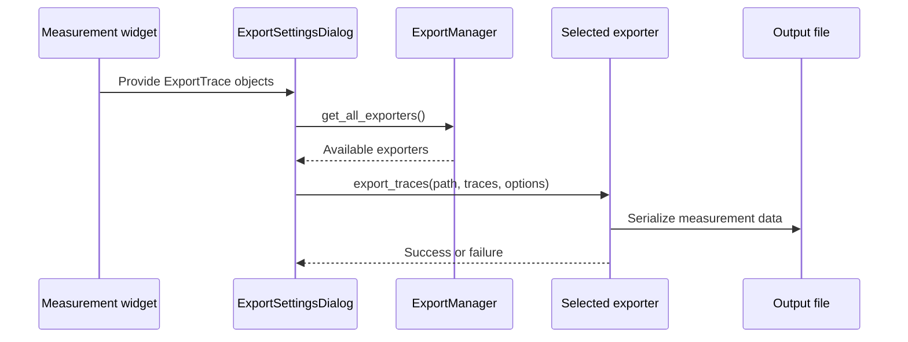

# Export System

The export system turns measurement results into CSV/TXT or JSON files. Measurement widgets pass `ExportTrace` objects to `ExportSettingsDialog`, which collects the selected traces and options and dispatches the request through `ExportManager`.

## Core Components

| Component | Responsibility |
|:---|:---|
| `ExportTrace` | Holds trace identity, source, timestamp, plot type, axis metadata, data arrays, calibration, and additional metadata. |
| `ExportSettingsDialog` | Lets users select traces, choose an export format, set format options, and export as one combined file or separate files. |
| `ExportManager` | Registers and returns the available exporter implementations. |
| `BaseTraceExporter` | Defines the interface that each exporter implements. |
| `CsvTraceExporter` | Writes CSV or tab-separated text, with merged and independent layouts. |
| `JsonTraceExporter` | Serializes traces to a versioned JSON document. |

## Export Flow

## CSV and JSON

The CSV exporter supports comma or tab delimiters, optional headers and metadata, and two layouts. The merged layout aligns traces on a common X grid, using either a selected reference trace or the union of X values. The independent layout writes each trace's X and Y columns separately. Text fields that could be interpreted as spreadsheet formulas are sanitized before writing.

The JSON exporter writes a versioned object containing the serialized traces. `ExportTrace.to_dict()` converts NumPy arrays and metadata objects to JSON-compatible values.

For implementation details, see [the export data model](../../src/core/export/trace.py), [CSV exporter](../../src/core/export/csv_exporter.py), [JSON exporter](../../src/core/export/json_exporter.py), [manager](../../src/core/export/manager.py), and [export dialog](../../src/gui/widgets/export_dialog.py).
