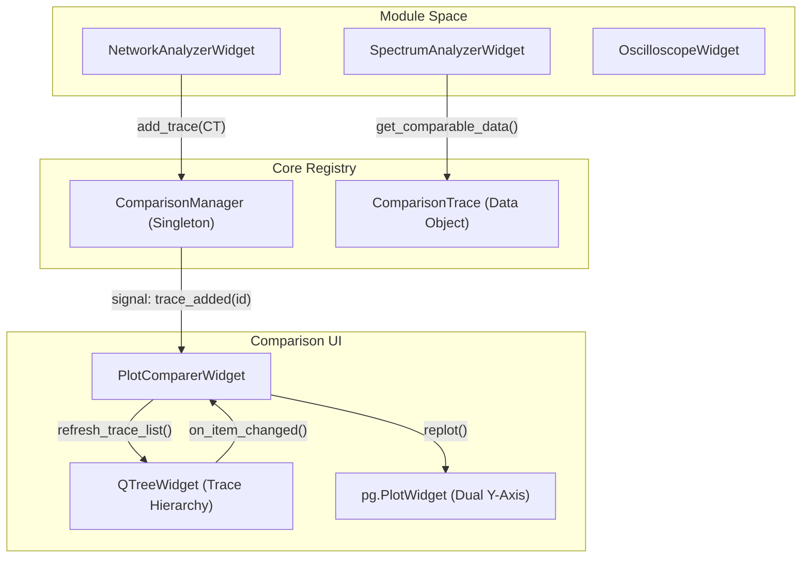
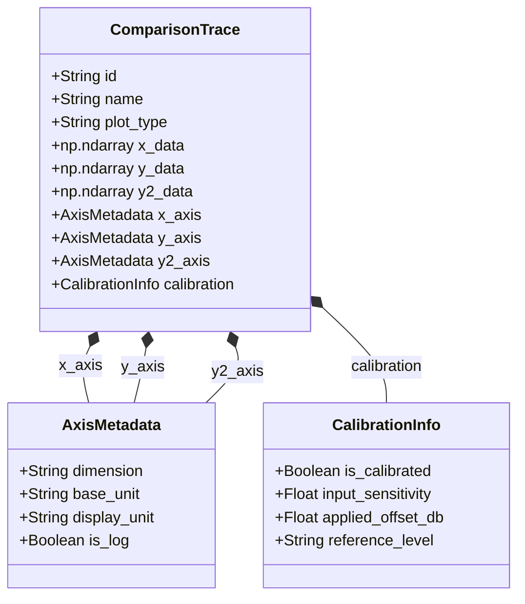

# Plot Comparer and Comparison Manager

Relevant source files

The following files were used as context for generating this wiki page:

- [AGENTS.md](../../AGENTS.md)
- [docs/widgets/plot_comparer.en.md](../../docs/widgets/plot_comparer.en.md)
- [docs/widgets/plot_comparer.md](../../docs/widgets/plot_comparer.md)
- [scripts/check_ui_size_limits.py](../../scripts/check_ui_size_limits.py)
- [src/core/comparison_manager.py](../../src/core/comparison_manager.py)
- [src/gui/widgets/plot_comparer.py](../../src/gui/widgets/plot_comparer.py)
- [tests/logic_verification/core/test_comparison_manager.py](../../tests/logic_verification/core/test_comparison_manager.py)
- [tests/logic_verification/gui/test_plot_comparer.py](../../tests/logic_verification/gui/test_plot_comparer.py)

The **Plot Comparer** and **Comparison Manager** form a centralized subsystem within MeasureLab designed to aggregate, visualize, and manipulate measurement data from disparate sources. This system allows users to overlay real-time or historical traces from modules such as the Spectrum Analyzer, Network Analyzer, and Oscilloscope onto a single unified plot for differential analysis.

### 1. Comparison Manager Architecture

The `ComparisonManager` is a singleton registry that acts as the "Source of Truth" for all comparable data across the application `src/core/comparison_manager.py:154-164`. It manages a collection of `ComparisonTrace` objects, which encapsulate measurement data along with rich metadata required for accurate reconstruction and unit conversion `src/core/comparison_manager.py:55-77`.

#### Data Entities
*   **ComparisonTrace**: The primary data container. It stores X, Y, and optional Y2 data as NumPy arrays to ensure high-performance rendering `src/core/comparison_manager.py:78-97`.
*   **AxisMetadata**: Defines the physical dimension (e.g., voltage, frequency), units (e.g., V, Hz, dBV), and scaling (linear vs. log) for each axis `src/core/comparison_manager.py:35-40`.
*   **CalibrationInfo**: Captures the calibration state of the source module at the time of capture, including input sensitivity and applied offsets `src/core/comparison_manager.py:13-18`.

#### Data Flow: Registry to Widget
The manager uses Qt signals to notify the UI when the registry state changes:
1.  **Capture**: A measurement module calls `ComparisonManager.instance().add_trace(trace)` `src/core/comparison_manager.py:181-185`.
2.  **Notification**: The manager emits `trace_added(trace_id)` `src/core/comparison_manager.py:160`.
3.  **UI Sync**: The `PlotComparerWidget` receives the signal and updates its hierarchical tree view and plot area `src/gui/widgets/plot_comparer.py:77-79`.

**Sources:** `src/core/comparison_manager.py:1-185`, `src/gui/widgets/plot_comparer.py:54-90`

### 2. Plot Comparer Widget

The `PlotComparerWidget` provides the user interface for interacting with the aggregated data. It is divided into a plot area (left) and a control panel (right) `src/gui/widgets/plot_comparer.py:96-103`.

#### Visualization Engine
*   **Dual Y-Axis**: Utilizes a secondary `pg.ViewBox` linked to the main plot to display different physical quantities (e.g., Gain on Y1 and Phase on Y2) simultaneously `src/gui/widgets/plot_comparer.py:174-183`.
*   **Interactive Cursor**: A crosshair cursor tracks the mouse, interpolating values across all visible traces at the current X-coordinate. These values are displayed in a monospace readout label `src/gui/widgets/plot_comparer.py:127-141`, `src/gui/widgets/plot_comparer.py:185-193`.
*   **Normalization**: A "Normalize" function aligns the maximum peak of all active traces to a reference level (e.g., 0 dB), facilitating shape-only comparison `docs/widgets/plot_comparer.en.md:20`.

#### Hierarchical Trace Management
The widget uses a `QTreeWidget` to manage traces. Each trace is a top-level item, with its sub-components (Y1, Y2, offsets) as child nodes `src/gui/widgets/plot_comparer.py:19-21`.
*   **Master Toggles**: Checkboxes for specific dimensions (e.g., "Gain", "Phase") allow bulk visibility toggling across all loaded traces `tests/logic_verification/gui/test_plot_comparer.py:105-115`.
*   **Inline Adjustments**: Users can apply manual gain offsets (dB), linear Y-offsets, or X-axis shifts (time/frequency) directly within the tree view using `QDoubleSpinBox` widgets `src/gui/widgets/plot_comparer.py:14-15`, `docs/widgets/plot_comparer.en.md:15-19`.

**Sources:** `src/gui/widgets/plot_comparer.py:104-193`, `docs/widgets/plot_comparer.en.md:1-28`, `tests/logic_verification/gui/test_plot_comparer.py:35-143`

### 3. System Diagrams

#### Trace Registration and UI Update Flow
This diagram illustrates the relationship between the singleton manager, the data-generating modules, and the observer widget.

**Sources:** `src/core/comparison_manager.py:154-185`, `src/gui/widgets/plot_comparer.py:74-90`, `tests/logic_verification/gui/test_plot_comparer.py:144-183`

#### Trace Data Structure and Axis Mapping
This diagram maps the code entities involved in representing a single measurement trace.

**Sources:** `src/core/comparison_manager.py:12-77`

### 4. Integration and Export

Modules implementing the `ComparableWidgetInterface` (implied by the `get_comparable_data` method) can export their state to the `ComparisonManager`.

#### Module Export Implementation
For example, the `SpectrumAnalyzerWidget` implements `get_comparable_data` to package its current FFT results into `ComparisonTrace` objects. It handles both single-channel and dual-channel (L/R) modes by creating separate traces for each channel `tests/logic_verification/gui/test_plot_comparer.py:144-183`.

#### Persistence
The `ComparisonManager` supports importing and exporting the entire registry to `.mlcomp` (JSON) files `tests/logic_verification/core/test_comparison_manager.py:126-182`.
*   **JSON Serialization**: Traces are converted to dictionaries using `to_dict()` and `from_dict()` methods, which handle the conversion of NumPy arrays to serializable lists `src/core/comparison_manager.py:98-151`.
*   **Export Options**: The `PlotComparerWidget` provides an export dialog allowing users to combine multiple traces into a single file or export them individually as CSV or JSON `docs/widgets/plot_comparer.en.md:42-54`.

**Sources:** `src/core/comparison_manager.py:98-151`, `tests/logic_verification/core/test_comparison_manager.py:126-182`, `docs/widgets/plot_comparer.en.md:42-54`

---
