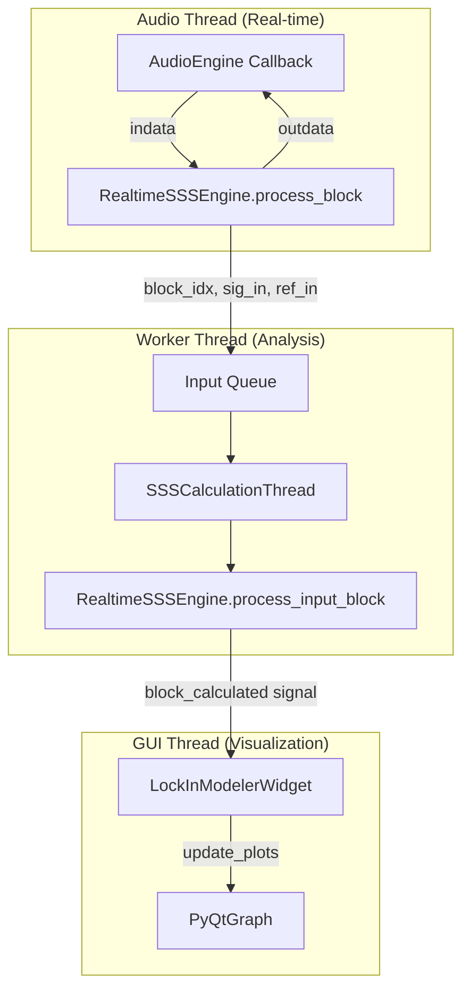
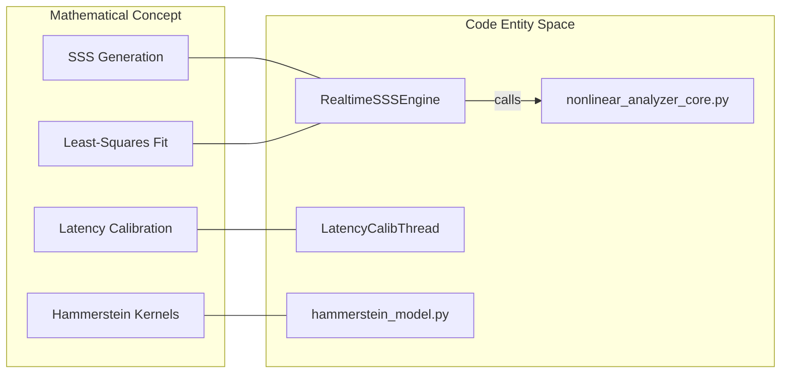

# Technical Implementation Notes

Relevant source files

The following files were used as context for generating this wiki page:

- [.vscode/launch.json](../../.vscode/launch.json)
- [.vscode/tasks.json](../../.vscode/tasks.json)
- [.zed/settings.json](../../.zed/settings.json)
- [.zed/tasks.json](../../.zed/tasks.json)
- [src/core/realtime_sss_core.py](../../src/core/realtime_sss_core.py)
- [src/gui/widgets/lock_in_modeler.py](../../src/gui/widgets/lock_in_modeler.py)
- [tests/core/test_realtime_sss_core.py](../../tests/core/test_realtime_sss_core.py)
- [tests/logic_verification/gui/widgets/test_lock_in_modeler.py](../../tests/logic_verification/gui/widgets/test_lock_in_modeler.py)

This section provides a high-level technical overview of the digital signal processing (DSP) and mathematical foundations of MeasureLab. It describes the interaction between real-time audio streams and the heavy-duty background analysis tasks required for precision measurement.

## System Integration Overview

MeasureLab's technical core relies on a separation of concerns between the high-priority `AudioEngine` callback and background computation threads. The `RealtimeSSSEngine` serves as the primary bridge, providing methods to generate excitation signals and process input blocks using Least-Squares estimation `src/core/realtime_sss_core.py:16-16`.

### Signal Processing Data Flow

The following diagram illustrates how the `LockInModeler` coordinates between the audio hardware and the mathematical engines.

**Measurement System Data Flow**

Sources: `src/gui/widgets/lock_in_modeler.py:64-116`, `src/core/realtime_sss_core.py:16-112`, `tests/core/test_realtime_sss_core.py:37-52`

---

## 5.1 SSS Measurement and Hammerstein Modeling
The Synchronized Swept Sine (SSS) implementation uses Novak's constraints to ensure the phase trajectory is perfectly periodic within the FFT window, eliminating spectral leakage without windowing. The system extracts harmonic kernels by deconvolving the recorded response with a pre-calculated inverse filter.

Key features include:
*   **Fractional Delay Correction**: Sub-sample peak detection for precise jitter alignment `src/core/realtime_sss_core.py:142-145`.
*   **Kernel Separation**: Extraction of $h_1$ through $h_5$ kernels for Parallel Hammerstein Models.

For details, see [SSS Measurement and Hammerstein Modeling](#5.1).

---

## 5.2 Lock-in Amplifier Principles
The Lock-in suite implements dual-phase (IQ) demodulation to extract magnitude and phase from noisy signals. Unlike hardware lock-ins, MeasureLab addresses the "undefined phase" problem inherent in PC audio buffers by requiring a hardware loopback or reference channel `src/gui/widgets/lock_in_modeler.py:146-149`.

Implementation highlights:
*   **Transfer Function Mode**: Real-time ratio of Signal vs. Reference `tests/core/test_realtime_sss_core.py:92-120`.
*   **Dynamic Reserve**: Managed through IIR post-mix filtering to reject out-of-band noise.

For details, see [Lock-in Amplifier Principles](#5.2).

---

## 5.3 Feedforward Compensation Algorithm
The Feedforward Compensator uses the Linear-Inverse Compensated Feedforward (LICFF) algorithm. It converts Hammerstein kernels into power series coefficients to pre-distort the signal, effectively cancelling nonlinearities in the DUT.

Technical safeguards:
*   **Instability Detection**: Uses `stabilize_poly` to reflect roots inside the unit circle.
*   **Normalization**: Prevents digital clipping during the pre-distortion phase.

For details, see [Feedforward Compensation Algorithm](#5.3).

---

## 5.4 Frequency Analysis and Precision Tracking
Precision tracking is handled by specialized estimators that go beyond standard FFT binning. The system utilizes three-pass searches (coarse to fine) and 1PPS (Pulse Per Second) monitoring to track sample clock drift over long durations.

Key components:
*   **Allan Deviation**: Used in `frequency_analysis.py` to characterize clock stability.
*   **Online Least-Squares**: Used in the 1PPS monitor with MAD (Median Absolute Deviation) outlier rejection to calculate PPM drift in real-time.

For details, see [Frequency Analysis and Precision Tracking](#5.4).

---

## DSP Logic Mapping

The following diagram bridges the mathematical concepts used in documentation to the specific Python classes and methods in the codebase.

**Algorithm to Code Mapping**

Sources: `src/core/realtime_sss_core.py:7-11`, `src/gui/widgets/lock_in_modeler.py:36-62`, `src/core/hammerstein_model.py:31-31`

---
