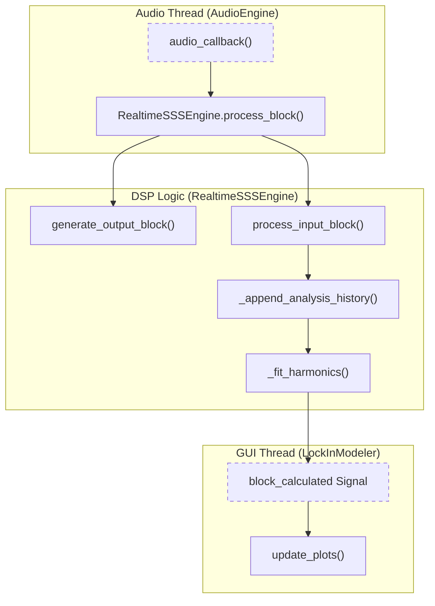
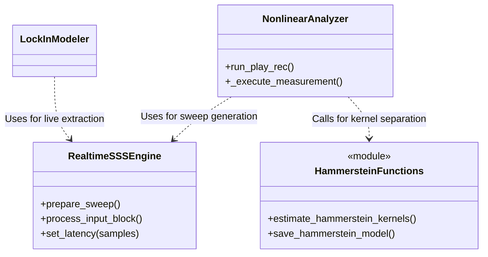

# SSS Measurement and Hammerstein Modeling

Relevant source files

The following files were used as context for generating this wiki page:

- [.gitignore](../../.gitignore)
- [.vscode/launch.json](../../.vscode/launch.json)
- [.vscode/tasks.json](../../.vscode/tasks.json)
- [.zed/settings.json](../../.zed/settings.json)
- [.zed/tasks.json](../../.zed/tasks.json)
- [scripts/optimize_hammerstein_real_device.py](../../scripts/optimize_hammerstein_real_device.py)
- [scripts/verify_lock_in_modeler_hammerstein_real_device.py](../../scripts/verify_lock_in_modeler_hammerstein_real_device.py)
- [scripts/verify_lockin_vs_nonlinear_real_device.py](../../scripts/verify_lockin_vs_nonlinear_real_device.py)
- [src/core/hammerstein_model.py](../../src/core/hammerstein_model.py)
- [src/core/nonlinear_analyzer_core.py](../../src/core/nonlinear_analyzer_core.py)
- [src/core/realtime_sss_core.py](../../src/core/realtime_sss_core.py)
- [src/gui/widgets/lock_in_modeler.py](../../src/gui/widgets/lock_in_modeler.py)
- [tests/core/test_realtime_sss_core.py](../../tests/core/test_realtime_sss_core.py)
- [tests/logic_verification/core/test_hammerstein_model.py](../../tests/logic_verification/core/test_hammerstein_model.py)
- [tests/logic_verification/gui/test_nonlinear_analyzer_gui.py](../../tests/logic_verification/gui/test_nonlinear_analyzer_gui.py)
- [tests/logic_verification/gui/widgets/test_lock_in_modeler.py](../../tests/logic_verification/gui/widgets/test_lock_in_modeler.py)
- [tests/logic_verification/measurement_modules/test_lockin_vs_nonlinear.py](../../tests/logic_verification/measurement_modules/test_lockin_vs_nonlinear.py)
- [tests/logic_verification/measurement_modules/test_nonlinear_analyzer.py](../../tests/logic_verification/measurement_modules/test_nonlinear_analyzer.py)

This page specifies the technical implementation of the Synchronized Swept Sine (SSS) method and the extraction of Parallel Hammerstein Model (PHM) kernels. These algorithms form the core of the `NonlinearAnalyzer` and `LockInModeler` modules, enabling high-precision identification of nonlinear systems.

## Synchronized Sine Sweep (SSS) Design

The system utilizes the SSS method as defined by Novak et al. (2015) to ensure perfect phase synchronization across harmonics. Unlike standard log-sweeps, SSS constrains the sweep rate such that the phase at any time $t$ is perfectly defined relative to the start frequency $f_1$ and the sweep constant $L$.

### Exponential Sweep Generation
The sweep signal is generated in `src/core/nonlinear_analyzer_core.py` using the following parameters:
*   **$k$ parameter**: An integer constant derived from the start frequency and duration to ensure integer-cycle alignment `src/core/nonlinear_analyzer_core.py:138-142`.
*   **Phase Trajectory**: $\phi(t) = 2\pi k \exp(t/L)$ `src/core/nonlinear_analyzer_core.py:149`.
*   **Guard Bands**: Frequency margins are automatically added (typically $f_1 / 1.3$ and $f_2 \times 1.15$) to suppress Gibbs ripples at the sweep boundaries `src/core/nonlinear_analyzer_core.py:124-128`.

### TSA and Jitter Alignment
To combat clock drift between asynchronous converters, the system implements Time-Synchronous Averaging (TSA) with sub-sample jitter alignment.
1.  **Sub-sample Peak Detection**: Uses FFT-based upsampling (factor of 100) to find the impulse response peak with fractional precision `src/core/nonlinear_analyzer_core.py:9-55`.
2.  **Fractional Delay Correction**: Shifts signals in the frequency domain using the phase-shift property of the Fourier Transform to align multiple averages before accumulation `src/core/nonlinear_analyzer_core.py:58-69`.
3.  **Clock Drift Compensation**: A Kaiser-windowed sinc resampler compensates for linear sample clock drift (`drift_factor`) `src/core/nonlinear_analyzer_core.py:72-108`.

**Sources:** `src/core/nonlinear_analyzer_core.py`, `src/core/realtime_sss_core.py`.

---

## Real-time SSS Engine

The `RealtimeSSSEngine` provides a streaming implementation of the SSS method, allowing for live updates of frequency response and harmonic distortion during the sweep.

### Data Flow: Audio Callback to DSP
The engine processes incoming audio blocks and extracts harmonic components using a local Least-Squares (LS) fit.

**Sources:** `src/core/realtime_sss_core.py:16-31`, `src/gui/widgets/lock_in_modeler.py:64-116`.

### Harmonic Extraction
Instead of traditional FFT windowing, the engine uses a sliding history buffer and performs a Least-Squares fit on the instantaneous phase $\theta(t)$ `src/core/realtime_sss_core.py:190-210`. This allows the system to extract up to the 5th harmonic even with very short analysis windows (defined by `analysis_cycles`) `src/core/realtime_sss_core.py:38-40`.

---

## Parallel Hammerstein Model (PHM) Identification

The PHM represents a nonlinear system as a sum of parallel branches, each consisting of a static power-law nonlinearity followed by a linear filter (kernel) $h_p(t)$.

### Kernel Separation via Chebyshev Inversion
MeasureLab performs multiple SSS sweeps at different amplitudes to decouple the overlapping contributions of power-series terms.

| Step | Operation | Description |
| :--- | :--- | :--- |
| 1 | **Deconvolution** | $Y(f) / S(f)$ with Tikhonov regularization to obtain raw impulse responses `src/core/nonlinear_analyzer_core.py:171-191`. |
| 2 | **Amplitude Mapping** | Collects complex harmonic responses across $K$ amplitude steps `src/core/nonlinear_analyzer_core.py:194-209`. |
| 3 | **Matrix Inversion** | Solves the Van der Monde-like system to separate kernels $h_1$ through $h_5$ `src/core/hammerstein_model.py:150-220`. |
| 4 | **Chebyshev Transform** | Converts power-series kernels to Chebyshev-mapped kernels for improved numerical stability `src/core/nonlinear_analyzer_core.py:210-230`. |

### Implementation Mapping

**Sources:** `src/core/hammerstein_model.py`, `src/core/nonlinear_analyzer_core.py`, `src/gui/widgets/lock_in_modeler.py`.

---

## Latency and Phase Correction

Accurate kernel separation requires precise time-alignment between the reference and measurement channels.

1.  **System Latency Measurement**: A short SSS pilot tone is used to measure the round-trip latency of the audio interface `src/core/realtime_sss_core.py:532-555`.
2.  **Fractional Delay Correction**: The `measure_system_latency` function returns a float value, which is then applied as a phase rotation in the frequency domain during deconvolution `src/core/nonlinear_analyzer_core.py:58-69`.
3.  **XFER Mode**: In Transfer Function mode, the system calculates $H(f) = \frac{Y_{meas}(f)}{Y_{ref}(f)}$, effectively cancelling the frequency response of the audio interface itself `src/core/realtime_sss_core.py:310-330`.

**Sources:** `src/core/realtime_sss_core.py:532-555`, `src/core/nonlinear_analyzer_core.py:58-69`, `tests/core/test_realtime_sss_core.py:53-90`.

## Data Persistence
Models are stored in a standardized JSON format containing both time-domain kernels and frequency-domain magnitudes/phases.
*   **File Format**: `hammerstein_model_*.json` `src/core/hammerstein_model.py:9-47`.
*   **Active Model Cache**: The `_ActiveModelCache` singleton allows the `FeedforwardCompensator` to access the latest identified kernels without re-loading from disk `src/core/hammerstein_model.py:85-112`.

**Sources:** `src/core/hammerstein_model.py`.

---
