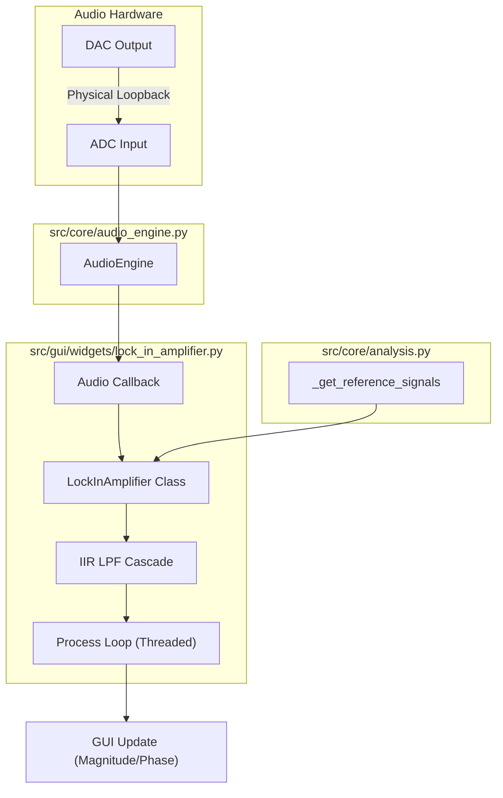
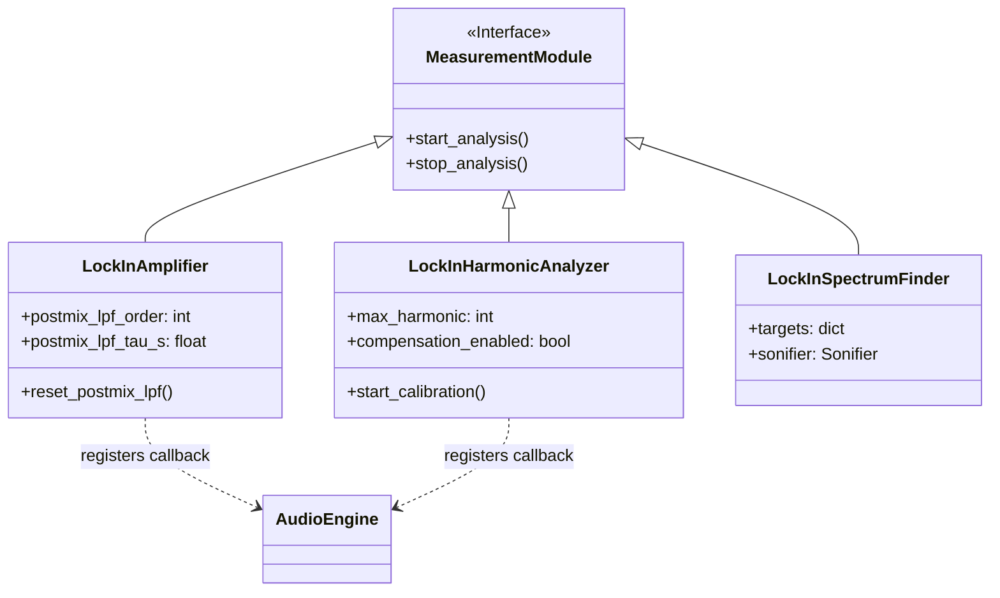

# Lock-in Amplifier Principles

<details>
<summary>Relevant source files</summary>

The following files were used as context for generating this wiki page:

- [.agent/skills/ci_prechecker/SKILL.md](../../.agent/skills/ci_prechecker/SKILL.md)
- [src/core/analysis.py](../../src/core/analysis.py)
- [src/core/sonifier.py](../../src/core/sonifier.py)
- [src/gui/widgets/advanced_distortion_meter.py](../../src/gui/widgets/advanced_distortion_meter.py)
- [src/gui/widgets/arbitrary_harmonic_generator.py](../../src/gui/widgets/arbitrary_harmonic_generator.py)
- [src/gui/widgets/distortion_analyzer.py](../../src/gui/widgets/distortion_analyzer.py)
- [src/gui/widgets/frequency_counter.py](../../src/gui/widgets/frequency_counter.py)
- [src/gui/widgets/hrtf_player.py](../../src/gui/widgets/hrtf_player.py)
- [src/gui/widgets/lock_in_amplifier.py](../../src/gui/widgets/lock_in_amplifier.py)
- [src/gui/widgets/lockin_harmonic_analyzer.py](../../src/gui/widgets/lockin_harmonic_analyzer.py)
- [src/gui/widgets/lockin_spectrum_finder.py](../../src/gui/widgets/lockin_spectrum_finder.py)
- [src/gui/widgets/noise_profiler.py](../../src/gui/widgets/noise_profiler.py)
- [src/gui/widgets/one_pps_monitor.py](../../src/gui/widgets/one_pps_monitor.py)
- [src/gui/widgets/ultrasound_modulator.py](../../src/gui/widgets/ultrasound_modulator.py)
- [tests/logic_verification/analysis/test_c_weighting_design.py](../../tests/logic_verification/analysis/test_c_weighting_design.py)
- [tests/logic_verification/analysis/test_imd.py](../../tests/logic_verification/analysis/test_imd.py)
- [tests/logic_verification/core/test_sonifier.py](../../tests/logic_verification/core/test_sonifier.py)
- [tests/logic_verification/gui/widgets/test_arbitrary_harmonic_generator.py](../../tests/logic_verification/gui/widgets/test_arbitrary_harmonic_generator.py)
- [tests/logic_verification/instruments/test_lockin_harmonic_analyzer.py](../../tests/logic_verification/instruments/test_lockin_harmonic_analyzer.py)
- [tests/logic_verification/instruments/test_lockin_spectrum_finder_sonification.py](../../tests/logic_verification/instruments/test_lockin_spectrum_finder_sonification.py)
- [tests/security/test_arbitrary_harmonic_generator_security.py](../../tests/security/test_arbitrary_harmonic_generator_security.py)

</details>


This page details the mathematical and implementation foundations of the lock-in detection suite in MeasureLab. It covers the dual-phase demodulation process, the specific challenges of PC-based audio hardware, and the digital signal processing (DSP) strategies used to achieve high dynamic reserve and precision.

## Mathematical Foundation: Dual-Phase Demodulation

MeasureLab utilizes **Dual-Phase Demodulation** (also known as IQ detection) to extract the amplitude and phase of a signal relative to a reference. This method is immune to noise outside a narrow bandwidth centered at the reference frequency.

### The Mixing Process
The input signal $V_{in}(t)$ is multiplied by two orthogonal reference signals: a sine (In-phase, $I$) and a cosine (Quadrature, $Q$).

$$I(t) = V_{in}(t) \cdot \sin(2\pi f_{ref} t)$$
$$Q(t) = V_{in}(t) \cdot \cos(2\pi f_{ref} t)$$

In `src/core/analysis.py`, reference signals are generated and cached for efficiency `src/core/analysis.py:96-107`.

### Low-Pass Filtering and DC Extraction
The multiplication results in components at $DC$ (the difference frequency, which is $0$ when locked) and $2f_{ref}$ (the sum frequency). A low-pass filter (LPF) removes the $2f_{ref}$ component, leaving only the DC terms proportional to the signal's vector components:

$$X = \langle I(t) \rangle_{LPF}$$
$$Y = \langle Q(t) \rangle_{LPF}$$

### Magnitude and Phase Calculation
The final polar coordinates are derived from the Cartesian $X$ and $Y$ values:
*   **Magnitude:** $A = 2 \cdot \sqrt{X^2 + Y^2}$
*   **Phase:** $\phi = \operatorname{atan2}(Y, X)$

This logic is implemented in the `LockInAmplifier` callback and processing loop `src/gui/widgets/lock_in_amplifier.py:228-255`.

---

## The Undefined Phase Problem and Hardware Loopback

In standard PC audio architectures (Windows/ASIO, macOS/CoreAudio, Linux/ALSA), there is no hardware-level synchronization between the DAC (output) clock and the ADC (input) clock's absolute starting phase.

### Why Hardware Loopback is Required
1.  **Phase Uncertainty:** When the `AudioEngine` starts, the delay between the software buffer request and the actual transducer movement is non-deterministic at the sample level.
2.  **Clock Drift:** Over long measurements, the DAC and ADC clocks may drift relative to each other if they are not derived from the same crystal oscillator.

To solve this, MeasureLab's Lock-in modules (such as the `LockInAmplifier` and `LockInHarmonicAnalyzer`) require a **Reference Channel**. Users must loop the excitation signal back into one of the input channels `src/gui/widgets/lock_in_amplifier.py:59-61`. The system then treats this physical loopback as the "True Phase" reference ($0^\circ$), and measures the "Signal Channel" relative to it.

### Continuous Phase Tracking
To handle clock drift and jitter, the `LockInAmplifier` performs continuous phase tracking of the reference channel `src/gui/widgets/lock_in_amplifier.py:175-176`. This ensures that even if the audio device drops a sample or the clock speed fluctuates, the relative phase between the reference and the DUT (Device Under Test) remains stable.

---

## DSP Implementation: IIR Post-Mix LPF Cascade

To achieve high **Dynamic Reserve** (the ability to detect a small signal buried in noise much larger than the signal itself), MeasureLab uses a specialized filtering strategy.

### Multi-Pole IIR Cascade
Instead of a single LPF, the system implements a cascade of up to 8 one-pole IIR sections on the complex baseband result ($X + jY$) `src/gui/widgets/lock_in_amplifier.py:79-86`. This provides:
*   **Steep Roll-off:** Better rejection of nearby interferers.
*   **Adjustable Time Constant:** The `postmix_lpf_tau_s` parameter allows users to trade off measurement speed for precision `src/gui/widgets/lock_in_amplifier.py:84`.

### Implementation in Code
The filter state is maintained as a complex array to process $I$ and $Q$ simultaneously, preserving the phase relationship:
```python
# From src/gui/widgets/lock_in_amplifier.py
self._postmix_lpf_state = [0j] * 8
```
The filter is reset whenever the harmonic or frequency changes to prevent stale data contamination `src/gui/widgets/lock_in_amplifier.py:131-134`.

---

## Data Flow and Component Architecture

The following diagram illustrates how the `LockInAmplifier` interacts with the `AudioEngine` and the DSP components.

**Figure 1: Lock-in Detection Data Flow**

Sources: `src/core/audio_engine.py`, `src/gui/widgets/lock_in_amplifier.py:185-225`, `src/core/analysis.py:96-107`

---

## Advanced Lock-in Variants

The codebase extends basic lock-in principles into specialized analyzers:

### 1. Lock-in Harmonic Analyzer
Uses **Matrix Projection** to detect up to 200 harmonics simultaneously `src/gui/widgets/lock_in_harmonic_analyzer.py:35`. It calculates THD and THD+N by projecting the input signal onto a set of reference vectors derived from the fundamental frequency `src/gui/widgets/lock_in_harmonic_analyzer.py:120-124`.

### 2. Lock-in Spectrum Finder
Performs a "Blind" scan of the spectrum by iterating through a list of target frequencies (e.g., mains harmonics, musical scales) and applying lock-in detection to each `src/gui/widgets/lock_in_spectrum_finder.py:57-104`.

### 3. Lock-in Modeler (SSS)
The Synchronized Swept Sine (SSS) method is a wideband application of lock-in principles. By using an exponential sweep, the system can separate linear response from nonlinear harmonic kernels in the time domain `src/gui/widgets/lock_in_harmonic_analyzer.py:82-94`.

**Figure 2: Lock-in Class Hierarchy and Relations**

Sources: `src/measurement_modules/base.py`, `src/gui/widgets/lock_in_amplifier.py:40`, `src/gui/widgets/lock_in_harmonic_analyzer.py:40`, `src/gui/widgets/lock_in_spectrum_finder.py:38`

---

## Technical Summary Table

| Feature | Implementation Detail | Source |
| :--- | :--- | :--- |
| **Demodulation** | Dual-phase (IQ) with sine/cosine references | `src/core/analysis.py:96-107` |
| **Filtering** | 1 to 8-pole complex IIR cascade | `src/gui/widgets/lock_in_amplifier.py:79-86` |
| **Reference** | External Hardware Loopback required | `src/gui/widgets/lock_in_amplifier.py:53-61` |
| **Max Harmonics** | Up to 200 orders in Harmonic Analyzer | `src/gui/widgets/lock_in_harmonic_analyzer.py:35` |
| **Phase Tracking** | Continuous unwrapped reference phase | `src/gui/widgets/lock_in_amplifier.py:175-176` |

Sources: `src/core/analysis.py`, `src/gui/widgets/lock_in_amplifier.py`, `src/gui/widgets/lock_in_harmonic_analyzer.py`

---
