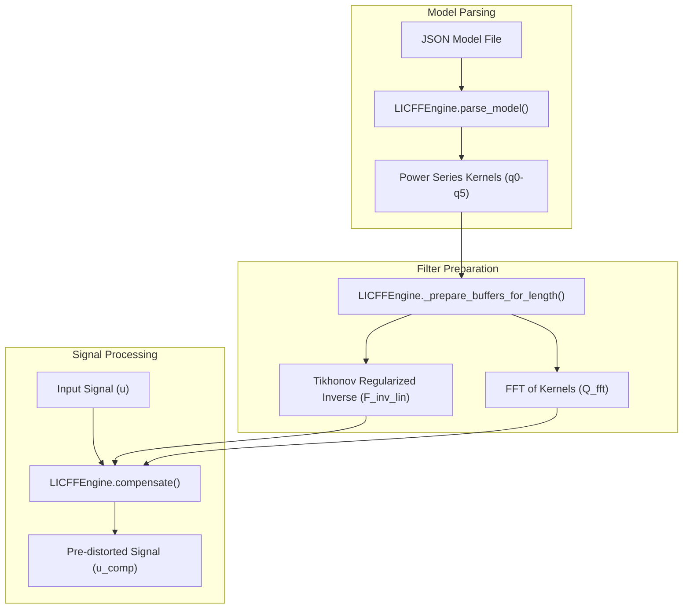

# Feedforward Compensation Algorithm

<details>
<summary>Relevant source files</summary>

The following files were used as context for generating this wiki page:

- [scripts/verify_lockin_vs_nonlinear_real_device.py](../../scripts/verify_lockin_vs_nonlinear_real_device.py)
- [src/core/nonlinear_analyzer_core.py](../../src/core/nonlinear_analyzer_core.py)
- [src/gui/widgets/feedforward_compensator.py](../../src/gui/widgets/feedforward_compensator.py)
- [tests/logic_verification/gui/test_nonlinear_analyzer_gui.py](../../tests/logic_verification/gui/test_nonlinear_analyzer_gui.py)
- [tests/logic_verification/gui/widgets/test_feedforward_compensator.py](../../tests/logic_verification/gui/widgets/test_feedforward_compensator.py)
- [tests/logic_verification/measurement_modules/test_lockin_vs_nonlinear.py](../../tests/logic_verification/measurement_modules/test_lockin_vs_nonlinear.py)
- [tests/logic_verification/measurement_modules/test_nonlinear_analyzer.py](../../tests/logic_verification/measurement_modules/test_nonlinear_analyzer.py)

</details>


The Feedforward Compensation subsystem implements the **Iterative Linear-Inverse Compensated Feedforward (LICFF)** algorithm. This system uses a Parallel Hammerstein Model (PHM) identified from the Nonlinear System Identification module to pre-distort audio signals, effectively cancelling both linear frequency response errors and nonlinear harmonic distortions in the playback chain.

## LICFF Algorithm Overview

The LICFF algorithm operates by applying a series of inverse kernels to the input signal. Unlike simple linear equalization, LICFF accounts for the interaction between frequency-dependent gain and nonlinear power-series terms. The implementation supports both real-time processing and iterative offline compensation for high-precision laboratory measurements.

### Data Flow and Engine Architecture

The `LICFFEngine` is the primary computational entity, responsible for parsing the PHM model and preparing the inverse filters.

"LICFF Engine Data Flow"

Sources: `src/gui/widgets/feedforward_compensator.py:36-73`, `src/gui/widgets/feedforward_compensator.py:187-200`

## Implementation Details

### Kernel Mapping and Normalization
The engine consumes kernels $h_1$ through $h_5$ extracted via Synchronized Swept Sine (SSS) deconvolution. In the `LICFFEngine.parse_model` function, these are mapped directly to power-series coefficients $q_p$ `src/gui/widgets/feedforward_compensator.py:98-104`. 

To ensure stability and prevent digital clipping, the engine:
1.  **Normalizes** kernels based on the peak of the linear response $h_1$ `src/gui/widgets/feedforward_compensator.py:125-134`.
2.  **Thresholds** high-order kernels (e.g., $h_4, h_5$) against a noise floor (typically -40 dB to -80 dB relative to $h_1$) to prevent compensating for measurement noise `src/gui/widgets/feedforward_compensator.py:107-122`.

### Inverse Filter Design
The linear inverse filter $F_{inv}$ is calculated in the frequency domain using Tikhonov regularization to prevent extreme boosts at nulls:
$$H_{inv}(f) = \frac{H_1^*(f)}{|H_1(f)|^2 + \epsilon}$$
The engine uses `solve_eps_in` to perform a logarithmic bisection search for an $\epsilon$ value that matches a user-defined maximum boost (e.g., +12 dB) `src/gui/widgets/feedforward_compensator.py:160-185`.

### Iterative Compensation
For nonlinear compensation, the `compensate` method can run iteratively. In each iteration, it calculates the predicted nonlinear distortion of the current pre-distorted signal and subtracts it from the input `src/gui/widgets/feedforward_compensator.py:440-470`.

## Instability Detection and Stabilization

A critical component of the compensator is ensuring that the pre-distortion does not cause system instability.

"Stability Management and Out-of-Band Handling"
```mermaid
graph TD
    [u_comp_signal] --> [LICFFEngine.compensate()]
    [LICFFEngine.compensate()] --> [Check Out-of-Band Mode]
    
    subgraph "OOB Handling"
        [Check Out-of-Band Mode] -- "bypass_aligned" --> [Apply Bandpass Filter]
        [Check Out-of-Band Mode] -- "full_compensation" --> [Unfiltered Output]
    end

    subgraph "Stabilization Logic"
        [Apply Bandpass Filter] --> [stabilize_poly]
        [stabilize_poly] --> [Polynomial Root Reflection]
        [Polynomial Root Reflection] --> [Stable u_comp]
    end
```
Sources: `src/gui/widgets/feedforward_compensator.py:59-60`, `src/gui/widgets/feedforward_compensator.py:201-215`

### Out-of-Band (OOB) Handling
Since measurement models are only valid within the sweep range (e.g., 20Hz - 20kHz), the engine provides several modes defined in `out_of_band_mode`:
*   **bypass_aligned**: Applies a zero-phase bandpass filter matching the model's valid range to the compensated signal, ensuring no attempt is made to correct DC or ultrasonic regions where the model is undefined `src/gui/widgets/feedforward_compensator.py:201-225`.
*   **full_compensation**: Allows the inverse filter to operate across the entire Nyquist bandwidth (risky).

## Key Classes and Functions

| Entity | Role | Location |
| :--- | :--- | :--- |
| `LICFFEngine` | Core DSP implementation of the LICFF algorithm. | `src/gui/widgets/feedforward_compensator.py:36-36` |
| `OfflineFFCompWorker` | QThread wrapper for batch processing WAV files. | `src/gui/widgets/feedforward_compensator.py:545-545` |
| `FeedforwardCompensator` | Module-level logic for managing model state. | `src/gui/widgets/feedforward_compensator.py:657-657` |
| `solve_eps_in` | Bisection search for regularization parameters. | `src/gui/widgets/feedforward_compensator.py:160-160` |
| `forward_model` | Simulates system output for a given input. | `src/gui/widgets/feedforward_compensator.py:349-349` |

## Verification and Testing

The algorithm is verified through `test_licff_engine_basic` and `test_compensate_delay_cancellation_nonlinear`, which ensure that:
1.  Linear delays in the model are correctly cancelled by the inverse filter `tests/logic_verification/gui/widgets/test_feedforward_compensator.py:177-213`.
2.  Noise thresholding correctly zeros out insignificant high-order kernels `tests/logic_verification/gui/widgets/test_feedforward_compensator.py:138-175`.
3.  The iterative process converges for known nonlinearities (e.g., quadratic/cubic systems) `tests/logic_verification/gui/widgets/test_feedforward_compensator.py:71-92`.

Sources: `src/gui/widgets/feedforward_compensator.py:1-600`, `tests/logic_verification/gui/widgets/test_feedforward_compensator.py:1-231`

---
