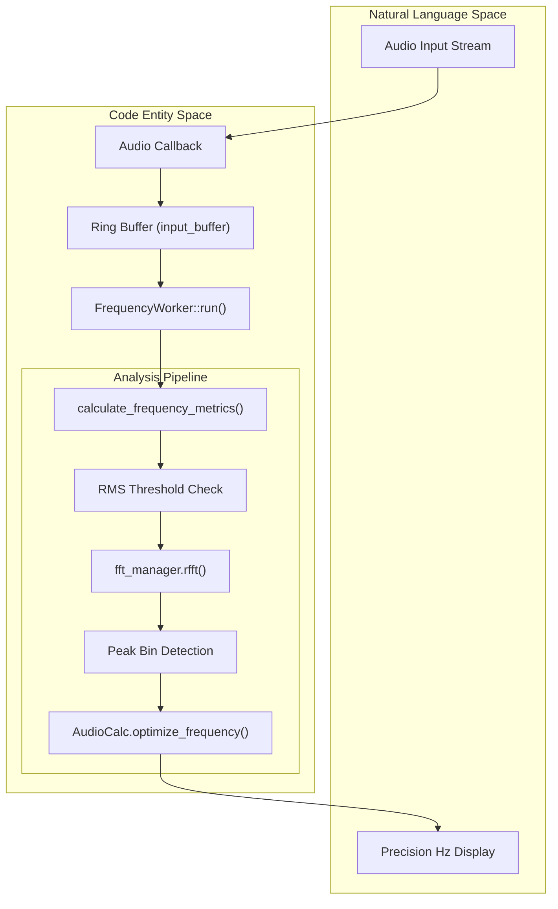
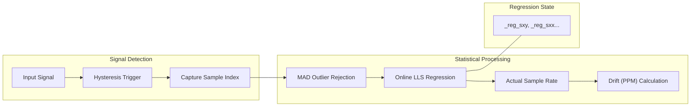

# Frequency Analysis and Precision Tracking

Relevant source files

The following files were used as context for generating this wiki page:

- [.agent/skills/ci_prechecker/SKILL.md](../../.agent/skills/ci_prechecker/SKILL.md)
- [src/core/analysis.py](../../src/core/analysis.py)
- [src/core/frequency_analysis.py](../../src/core/frequency_analysis.py)
- [src/gui/widgets/advanced_distortion_meter.py](../../src/gui/widgets/advanced_distortion_meter.py)
- [src/gui/widgets/distortion_analyzer.py](../../src/gui/widgets/distortion_analyzer.py)
- [src/gui/widgets/frequency_counter.py](../../src/gui/widgets/frequency_counter.py)
- [src/gui/widgets/hrtf_player.py](../../src/gui/widgets/hrtf_player.py)
- [src/gui/widgets/lock_in_amplifier.py](../../src/gui/widgets/lock_in_amplifier.py)
- [src/gui/widgets/noise_profiler.py](../../src/gui/widgets/noise_profiler.py)
- [src/gui/widgets/one_pps_monitor.py](../../src/gui/widgets/one_pps_monitor.py)
- [tests/core/test_core_frequency_analysis.py](../../tests/core/test_core_frequency_analysis.py)
- [tests/logic_verification/analysis/test_c_weighting_design.py](../../tests/logic_verification/analysis/test_c_weighting_design.py)
- [tests/logic_verification/analysis/test_distortion.py](../../tests/logic_verification/analysis/test_distortion.py)
- [tests/logic_verification/analysis/test_filters.py](../../tests/logic_verification/analysis/test_filters.py)
- [tests/logic_verification/analysis/test_frequency_analysis.py](../../tests/logic_verification/analysis/test_frequency_analysis.py)
- [tests/logic_verification/analysis/test_frequency_optimization.py](../../tests/logic_verification/analysis/test_frequency_optimization.py)
- [tests/logic_verification/analysis/test_imd.py](../../tests/logic_verification/analysis/test_imd.py)
- [tests/logic_verification/analysis/test_resample.py](../../tests/logic_verification/analysis/test_resample.py)
- [tests/logic_verification/gui/test_oscilloscope_math.py](../../tests/logic_verification/gui/test_oscilloscope_math.py)

This page details the technical implementation of high-precision frequency estimation, stability analysis, and clock drift tracking within MeasureLab. These algorithms power the Frequency Counter, 1PPS Monitor, and various distortion analyzers.

## Precision Frequency Estimation

The system employs a multi-stage approach to estimate the fundamental frequency of a signal with sub-bin precision, moving from coarse FFT-based detection to iterative optimization.

### Three-Pass Search Strategy
The core frequency estimation logic is encapsulated in `calculate_frequency_metrics` `src/core/frequency_analysis.py:6-53`, which follows these steps:

1.  **Amplitude Gating**: The RMS level is calculated. If it falls below `gate_threshold_db`, the analysis is bypassed `src/core/frequency_analysis.py:24-28`.
2.  **Coarse Estimate**: A Hamming window is applied to the buffer, followed by an RFFT. The bin with the maximum magnitude provides the initial frequency estimate `src/core/frequency_analysis.py:32-37`.
3.  **Iterative Optimization**: For frequencies above 10 Hz, the coarse estimate is refined using `AudioCalc.optimize_frequency` `src/core/analysis.py:216-220`. This function (not shown in full but referenced) typically uses a bounded scalar minimization (e.g., Brent's method) to find the frequency that minimizes the residual energy after subtracting a fitted sine wave.

### Bin Snapping
In modules like the `DistortionAnalyzer`, users can enable `snap_to_bin_center` `src/gui/widgets/distortion_analyzer.py:50`. This aligns the generator frequency exactly with an FFT bin center to eliminate spectral leakage without requiring windows, which is critical for measuring ultra-low THD floor components.

### Implementation Diagram: Frequency Estimation Flow
The following diagram illustrates the data flow from raw audio samples to a precision frequency readout.

| Entity | Role |
| :--- | :--- |
| `FrequencyWorker` | `QRunnable` that executes analysis in a background thread `src/gui/widgets/frequency_counter.py:99-121`. |
| `calculate_frequency_metrics` | Orchestrates the coarse and fine estimation logic `src/core/frequency_analysis.py:6-53`. |
| `fft_manager` | Provides optimized FFT transforms `src/core/fft_manager.py`. |

Sources: `src/core/frequency_analysis.py:6-53`, `src/gui/widgets/frequency_counter.py:99-121`, `src/gui/widgets/distortion_analyzer.py:41-55`

---

## Stability Analysis: Allan Deviation

To measure the long-term stability of oscillators or sample clocks, MeasureLab implements Allan Deviation ($\sigma_y(\tau)$), which distinguishes between different noise types (e.g., white FM vs. random walk FM).

### Mathematical Implementation
The function `calculate_allan_deviation` `src/core/frequency_analysis.py:56-90` computes the deviation for multiple observation intervals ($\tau$).
*   **Averaging**: The input frequency history is reshaped into blocks of size $m$ to calculate the mean frequency $y_k$ for that interval `src/core/frequency_analysis.py:79`.
*   **Difference Calculation**: The variance is derived from the mean square of successive differences: $\sigma_y^2(\tau) = \frac{1}{2(N-1)} \sum (y_{k+1} - y_k)^2$ `src/core/frequency_analysis.py:81-82`.
*   **Logarithmic Scaling**: To handle long datasets efficiently, the observation interval $m$ is doubled in each iteration ($m *= 2$), producing a logarithmic distribution of $\tau$ values `src/core/frequency_analysis.py:88`.

### Threaded Execution
Because Allan Deviation calculations can become computationally expensive as the history grows (up to 360,000 points `src/gui/widgets/frequency_counter.py:145`), it is offloaded to `AllanWorker` `src/gui/widgets/frequency_counter.py:43-91`.

Sources: `src/core/frequency_analysis.py:56-90`, `src/gui/widgets/frequency_counter.py:43-91`, `src/gui/widgets/frequency_counter.py:145`

---

## 1PPS Online Regression and Drift Tracking

The `OnePPSMonitor` tracks the drift of the audio interface's sample clock relative to an external 1 Pulse Per Second (PPS) reference signal.

### Online Least Squares Regression
The monitor uses online (recursive) least squares to estimate the actual sample rate. It models the relationship $y = mx + c$, where:
*   $x$: Pulse Count (integer seconds).
*   $y$: Sample Index (cumulative samples since start).
*   $m$: Estimated Sample Rate (Slope).

The state is maintained via cumulative sums: `_reg_n`, `_reg_sx`, `_reg_sy`, `_reg_sxx`, and `_reg_sxy` `src/gui/widgets/one_pps_monitor.py:83-87`. This allows the system to update the drift estimate with every new pulse without re-processing the entire history.

### Robust Outlier Rejection
To prevent jitter or false triggers from corrupting the regression, the system employs a Median Absolute Deviation (MAD) filter `src/gui/widgets/one_pps_monitor.py:49-55`.
*   **Filter Window**: A rolling window of recent pulse intervals is maintained.
*   **Sigma Clipping**: Pulses that fall outside a user-defined `filter_tolerance_sigma` relative to the median are rejected from the regression `src/gui/widgets/one_pps_monitor.py:52`.

### 1PPS Monitoring Logic

Sources: `src/gui/widgets/one_pps_monitor.py:30-101`, `src/gui/widgets/one_pps_monitor.py:121-141`

---

## Advanced Phase and Fractional Tracking

### Fractional Phase Wrapping
In the `LockInAmplifier`, continuous phase tracking is maintained across buffer boundaries. The system tracks an `_unwrapped_ref_phase` `src/gui/widgets/lock_in_amplifier.py:175` to ensure that demodulation remains coherent even if the buffer size is not an integer multiple of the signal period.

### AR(2) and Harmonic Modeling
The `DistortionAnalyzer` uses an AR(2) or similar model (via `AudioCalc.analyze_harmonics`) to extract fundamental and harmonic components `src/gui/widgets/distortion_analyzer.py:103-132`.
*   **Averaging**: Raw RMS components (`raw_fund_rms`, `raw_res_rms`) are averaged in the linear domain before conversion to dB or percentage to prevent biasing from the log-normal distribution of noise `src/gui/widgets/distortion_analyzer.py:116-118`.
*   **Validation**: The system performs a sanity check: if THD+N is lower than THD (physically impossible), the result is flagged as invalid `src/gui/widgets/distortion_analyzer.py:188-190`.

Sources: `src/gui/widgets/lock_in_amplifier.py:175`, `src/gui/widgets/distortion_analyzer.py:103-190`

---
