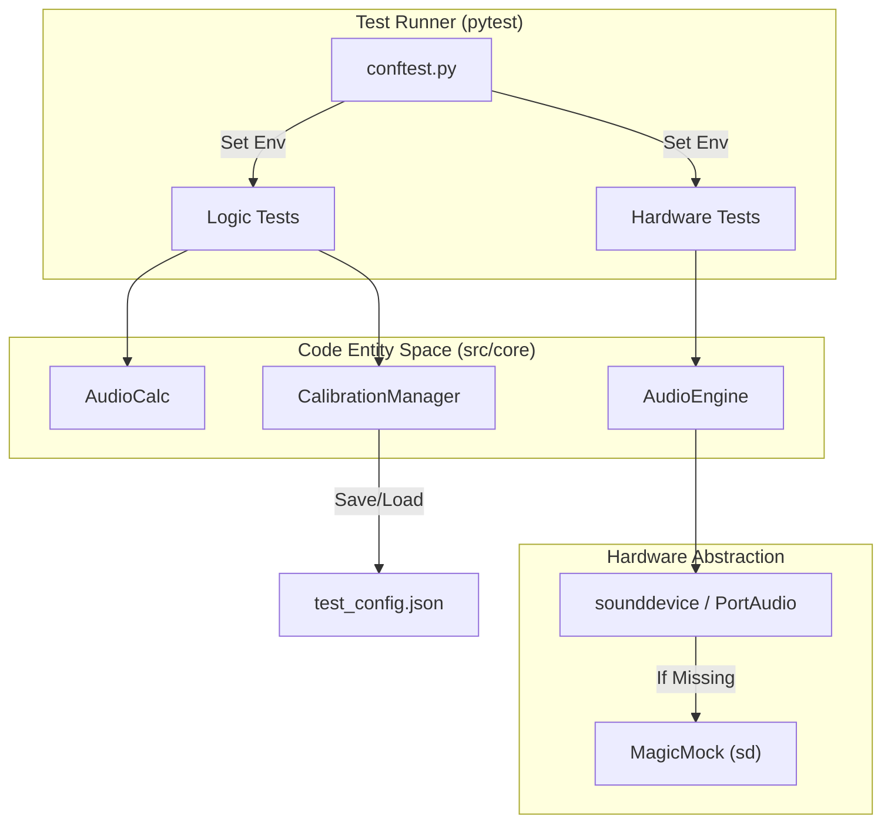
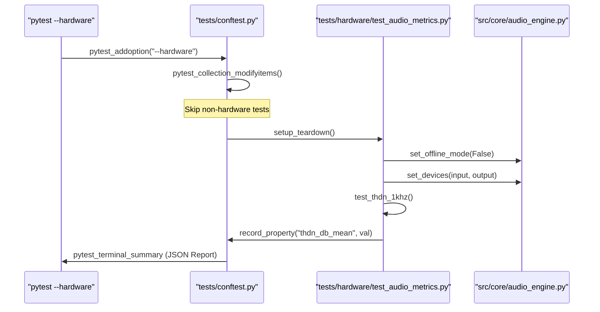

# Testing and Quality Assurance

Relevant source files

The following files were used as context for generating this wiki page:

- [pytest.ini](../../pytest.ini)
- [tests/conftest.py](../../tests/conftest.py)
- [tests/core/test_core_hammerstein_model.py](../../tests/core/test_core_hammerstein_model.py)
- [tests/hardware/test_audio_metrics.py](../../tests/hardware/test_audio_metrics.py)
- [tests/hardware/test_linearity.py](../../tests/hardware/test_linearity.py)
- [tests/hardware/test_lockin_accuracy.py](../../tests/hardware/test_lockin_accuracy.py)
- [tests/hardware/test_lockin_phase_stability.py](../../tests/hardware/test_lockin_phase_stability.py)
- [tests/hardware/test_multitone_distortion.py](../../tests/hardware/test_multitone_distortion.py)
- [tests/logic_verification/core/test_analysis.py](../../tests/logic_verification/core/test_analysis.py)
- [tests/logic_verification/core/test_calibration.py](../../tests/logic_verification/core/test_calibration.py)
- [tests/logic_verification/core/test_calibration_manager.py](../../tests/logic_verification/core/test_calibration_manager.py)

The MeasureLab test infrastructure is designed to ensure high-fidelity signal processing, UI stability, and hardware integration accuracy. The suite is divided into logic verification (unit/integration tests) and hardware benchmarks that require physical loopback interfaces.

## Test Infrastructure Overview

The testing environment is managed via `pytest` and configured in `tests/conftest.py`. To facilitate CI/CD and automated environments, the system defaults to a headless state for Qt and mocks hardware dependencies when they are unavailable.

### Environment Configuration
- **Headless Qt**: The `QT_QPA_PLATFORM` is set to `offscreen` to allow GUI widget testing without a physical display `tests/conftest.py:13-14`.
- **Testing Flag**: `MEASURELAB_TESTING` is set to `1` to disable persistent file logging and prevent tests from overwriting user configurations `tests/conftest.py:16-17`.
- **Hardware Mocking**: If `sounddevice` or PortAudio is missing, a `MagicMock` is injected into `sys.modules` to prevent import errors during logic-only tests `tests/conftest.py:19-30`.

### Test Categories
| Category | Marker | Description |
| :--- | :--- | :--- |
| **Logic Verification** | (Default) | Unit tests for DSP algorithms, config management, and UI logic. |
| **Hardware Tests** | `@pytest.mark.hardware` | Integration tests requiring physical audio loopback to verify real-world accuracy `tests/conftest.py:107-112`. |
| **Benchmarks** | `benchmark` | Performance testing of FFT and sweep algorithms. |

## Logic Verification
The logic verification suite focuses on the "Code Entity Space," ensuring that core managers and DSP functions behave as mathematically expected.

- **Core Managers**: Tests for `CalibrationManager` verify the persistence of SPL offsets, input sensitivity, and frequency correction maps `tests/logic_verification/core/test_calibration_manager.py:66-80`.
- **DSP Algorithms**: `AudioCalc` methods such as `calculate_thdn_sine_fit` and `optimize_frequency` are validated against synthetic signals to ensure precision `tests/logic_verification/core/test_analysis.py:99-105`.
- **Headless UI**: Widgets are instantiated and exercised in an offscreen buffer to verify state transitions and data handling.

For details, see [Logic Verification Tests](#6.1).

## Hardware and Security Tests
Hardware tests are triggered using the `--hardware` flag. These tests use the `AudioEngine` to perform real-time measurements through the system's physical ASIO/CoreAudio/ALSA drivers.

### Hardware Accuracy Metrics
The suite measures physical performance characteristics:
- **THD+N Stability**: Verified using `DistortionAnalyzer.calculate_metrics` over a physical loopback `tests/hardware/test_audio_metrics.py:95-104`.
- **Lock-in Precision**: Measures Relative Standard Deviation (RSD) in ppm for magnitude stability `tests/hardware/test_lockin_accuracy.py:122-124`.
- **Phase Stability**: Uses `LockInFrequencyCounter` to calculate Time Interval Error (TIE) and jitter in nanoseconds `tests/hardware/test_lockin_phase_stability.py:135-138`.

### Security and Benchmarks
- **Security**: Includes checks for CSV injection in exporters and path traversal in the `ConfigManager`.
- **Benchmarks**: Validates the throughput of the `RealtimeSSSEngine` and `FFTManager` under load.

For details, see [Hardware, Security, and Benchmark Tests](#6.2).

## Test Architecture Diagrams

### Testing Data Flow
This diagram illustrates how the test runner interacts with both the mocked environment and the physical hardware abstraction layer.

Sources: `tests/conftest.py:8-30`, `tests/logic_verification/core/test_calibration_manager.py:58-64`, `tests/hardware/test_audio_metrics.py:32-41`

### Hardware Test Execution Lifecycle
This diagram shows the relationship between the `pytest` CLI options and the internal state of the hardware test modules.

Sources: `tests/conftest.py:81-112`, `tests/conftest.py:146-168`, `tests/hardware/test_audio_metrics.py:33-51`

## Summary of Test Utilities

| Utility | File Path | Purpose |
| :--- | :--- | :--- |
| **Offscreen Fixture** | `tests/conftest.py` | Forces Qt into `offscreen` mode for headless CI `14`. |
| **Hardware Config** | `tests/conftest.py` | Loads `config.json` to identify physical I/O for tests `48-78`. |
| **JSON Reporter** | `tests/conftest.py` | Aggregates hardware metrics into `report.json` `130-143`. |
| **Mock Numpy** | `tests/logic_verification/core/test_calibration_manager.py` | Provides fallback DSP math if `numpy` is missing `12-47`. |

Sources: `tests/conftest.py:1-210`, `tests/logic_verification/core/test_calibration_manager.py:1-50`, `tests/hardware/test_audio_metrics.py:1-115`

---
