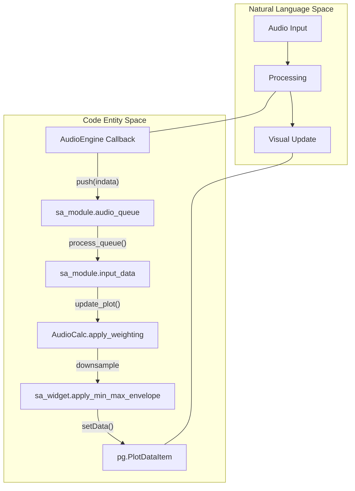
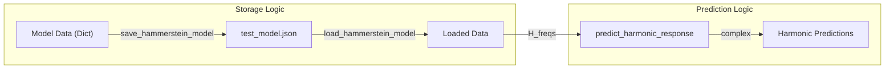

# Logic Verification Tests

Relevant source files

The following files were used as context for generating this wiki page:

- [tests/core/test_core_hammerstein_model.py](../../tests/core/test_core_hammerstein_model.py)
- [tests/logic_verification/analysis/test_lockin_comprehensive.py](../../tests/logic_verification/analysis/test_lockin_comprehensive.py)
- [tests/logic_verification/analysis/test_noise_profile_logic.py](../../tests/logic_verification/analysis/test_noise_profile_logic.py)
- [tests/logic_verification/core/test_analysis.py](../../tests/logic_verification/core/test_analysis.py)
- [tests/logic_verification/core/test_audio_engine.py](../../tests/logic_verification/core/test_audio_engine.py)
- [tests/logic_verification/core/test_calibration.py](../../tests/logic_verification/core/test_calibration.py)
- [tests/logic_verification/core/test_calibration_manager.py](../../tests/logic_verification/core/test_calibration_manager.py)
- [tests/logic_verification/core/test_window_functions.py](../../tests/logic_verification/core/test_window_functions.py)
- [tests/logic_verification/gui/test_bit_depth_analyzer.py](../../tests/logic_verification/gui/test_bit_depth_analyzer.py)
- [tests/logic_verification/gui/test_frequency_counter_reset.py](../../tests/logic_verification/gui/test_frequency_counter_reset.py)
- [tests/logic_verification/gui/test_main_window_activity.py](../../tests/logic_verification/gui/test_main_window_activity.py)
- [tests/logic_verification/gui/test_noise_profiler_gui_logic.py](../../tests/logic_verification/gui/test_noise_profiler_gui_logic.py)
- [tests/logic_verification/gui/test_recorder_player_race.py](../../tests/logic_verification/gui/test_recorder_player_race.py)
- [tests/logic_verification/gui/widgets/test_distortion_analyzer_widget.py](../../tests/logic_verification/gui/widgets/test_distortion_analyzer_widget.py)
- [tests/logic_verification/instruments/test_spectrum_analyzer.py](../../tests/logic_verification/instruments/test_spectrum_analyzer.py)

The `logic_verification` test suite is designed to validate the core mathematical algorithms, state management, and GUI logic of MeasureLab in a controlled environment. Unlike hardware integration tests, these tests focus on deterministic software behavior using mocks for hardware dependencies like audio interfaces and physical inputs.

## Core Logic Tests

The core tests verify the foundational subsystems that drive the application, ensuring that data processing remains accurate across architectural changes.

### Audio Engine Verification
The `AudioEngine` is tested using a `VirtualStream` `tests/logic_verification/core/test_audio_engine.py:25-39` which simulates the PortAudio callback loop without requiring a physical sound card. 
*   **Headless Execution**: The tests mock `sounddevice` `tests/logic_verification/core/test_audio_engine.py:10-12` to prevent CI failures in environments without audio drivers.
*   **State Management**: Tests verify the correct propagation of settings like software loopback, output muting, and offline mode `tests/logic_verification/core/test_audio_engine.py:97-138`.
*   **Status Reporting**: The `get_status` method is validated to ensure it correctly reports CPU load, sample rate, and accumulated callback errors `tests/logic_verification/core/test_audio_engine.py:162-194`.

### Calibration and Configuration
The `CalibrationManager` logic is verified for persistence and mathematical correctness.
*   **SPL Conversion**: Tests confirm that `dbfs_to_spl` correctly applies offsets calculated during calibration `tests/logic_verification/core/test_calibration_manager.py:101-115`.
*   **Profile Management**: Logic for saving, loading, and deleting hardware profiles is tested to ensure no data corruption occurs during JSON serialization `tests/logic_verification/core/test_calibration_manager.py:151-170`.
*   **Frequency Maps**: The system verifies linear interpolation and boundary clamping for frequency correction maps (Magnitude/Phase) `tests/logic_verification/core/test_calibration.py:122-162`.

### Analysis Algorithms
The `AudioCalc` class in `src.core.analysis` contains the primary DSP logic, which is tested for precision:
*   **THD+N Calculation**: Verified using synthetic sine waves with injected noise, ensuring the AES17 filter and sine-fitting algorithms produce expected dB values `tests/logic_verification/core/test_analysis.py:138-168`.
*   **Noise Profiling**: Validates the detection of 50/60Hz hum, calculation of 1/f flicker slopes, and Rayleigh RMS correction factors `tests/logic_verification/analysis/test_noise_profile_logic.py:21-72`.
*   **Filter Integrity**: Tests ensure that A-weighting and C-weighting filters meet SOS (Second-Order Sections) shape requirements `tests/logic_verification/core/test_analysis.py:49-58`.

**Sources:**
*   `tests/logic_verification/core/test_audio_engine.py:1-194`
*   `tests/logic_verification/core/test_calibration_manager.py:58-170`
*   `tests/logic_verification/core/test_analysis.py:7-168`
*   `tests/logic_verification/analysis/test_noise_profile_logic.py:12-72`

---

## GUI and Widget Logic Tests

MeasureLab utilizes `pytest-qt` and a headless Qt platform (`offscreen`) to verify widget behavior without a physical display.

### Headless Qt Approach
To run tests in CI environments, the `QT_QPA_PLATFORM` is set to `offscreen` `tests/logic_verification/gui/test_frequency_counter_reset.py:14`. This allows `qtbot` to simulate clicks, text input, and window events.

### Component Verification
| Widget | Logic Tested | Key File |
| :--- | :--- | :--- |
| **MainWindow** | Sidebar activity indicators and detached window tooltips. | `test_main_window_activity.py` |
| **Distortion Analyzer** | AES17 calibration state machine and color-coded feedback for input levels. | `test_distortion_analyzer_widget.py` |
| **Frequency Counter** | State reset logic and "Compact Mode" UI transformations. | `test_frequency_counter_reset.py` |
| **Spectrum Analyzer** | Queue data flow from audio callback to plot rendering and weighting application. | `test_spectrum_analyzer.py` |
| **Bit Depth Analyzer** | ENOB (Effective Number of Bits) estimation and UI history updates. | `test_bit_depth_analyzer.py` |

### Data Flow Diagram: Callback to Widget
The following diagram illustrates how the logic verification tests bridge the gap between the `AudioEngine` callback and the `SpectrumAnalyzerWidget`.

**Title: Audio Data Propagation Logic**

**Sources:**
*   `tests/logic_verification/gui/test_main_window_activity.py:34-101`
*   `tests/logic_verification/gui/widgets/test_distortion_analyzer_widget.py:18-121`
*   `tests/logic_verification/gui/test_frequency_counter_reset.py:35-125`
*   `tests/logic_verification/instruments/test_spectrum_analyzer.py:42-175`
*   `tests/logic_verification/gui/test_bit_depth_analyzer.py:11-39`

---

## Race Condition and Edge Case Tests

Specific tests target multi-threaded edge cases, particularly in the `RecorderPlayer` and `AudioEngine` interactions.

### Buffer Management
The `test_infinite_loop_hang_empty_buffer` test `tests/logic_verification/gui/test_recorder_player_race.py:83-113` ensures that the `RecorderPlayer` audio callback gracefully exits and stops playback if the buffer is empty, preventing a thread hang.

### Hammerstein Model Persistence
Logic for the Nonlinear Response Analyzer is verified by mocking the `json.dump` process to ensure that complex `numpy` arrays in the `HammersteinModel` are correctly serialized and deserialized without precision loss `tests/core/test_core_hammerstein_model.py:32-64`.

**Title: Hammerstein Model Data Flow**

**Sources:**
*   `tests/logic_verification/gui/test_recorder_player_race.py:49-113`
*   `tests/core/test_core_hammerstein_model.py:32-136`

---
