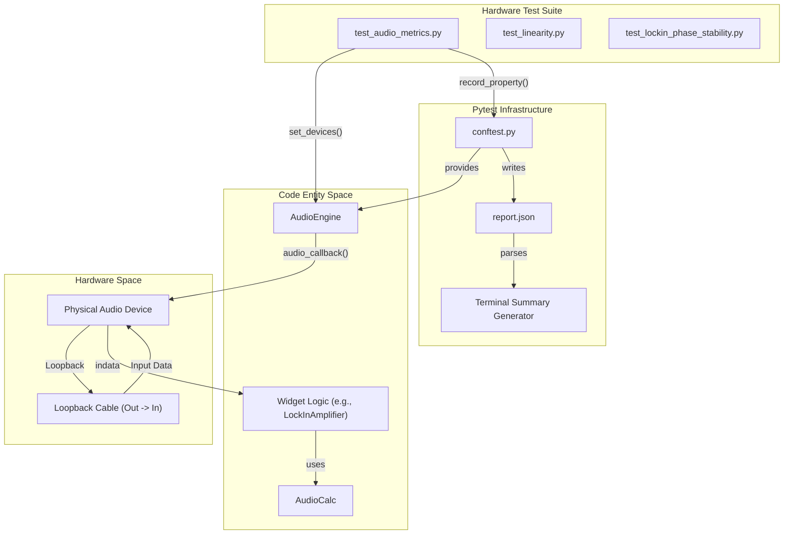
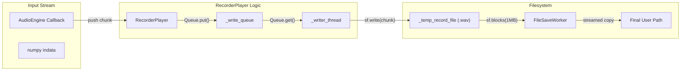

# Hardware, Security, and Benchmark Tests

Relevant source files

The following files were used as context for generating this wiki page:

- [pytest.ini](../../pytest.ini)
- [src/gui/widgets/recorder_player.py](../../src/gui/widgets/recorder_player.py)
- [tests/conftest.py](../../tests/conftest.py)
- [tests/hardware/test_audio_metrics.py](../../tests/hardware/test_audio_metrics.py)
- [tests/hardware/test_linearity.py](../../tests/hardware/test_linearity.py)
- [tests/hardware/test_lockin_accuracy.py](../../tests/hardware/test_lockin_accuracy.py)
- [tests/hardware/test_lockin_phase_stability.py](../../tests/hardware/test_lockin_phase_stability.py)
- [tests/hardware/test_multitone_distortion.py](../../tests/hardware/test_multitone_distortion.py)
- [tests/logic_verification/analysis/test_distortion_averaging.py](../../tests/logic_verification/analysis/test_distortion_averaging.py)
- [tests/logic_verification/gui/test_noise_profiler_widget_logic.py](../../tests/logic_verification/gui/test_noise_profiler_widget_logic.py)
- [tests/logic_verification/instruments/test_allan_worker.py](../../tests/logic_verification/instruments/test_allan_worker.py)
- [tests/security/test_calibration_path_traversal.py](../../tests/security/test_calibration_path_traversal.py)
- [tests/security/test_config_path_resolution.py](../../tests/security/test_config_path_resolution.py)
- [tests/security/test_config_permissions.py](../../tests/security/test_config_permissions.py)
- [tests/security/test_config_traversal.py](../../tests/security/test_config_traversal.py)
- [tests/security/test_recorder_memory.py](../../tests/security/test_recorder_memory.py)

This page details the testing infrastructure for hardware integration, security hardening, and algorithmic performance. These tests ensure the reliability of the DSP pipeline under real-world conditions and protect against common software vulnerabilities.

## Hardware Integration Tests

Hardware tests are marked with the `@pytest.mark.hardware` decorator `pytest.ini:7-7` and require a physical audio loopback (output connected to input). They are executed using the `--hardware` flag `tests/conftest.py:82-87`.

### Test Modes
The test suite supports two execution modes via the `--hardware-mode` parameter `tests/conftest.py:89-94`:
*   **Typical**: Runs a single representative case (e.g., -6dBFS amplitude, 10x averaging) to verify basic functionality.
*   **Limit**: Executes a matrix of parameters (amplitudes, buffer sizes, averaging counts) to identify performance boundaries and stability limits.

### Audio Metrics and Linearity
The system verifies fundamental audio performance through automated sweeps.

*   **THD+N Matrix**: Measures Total Harmonic Distortion plus Noise at 1kHz across an amplitude sweep from -12dBFS to 0dBFS `tests/hardware/test_audio_metrics.py:25-30`. It utilizes the `DistortionAnalyzer` class to calculate `mean_thdn` and `std_thdn` `tests/hardware/test_audio_metrics.py:165-166`.
*   **Linearity Sweep**: Uses a dual-phase lock-in calculation via `AudioCalc.calculate_lockin_measurement` `tests/hardware/test_linearity.py:182-184` to measure gain consistency. The test sweeps levels down to -120dBFS in "limit" mode `tests/hardware/test_linearity.py:30-34`.
*   **Multitone Distortion (MIM)**: Evaluates "Total Distortion + Noise" (TD+N) using 31 or 63 tones `tests/hardware/test_multitone_distortion.py:25-31`. It uses the `AdvancedDistortionMeter` in `MIM` mode `tests/hardware/test_multitone_distortion.py:87-87` and calculates metrics via `AudioCalc.calculate_multitone_tdn` `tests/hardware/test_multitone_distortion.py:166-166`.

### Lock-in Accuracy and Phase Stability
Precision tracking is verified through high-resolution stability tests.

*   **Magnitude Stability**: Measures the Relative Standard Deviation (RSD) in ppm for a 1kHz signal `tests/hardware/test_lockin_accuracy.py:122-123`. It iterates through buffer sizes up to 524,288 samples to ensure logic stability with large FFT sizes `tests/hardware/test_lockin_accuracy.py:27-27`.
*   **Phase Stability & TIE**: Uses the `LockInFrequencyCounter` to measure Time Interval Error (TIE) and phase jitter `tests/hardware/test_lockin_phase_stability.py:45-47`. It detrends the accumulated phase to calculate short-term jitter in nanoseconds `tests/hardware/test_lockin_phase_stability.py:137-138`.

### Data Flow: Hardware Test Execution
The following diagram illustrates how the `pytest` infrastructure interacts with the `AudioEngine` and hardware devices.

**Hardware Test Architecture**

**Sources:** `tests/conftest.py:81-113`, `tests/hardware/test_audio_metrics.py:32-51`, `tests/hardware/test_lockin_phase_stability.py:55-78`

---

## Security Tests

The security suite focuses on protecting the filesystem and ensuring memory safety during high-bandwidth operations.

### Filesystem Protection
*   **Path Traversal**: `test_screenshot_path_traversal` ensures that relative paths in the configuration (e.g., `../target`) are handled safely by the `ConfigManager` `tests/security/test_config_traversal.py:8-12`.
*   **External Calibration**: `test_load_frequency_map_allows_external_path` verifies that the `CalibrationManager` can explicitly load user-provided files from external directories (like Downloads) while maintaining internal state integrity `tests/security/test_calibration_path_traversal.py:7-11`.
*   **Config Permissions**: Verified in `test_config_permissions.py` (referenced) to ensure sensitive JSON files are not world-readable.

### Memory Safety and Streaming
The `RecorderPlayer` module is a primary target for security testing due to its handling of large audio files.

*   **OOM Prevention**: `test_audio_callback_streams_to_disk` verifies that the `RecorderPlayer` audio callback pushes data to a `_write_queue` `src/gui/widgets/recorder_player.py:135-136` rather than an in-memory list, preventing Out-Of-Memory (OOM) crashes during long recordings `tests/security/test_recorder_memory.py:90-98`.
*   **Chunked I/O**: `FileSaveWorker` and `FileLoadWorker` are tested to ensure they use `sf.blocks` `src/gui/widgets/recorder_player.py:106-109` for efficient, constant-memory throughput regardless of file size `tests/security/test_recorder_memory.py:123-138`.
*   **Input Validation**: `AudioCalc.validate_audio_file_size` is called before loading to reject excessively large or corrupt headers `src/gui/widgets/recorder_player.py:49-53`.

**Recorder Security and Data Flow**

**Sources:** `src/gui/widgets/recorder_player.py:97-110`, `tests/security/test_recorder_memory.py:90-106`

---

## Algorithm Benchmarks

Benchmarks are integrated into the hardware and logic verification suites to track performance regressions in core DSP algorithms.

| Benchmark Target | Code Entity | Metrics Tracked |
| :--- | :--- | :--- |
| **Distortion Averaging** | `DistortionAnalyzer._apply_result_averaging` | Logic validity (THD+N > THD check) `tests/logic_verification/analysis/test_distortion_averaging.py:93-122` |
| **Lock-in Convergence** | `LockInAmplifier.process_data` | Magnitude settling time vs. `averaging_count` `tests/hardware/test_lockin_accuracy.py:86-90` |
| **Frequency Tracking** | `LockInFrequencyCounter` | Allan Deviation and Frequency Offset `tests/hardware/test_lockin_phase_stability.py:167-175` |
| **Multitone TD+N** | `AudioCalc.calculate_multitone_tdn` | Computational accuracy of TD+N vs. amplitude `tests/hardware/test_multitone_distortion.py:165-176` |

### Logic Verification
Logic tests use a "headless" Qt environment by setting `QT_QPA_PLATFORM=offscreen` `tests/conftest.py:13-14`. This allows verifying widget-bound logic (like the `DistortionAnalyzer`'s validity checks) without a physical display `tests/logic_verification/analysis/test_distortion_averaging.py:82-92`.

**Sources:** `tests/conftest.py:13-17`, `tests/logic_verification/analysis/test_distortion_averaging.py:93-143`, `tests/hardware/test_multitone_distortion.py:144-176`

---
