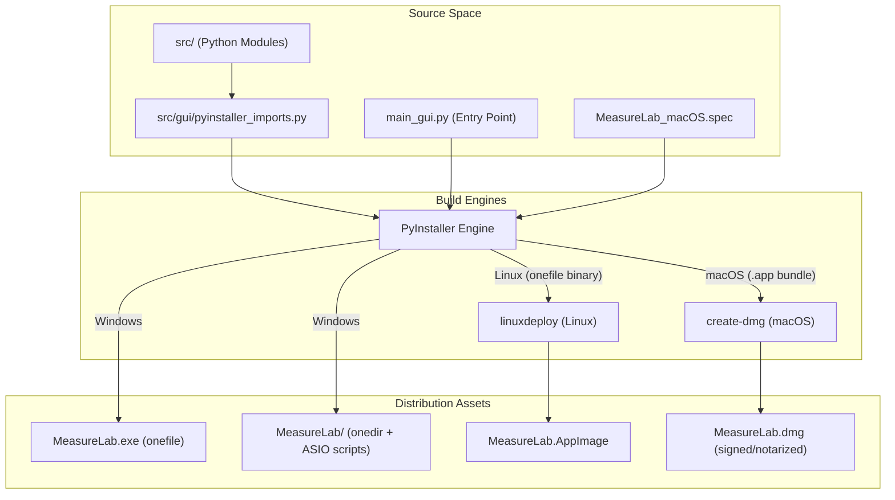
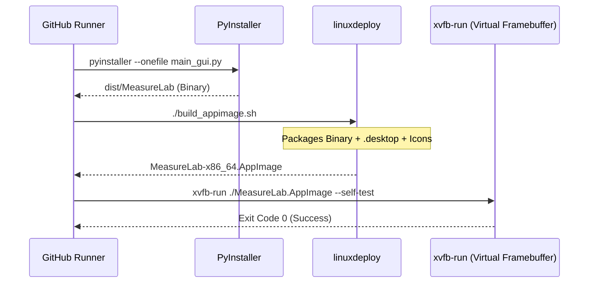

# Multi-Platform Build Workflows

Relevant source files

The following files were used as context for generating this wiki page:

- [.github/workflows/build_appimage.yml](../../.github/workflows/build_appimage.yml)
- [.github/workflows/build_macos.yml](../../.github/workflows/build_macos.yml)
- [.github/workflows/build_macos_intel.yml](../../.github/workflows/build_macos_intel.yml)
- [.github/workflows/build_windows.yml](../../.github/workflows/build_windows.yml)
- [.github/workflows/ci.yml](../../.github/workflows/ci.yml)
- [.github/workflows/pdf_draft.yml](../../.github/workflows/pdf_draft.yml)
- [.github/workflows/release.yml](../../.github/workflows/release.yml)
- [.github/workflows/scorecard.yml](../../.github/workflows/scorecard.yml)
- [MeasureLab_macOS.spec](../../MeasureLab_macOS.spec)
- [audio-tools.desktop](../../audio-tools.desktop)
- [build_appimage.sh](../../build_appimage.sh)
- [entitlements_mac.plist](../../entitlements_mac.plist)
- [src/gui/pyinstaller_imports.py](../../src/gui/pyinstaller_imports.py)

This page details the automated build processes and packaging strategies for MeasureLab across Windows, Linux, and macOS. The build system leverages **PyInstaller** to bundle the Python environment and dependencies into platform-specific distributions, including standalone executables, AppImages, and DMG installers.

## Build Process Overview

The build pipeline is triggered by tags (e.g., `v1.0.0`) or manual dispatch via GitHub Actions. It ensures consistency across architectures by using native runners for each target platform.

### High-Level Build Flow
The following diagram illustrates the transformation from source code to distributable assets across all platforms.

**Figure 1: Source to Asset Pipeline**

**Sources:** `.github/workflows/release.yml:1-200`, `src/gui/pyinstaller_imports.py:1-90`, `MeasureLab_macOS.spec:1-81`

---

## Windows Build Workflow

The Windows build generates two distinct distribution formats: a single-file executable for portability and a directory-based distribution for performance and ASIO support.

### ICU DLL Management
MeasureLab requires specific International Components for Unicode (ICU) libraries from the Windows system directory to support localization features. These are manually staged during the build process:
- `C:\Windows\System32\icu.dll`
- `C:\Windows\System32\icuuc.dll`
- `C:\Windows\System32\icuin.dll`

These are bundled into the executable using the `--add-binary "libs/icu*.dll;."` flag.

### ASIO Support Scripts
For the `onedir` build, specific batch scripts are included in the root folder to help users manage ASIO drivers, which often require specific environment configurations or registry tweaks:
- `enable_asio.bat`
- `disable_asio.bat`
- `README_ASIO.txt`

### Build Command Entities
| Entity | Role | Configuration |
| :--- | :--- | :--- |
| `onefile` | Portable Executable | `--onefile --windowed --name MeasureLab` |
| `onedir` | High Performance | `--windowed --name MeasureLab` |
| `Icon` | `app_icon.ico` | Generated via ImageMagick `magick` |
| `Hidden Imports` | `pyfftw` | Explicitly included for FFT acceleration |

**Sources:** `.github/workflows/build_windows.yml:65-94`, `.github/workflows/release.yml:37-62`

---

## Linux Build Workflow (AppImage)

Linux distribution focuses on the **AppImage** format to ensure binary compatibility across various distributions (Ubuntu, Fedora, Arch, etc.).

### AppImage Construction
The build utilizes `build_appimage.sh`, which coordinates the interaction between PyInstaller and `linuxdeploy`.

1.  **PyInstaller Phase**: Generates a standalone binary targeting the oldest supported GLIBC version.
2.  **Staging Phase**: Creates an `AppDir` structure following the FHS (Filesystem Hierarchy Standard).
3.  **Deployment Phase**: `linuxdeploy` integrates the `.desktop` file and icons, then packages the `AppDir` into a compressed AppImage.

### Verification via xvfb-run
Since CI environments are typically headless, the AppImage is verified using `xvfb-run`. The application is launched with the `--self-test` flag to ensure the Qt runtime and audio dependencies (PortAudio) initialize correctly without a physical display.

**Figure 2: Linux Build and Verification Logic**

**Sources:** `build_appimage.sh:1-43`, `.github/workflows/build_appimage.yml:71-87`

---

## macOS Build Workflow

The macOS build supports both **ARM64 (Apple Silicon)** and **Intel** architectures. It involves complex signing and entitlement steps to satisfy Gatekeeper requirements.

### The .spec File Implementation
The `MeasureLab_macOS.spec` file handles versioning and metadata dynamically:
- **Version Extraction**: Reads from `version.json` and sanitizes it for Apple's `CFBundleShortVersionString` (dots/digits only) and `CFBundleVersion` (digits only).
- **Bundle Metadata**: Sets `LSMinimumSystemVersion` to 13.0 and includes `NSMicrophoneUsageDescription` to trigger the macOS privacy prompt for audio input.

### Code Signing and Entitlements
The application is signed with the `--options=runtime` flag to enable the Hardened Runtime. Specific permissions are granted via `entitlements_mac.plist`:
- `com.apple.security.device.audio-input`: Required for `AudioEngine` to access hardware.
- `com.apple.security.cs.disable-library-validation`: Necessary for loading scientific libraries like `pyfftw` and `sndfile`.
- `com.apple.security.cs.allow-unsigned-executable-memory`: Required for JIT-like behavior in some Python extensions.

### Iconset Generation
The build script generates a standard macOS `.icns` file from a source `app_icon.png` using the `sips` (Scriptable Image Processing System) utility to create all required resolutions (16x16 to 512x512@2x).

**Sources:** `MeasureLab_macOS.spec:1-81`, `entitlements_mac.plist:1-13`, `.github/workflows/build_macos.yml:61-93`

---

## Static Import Discovery

Because MeasureLab uses a dynamic module registry (`MODULE_REGISTRY`) for lazy-loading UI components, PyInstaller's static analysis cannot automatically detect these dependencies.

### pyinstaller_imports.py
The file `src/gui/pyinstaller_imports.py` contains explicit imports of every measurement widget (e.g., `SpectrumAnalyzer`, `LockInAmplifier`, `NonlinearAnalyzer`). 
- This file is wrapped in an `if False:` block so it is never executed at runtime.
- PyInstaller parses this file during the `Analysis` phase to ensure all widget classes and their associated dependencies are included in the final bundle.

**Sources:** `src/gui/pyinstaller_imports.py:1-90`, `MeasureLab_macOS.spec:18-40`

---

## Artifact Aggregation and Security

The final stage of the release workflow aggregates all platform assets and performs security verification.

### Checksum Generation
Every asset (ZIP, AppImage, DMG) has a SHA-256 checksum generated. These are concatenated into platform-specific files (e.g., `checksums_windows.txt`) and uploaded as part of the release.

### Supply Chain Security
MeasureLab utilizes the **OpenSSF Scorecard** to monitor supply chain security. This includes:
- **Binary Authorization**: Checking for signed commits.
- **Dependency Pinning**: Using `constraints.txt` and SHA-256 hashes for GitHub Actions.
- **Workflow Permissions**: Restricting CI tokens to `contents: read` by default.

**Sources:** `.github/workflows/release.yml:79-95`, `.github/workflows/scorecard.yml:1-79`

---
