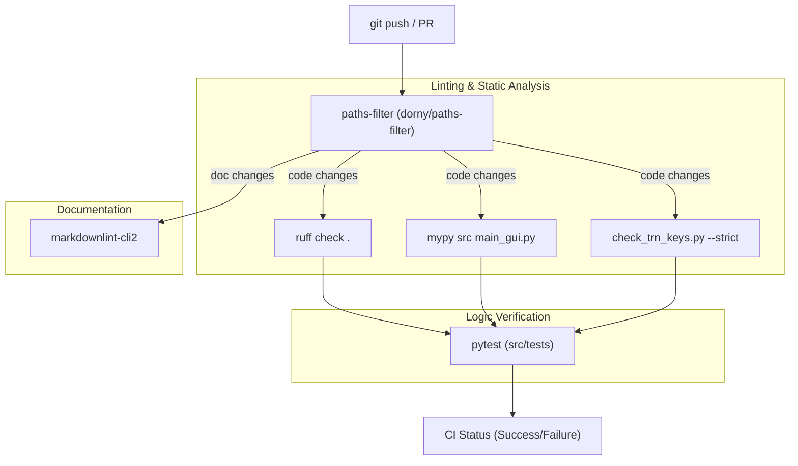
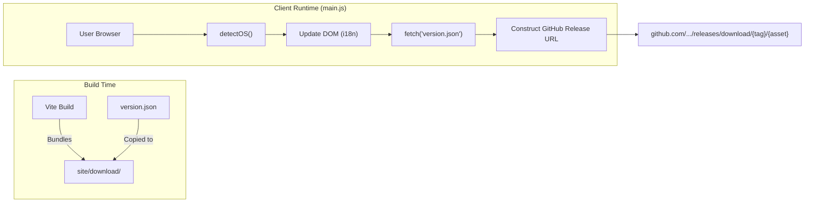

# CI, Documentation Deployment, and Release

Relevant source files

The following files were used as context for generating this wiki page:

- [.github/workflows/actionlint.yml](../../.github/workflows/actionlint.yml)
- [.github/workflows/build_appimage.yml](../../.github/workflows/build_appimage.yml)
- [.github/workflows/build_macos.yml](../../.github/workflows/build_macos.yml)
- [.github/workflows/build_macos_intel.yml](../../.github/workflows/build_macos_intel.yml)
- [.github/workflows/build_windows.yml](../../.github/workflows/build_windows.yml)
- [.github/workflows/ci.yml](../../.github/workflows/ci.yml)
- [.github/workflows/deploy_docs.yml](../../.github/workflows/deploy_docs.yml)
- [.github/workflows/deploy_download_site.yml](../../.github/workflows/deploy_download_site.yml)
- [.github/workflows/pdf_draft.yml](../../.github/workflows/pdf_draft.yml)
- [.github/workflows/release.yml](../../.github/workflows/release.yml)
- [.github/workflows/scorecard.yml](../../.github/workflows/scorecard.yml)
- [.github/workflows/virustotal.yml](../../.github/workflows/virustotal.yml)
- [docs/assets/js/katex.min.js](../../docs/assets/js/katex.min.js)
- [docs/hooks/render_math.py](../../docs/hooks/render_math.py)
- [download-site/.gitignore](../../download-site/.gitignore)
- [download-site/index.html](../../download-site/index.html)
- [download-site/main.js](../../download-site/main.js)
- [download-site/package-lock.json](../../download-site/package-lock.json)
- [download-site/package.json](../../download-site/package.json)
- [download-site/public/favicon.png](../../download-site/public/favicon.png)
- [download-site/style.css](../../download-site/style.css)
- [download-site/vite.config.js](../../download-site/vite.config.js)
- [tests/security/test_math_renderer_security.py](../../tests/security/test_math_renderer_security.py)

This page details the automation infrastructure for MeasureLab, including Continuous Integration (CI) pipelines, the multi-stage release process, documentation generation with PDF support, and the public download site.

## Continuous Integration (CI) Pipeline

The CI workflow, defined in `.github/workflows/ci.yml`, is the primary quality gate for all code contributions. It utilizes a matrix of linting, type checking, and automated testing to ensure stability before merging into `main`.

### Pipeline Stages
1.  **Path Filtering**: Uses `dorny/paths-filter` to determine if code or documentation changes were made, optimizing runner usage `.github/workflows/ci.yml:13-41`.
2.  **Documentation Linting**: Runs `markdownlint-cli2` on all Markdown files if documentation changes are detected `.github/workflows/ci.yml:42-57`.
3.  **Static Analysis**:
    *   **Ruff**: Performs fast linting and code style enforcement `.github/workflows/ci.yml:154-157`.
    *   **Mypy**: Conducts static type checking on `src` and `main_gui.py` `.github/workflows/ci.yml:158-161`.
4.  **Translation Key Validation**: Executes `scripts/check_trn_keys.py --strict` to ensure all localized strings in the source code have corresponding keys in the JSON language assets `.github/workflows/ci.yml:162-165`.
5.  **Automated Testing**: Runs `pytest` in an offscreen environment (`QT_QPA_PLATFORM: offscreen`) `.github/workflows/ci.yml:167-169`.

### CI Execution Flow
The following diagram illustrates the data flow from a developer push to the final CI result.

**Diagram: CI Workflow and Code Entity Mapping**

Sources: `.github/workflows/ci.yml:1-170`, `scripts/check_trn_keys.py:1-50`

## Documentation Deployment and PDF Export

Documentation is managed via MkDocs and deployed to GitHub Pages. The system supports multi-language manuals (Japanese and English) and generates PDF versions for offline use.

### PDF Generation Implementation
PDF export is triggered by the `ENABLE_PDF_EXPORT` environment variable `.github/workflows/pdf_draft.yml:55-57`. It utilizes the `mkdocs-with-pdf` plugin (based on WeasyPrint).
*   **System Dependencies**: Requires `libpango`, `brotli`, and `fonts-noto-cjk` to correctly render Japanese characters in the PDF `.github/workflows/pdf_draft.yml:45-49`.
*   **Post-processing**: The generated `operation_manual.pdf` files are renamed to include language suffixes (e.g., `_ja.pdf`, `_en.pdf`) before being uploaded as release assets or artifacts `.github/workflows/pdf_draft.yml:59-63`.

Sources: `.github/workflows/deploy_docs.yml:1-58`, `.github/workflows/pdf_draft.yml:1-72`

## Release Process and Asset Aggregation

The release workflow (`.github/workflows/release.yml`) automates the creation of binaries for Windows, Linux, and macOS when a version tag (e.g., `v1.0.0`) is pushed.

### Asset Aggregation and Checksums
Each platform job generates its respective binaries and calculates SHA-256 checksums.
*   **Windows**: Builds both `onefile` (single EXE) and `onedir` (folder) distributions. It also bundles ASIO helper scripts `.github/workflows/release.yml:47-62`.
*   **Linux**: Builds an AppImage and extracts the documentation PDFs to include them in the release `.github/workflows/release.yml:140-160`.
*   **Checksums**: Fragments like `checksums_windows.txt` and `checksums_linux.txt` are generated using `Get-FileHash` (PowerShell) or `sha256sum` (Linux) and uploaded as artifacts to be combined in a final release step `.github/workflows/release.yml:79-95`.

### VirusTotal Scanning
Upon completion of the Release workflow, a separate `virustotal.yml` workflow is triggered `.github/workflows/virustotal.yml:1-7`.
*   **Target Selection**: Automatically identifies the latest release or draft `.github/workflows/virustotal.yml:31-83`.
*   **Scan Logic**: Downloads assets, unzips the Windows `onefile` to scan the raw `.exe`, and submits files to the VirusTotal API v3 `.github/workflows/virustotal.yml:84-148`.
*   **Reporting**: Generates a summary of detection counts for each asset to ensure transparency and user trust `.github/workflows/virustotal.yml:181-220`.

Sources: `.github/workflows/release.yml:1-200`, `.github/workflows/virustotal.yml:1-250`

## Download Site

The MeasureLab download site is a standalone Vite/JavaScript application located in the `download-site/` directory. It serves as a user-friendly front-end for the GitHub release assets.

### Core Logic (`main.js`)
*   **OS Detection**: Automatically detects the user's operating system to highlight the appropriate download button `download-site/main.js:283-305`.
*   **Version Synchronization**: Fetches the current version from a `version.json` file shared with the main repository `download-site/main.js:255-265`.
*   **I18n**: Provides localized strings for English, Japanese, and Chinese (Simplified) `download-site/main.js:12-250`.
*   **Asset Mapping**: Maps internal variant keys (e.g., `arm64`, `onedir`) to the specific filename patterns used in the GitHub Release workflow `download-site/main.js:48-95`.

**Diagram: Download Site Data Flow**

Sources: `download-site/main.js:1-400`, `download-site/index.html:1-142`, `.github/workflows/deploy_docs.yml:40-49`

## Security and Supply Chain

*   **OpenSSF Scorecard**: The `.github/workflows/scorecard.yml` workflow periodically analyzes the repository for security best practices (e.g., branch protection, dependency pinning, SAST) and publishes the results to the OSSF metrics dashboard.
*   **Dependency Pinning**: Python dependencies are constrained using `constraints.txt` and verified during CI `.github/workflows/ci.yml:122-123`.
*   **Action Integrity**: GitHub Actions are referenced by SHA-256 hashes rather than tags to prevent supply chain attacks `.github/workflows/ci.yml:19-21`.

Sources: `.github/workflows/scorecard.yml:1-50`, `.github/workflows/ci.yml:1-170`

---
