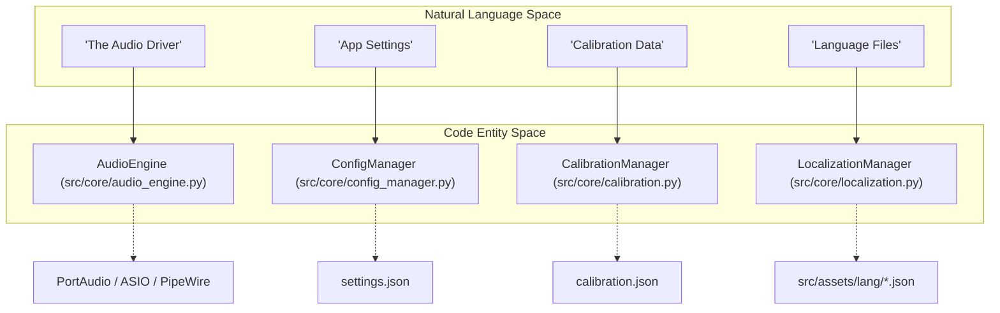
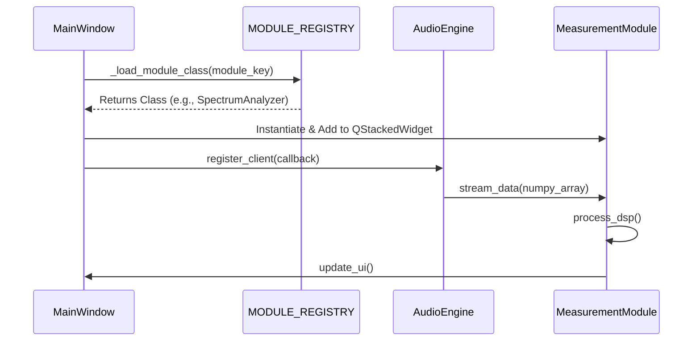

# Glossary

Relevant source files

The following files were used as context for generating this wiki page:

- [.agent/skills/ci_prechecker/SKILL.md](../../.agent/skills/ci_prechecker/SKILL.md)
- [CHANGELOG.md](../../CHANGELOG.md)
- [README.ja.md](../../README.ja.md)
- [README.md](../../README.md)
- [constraints.txt](../../constraints.txt)
- [docs/PROPOSED_FEATURES.md](../../docs/PROPOSED_FEATURES.md)
- [docs/glossary.en.md](../../docs/glossary.en.md)
- [docs/glossary.md](../../docs/glossary.md)
- [docs/widget_guide.en.md](../../docs/widget_guide.en.md)
- [docs/widget_guide.md](../../docs/widget_guide.md)
- [mkdocs.yml](../../mkdocs.yml)
- [pyproject.toml](../../pyproject.toml)
- [scripts/translation_whitelist.json](../../scripts/translation_whitelist.json)
- [scripts/verify_lockin_vs_nonlinear_real_device.py](../../scripts/verify_lockin_vs_nonlinear_real_device.py)
- [src/assets/lang/de.json](../../src/assets/lang/de.json)
- [src/assets/lang/en.json](../../src/assets/lang/en.json)
- [src/assets/lang/es.json](../../src/assets/lang/es.json)
- [src/assets/lang/fr.json](../../src/assets/lang/fr.json)
- [src/assets/lang/ja.json](../../src/assets/lang/ja.json)
- [src/assets/lang/ko.json](../../src/assets/lang/ko.json)
- [src/assets/lang/pt.json](../../src/assets/lang/pt.json)
- [src/assets/lang/ru.json](../../src/assets/lang/ru.json)
- [src/assets/lang/zh.json](../../src/assets/lang/zh.json)
- [src/core/analysis.py](../../src/core/analysis.py)
- [src/core/audio_engine.py](../../src/core/audio_engine.py)
- [src/core/calibration.py](../../src/core/calibration.py)
- [src/core/config_manager.py](../../src/core/config_manager.py)
- [src/core/module_constants.py](../../src/core/module_constants.py)
- [src/core/nonlinear_analyzer_core.py](../../src/core/nonlinear_analyzer_core.py)
- [src/core/sonifier.py](../../src/core/sonifier.py)
- [src/core/version.py](../../src/core/version.py)
- [src/gui/main_window.py](../../src/gui/main_window.py)
- [src/gui/widgets/advanced_distortion_meter.py](../../src/gui/widgets/advanced_distortion_meter.py)
- [src/gui/widgets/boxcar_averager.py](../../src/gui/widgets/boxcar_averager.py)
- [src/gui/widgets/distortion_analyzer.py](../../src/gui/widgets/distortion_analyzer.py)
- [src/gui/widgets/frequency_counter.py](../../src/gui/widgets/frequency_counter.py)
- [src/gui/widgets/hrtf_player.py](../../src/gui/widgets/hrtf_player.py)
- [src/gui/widgets/lock_in_amplifier.py](../../src/gui/widgets/lock_in_amplifier.py)
- [src/gui/widgets/lock_in_modeler.py](../../src/gui/widgets/lock_in_modeler.py)
- [src/gui/widgets/lockin_spectrum_finder.py](../../src/gui/widgets/lockin_spectrum_finder.py)
- [src/gui/widgets/noise_profiler.py](../../src/gui/widgets/noise_profiler.py)
- [src/gui/widgets/one_pps_monitor.py](../../src/gui/widgets/one_pps_monitor.py)
- [src/gui/widgets/settings.py](../../src/gui/widgets/settings.py)
- [tests/logic_verification/analysis/test_c_weighting_design.py](../../tests/logic_verification/analysis/test_c_weighting_design.py)
- [tests/logic_verification/analysis/test_imd.py](../../tests/logic_verification/analysis/test_imd.py)
- [tests/logic_verification/core/test_config_manager.py](../../tests/logic_verification/core/test_config_manager.py)
- [tests/logic_verification/core/test_config_manager_logic.py](../../tests/logic_verification/core/test_config_manager_logic.py)
- [tests/logic_verification/core/test_sonifier.py](../../tests/logic_verification/core/test_sonifier.py)
- [tests/logic_verification/gui/test_nonlinear_analyzer_gui.py](../../tests/logic_verification/gui/test_nonlinear_analyzer_gui.py)
- [tests/logic_verification/gui/widgets/test_lock_in_modeler.py](../../tests/logic_verification/gui/widgets/test_lock_in_modeler.py)
- [tests/logic_verification/instruments/test_lockin_spectrum_finder_sonification.py](../../tests/logic_verification/instruments/test_lockin_spectrum_finder_sonification.py)
- [tests/logic_verification/measurement_modules/test_lockin_vs_nonlinear.py](../../tests/logic_verification/measurement_modules/test_lockin_vs_nonlinear.py)
- [tests/logic_verification/measurement_modules/test_nonlinear_analyzer.py](../../tests/logic_verification/measurement_modules/test_nonlinear_analyzer.py)
- [version.json](../../version.json)

This page provides definitions for codebase-specific terminology, Digital Signal Processing (DSP) jargon, and domain concepts utilized within the MeasureLab ecosystem.

## Core System Terms

| Term | Definition | Code Reference |
| :--- | :--- | :--- |
| **MODULE_REGISTRY** | A dictionary mapping unique module keys to their dynamic import paths and class names. Used for lazy-loading GUI components. | `src/gui/main_window.py:74-116` |
| **AudioEngine** | The singleton responsible for managing hardware I/O, sample rate conversion, and the master callback loop. | `src/core/audio_engine.py:1-20` |
| **ConfigManager** | Manages persistent application state, hardware settings, and user preferences with debounced disk writes. | `src/core/config_manager.py:1-20` |
| **CalibrationManager** | Handles V/FS (Volts per Full Scale) sensitivity, SPL offsets, and frequency response correction curves. | `src/core/calibration.py:1-20` |
| **FFTManager** | A centralized utility for performing Fast Fourier Transforms, utilizing `pyfftw` wisdom for performance optimization. | `src/core/fft_manager.py:1-20` |

### System Entity Mapping
The following diagram illustrates how natural language concepts map to specific classes and files within the MeasureLab architecture.

**Diagram: Natural Language to Code Entity Mapping**

Sources: `src/gui/main_window.py:23-25`, `src/core/config_manager.py:1-10`, `src/core/calibration.py:1-10`

---

## DSP & Measurement Jargon

### SSS (Synchronized Swept Sine)
A measurement technique using an exponential chirp to characterize nonlinear systems. In MeasureLab, this is used to extract kernels for the **Parallel Hammerstein Model (PHM)**.
*   **Implementation**: Found in `NonlinearAnalyzer` and `RealtimeSSSEngine`.
*   **Kernels**: $h_1$ (linear response) through $h_5$ (5th order nonlinearity).
*   **Sources**: `src/core/nonlinear_analyzer_core.py:1-50`, `src/gui/main_window.py:111-114`

### Lock-in Detection (PSD)
**Phase Sensitive Detection** extracts a signal with a known carrier frequency from an extremely noisy environment.
*   **Implementation**: `LockInAmplifier` uses dual-phase (I/Q) demodulation.
*   **Hardware Loopback**: Required to maintain phase coherence between the software generator and the physical ADC input.
*   **Sources**: `src/gui/widgets/lock_in_amplifier.py:1-30`, `src/gui/main_window.py:85`

### Weighting Filters
Frequency-dependent curves applied to audio measurements to simulate human hearing or standard compliance.
*   **A-Weighting**: IEC 61672:2003 standard, used in the `SoundLevelMeter`.
*   **Implementation**: Calculated via `_calculate_ra_raw(f)` and cached for performance.
*   **Sources**: `src/core/analysis.py:15-26`, `src/core/analysis.py:45-54`

### Allan Deviation
A measure of frequency stability in clocks and oscillators, used to quantify jitter and drift over time.
*   **Implementation**: Calculated in `FrequencyCounter` to evaluate sample clock stability.
*   **Sources**: `src/assets/lang/en.json:150`, `src/gui/widgets/frequency_counter.py:1-20`

---

## Codebase Implementation Concepts

### Module Lifecycle
The `MainWindow` manages modules using a `QStackedWidget`. Modules are not instantiated until selected in the sidebar to reduce startup time.

**Diagram: Module Lifecycle and Data Flow**

Sources: `src/gui/main_window.py:119-134`, `src/gui/main_window.py:151-170`

### Key Abbreviations

| Abbreviation | Full Term | Context |
| :--- | :--- | :--- |
| **dBFS** | Decibels relative to Full Scale | Digital signal level. `src/assets/lang/en.json:14` |
| **THD+N** | Total Harmonic Distortion + Noise | Quality metric in `DistortionAnalyzer`. `src/gui/widgets/distortion_analyzer.py:1-10` |
| **IMD** | Intermodulation Distortion | Two-tone test (SMPTE/CCIF). `src/core/analysis.py:1-10` |
| **LUFS** | Loudness Units relative to Full Scale | EBU R128 / ITU BS.1770 standard. `src/gui/widgets/lufs_meter.py:1-5` |
| **1PPS** | One Pulse Per Second | High-precision clock sync monitoring. `src/gui/widgets/one_pps_monitor.py:1-10` |
| **OSL** | Open-Short-Load | Calibration technique for Impedance Analyzers. `src/gui/widgets/impedance_analyzer.py:1-10` |

### Specialized Components

#### Sonifier
A utility that converts measurement data (like spectrum peaks) into audible tones, allowing "eyes-free" monitoring of signal changes.
*   **Sources**: `src/core/sonifier.py:1-20`, `tests/logic_verification/core/test_sonifier.py:1-10`

#### Boxcar Averager
A module for synchronous averaging of repetitive signals to improve Signal-to-Noise Ratio (SNR).
*   **Sources**: `src/gui/widgets/boxcar_averager.py:1-20`, `src/gui/main_window.py:92`

#### DetachableWidgetWrapper
A GUI utility that allows any measurement module to be "popped out" of the main window into its own top-level window.
*   **Sources**: `src/gui/widgets/detachable_wrapper.py:1-10`, `src/gui/main_window.py:71`

Sources: `src/core/analysis.py:1-100`, `src/gui/main_window.py:74-116`, `src/core/module_constants.py:1-70`, `src/assets/lang/en.json:1-200`
