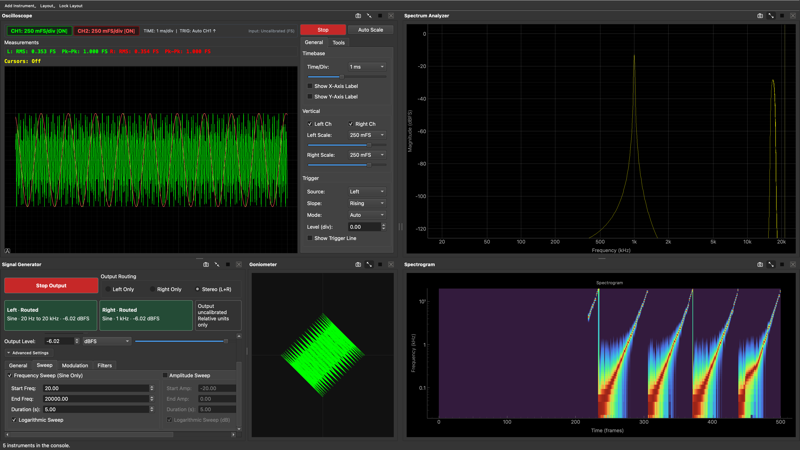

[**🇺🇸 English Version**](README.md)

# 🚀 **MeasureLab (Audio Measurement Suite)** 🎶

    [](https://youtube-at-vach.github.io/MeasureLab/) [オンライン・マニュアル](https://youtube-at-vach.github.io/MeasureLab/)

[](https://youtu.be/9fkJLfK5v0M)

「必要に応じて作り足しながら育ててきた DIY のオーディオ測定・解析ツール集」です。

**MeasureLab** は、これらのツールを1つの GUI アプリにまとめた形で提供します。Python と PyQt6 製で、高精度な信号生成・解析・測定を直感的に扱えます。このソフトウェアは一般的なオーディオデバイスで動作します。

本プロジェクトは、高価な測定機器を入手できないオーディオ研究家に向けた代替手段として、より多くの人に届くことを目指しています。

## ✨ 主な機能

### 🛠️ ウィジット / 測定モジュール

以下のモジュール/ウィジットが統合されています。
機能が多いため、まずは [**ウィジットガイド：目的別インデックス**](docs/widget_guide.md#quick-search-guide) から探すことをおすすめします。

各機能の詳細は [**ウィジットガイド**](docs/widget_guide.md) を、実際の測定例については [**測定レシピ**](docs/measurement_recipes/index.md) を参照してください。

| No. | ウィジット | 説明 |
| :--- | :--- | :--- |
| 1 | **Welcome** | 起動時のウェルカム画面で主要機能を案内。 |
| 2 | **Signal Generator** | 正弦波、矩形波、三角波、ノコギリ波(立ち上がり/立ち下がり)、ホワイト/ピンクノイズ、周波数スイープ信号を生成。位相制御、振幅制御、ステレオ出力、ビンセンターへのスナップに対応。 |
| 3 | **Spectrum Analyzer** | 高速FFTによるリアルタイムスペクトル解析。PSD/RMS表示、SI単位表示、周波数範囲制限、メモリ機能、カーソル測定に対応。 |
| 4 | **Sound Level Meter** | A/C/Z 周波数重み付け、FAST/SLOW/IMPULSE/10ms 時間重み付け、20Hz–20k/12.5k/8k 帯域選択に対応した高機能騒音計。Lp/Leq/LE/Lmax/Lmin/Lpeak表示、キャリブレーションオフセット適用に対応。 |
| 5 | **LUFS Meter** | ラウドネス (LUFS/LKFS) のリアルタイム測定。クレストファクター、ダイナミックレンジ表示。 |
| 6 | **Loopback Finder** | オーディオインターフェースのループバック経路を検出するツール。 |
| 7 | **Distortion Analyzer** | THD、THD+N、SINAD、IMD (SMPTE/CCIF) の測定。内蔵信号発生器、周波数スイープ、ビンセンターへのスナップ、ハーモニクスバーグラフ、平均化機能搭載。 |
| 8 | **Linearity Analyzer** | 信号レベルに対するゲインの直線性（AES17 Linearity Deviation）を測定。DACの微小信号再現性やビット精度、ダイナミックレンジの検証に対応。 |
| 9 | **Advanced Distortion Meter** | MIM (Multi-tone Intermodulation)、SPDR (Spurious-free Dynamic Range)、PIM (Passive Intermodulation) 測定を含む高度な歪み解析。 |
| 10 | **Network Analyzer** | 周波数特性(ゲイン・位相・群遅延)およびインパルスレスポンスの測定。スイープ測定、複数トレース表示、RIAAカーブ比較、周波数範囲制限対応。 |
| 11 | **Oscilloscope** | 2チャンネル波形表示、トリガー機能、カーソル測定、演算波形(A+B, A-B)、リアルタイムローパス/ハイパスフィルタリング対応。 |
| 12 | **Raw Time Series** | 長時間スパンをリングバッファで保持する2chスクロール波形モニタ。 |
| 13 | **Transient Analyzer** | トリガ収録＋CWT で過渡解析、解析帯域/スケールを柔軟に指定。 |
| 14 | **Lock-in Amplifier** | 位相敏感検波 (PSD) による微小信号測定。周波数応答解析 (FRA) モード、ハーモニクス復調(2次〜10次)、キャリブレーション機能搭載。 |
| 15 | **Lock-in Harmonic Analyzer** | ロックインアンプの原理を利用した超低歪み測定モジュール。最大200次までの多重並列IQ検波によって基本波と高調波に正確に同調（ロックイン）し、微小な歪みを高精度に抽出します。 |
| 16 | **Arbitrary Harmonic Generator** | 基本周波数と複数（最大50次まで）の高調波成分の振幅・位相を正確に定義し、複雑な波形を合成できる信号発生モジュール。 |
| 17 | **Lock-in Spectrum Finder** | 並列ロックイン検波（行列投影法）を用いた高精度スペクトル・ファインダー。 |
| 18 | **Impedance Analyzer** | インピーダンス測定とOSL (Open/Short/Load) キャリブレーション。複数プロットモード(Z/θ、R/X、Q、C/L、Nyquist、Smith Chart)、スイープ測定、キャリブレーション補間対応。 |
| 19 | **Inverse Filter** | キャリブレーションマップから逆特性FIRを設計し、音声ファイルへ適用するデコンボリューションツール. ゲイン上限による正則化、タップ数/スムージング指定、応答プレビュー、出力ピーク正規化付きのバッチ処理に対応。 |
| 20 | **Frequency Counter** | 高精度な周波数・周期測定。アラン分散プロット、ジッターヒストグラムおよび統計、キャリブレーション機能搭載。 |
| 21 | **Lock-in Frequency Counter** | ロックイン検波 (PSD) による高精度な周波数・位相偏差のトラッキング。微小な偏差の可視化と安定性の評価に対応。 |
| 22 | **1PPS Monitor** | 1PPS 信号の間隔を監視し、サンプリングレートの偏差を高精度に測定。ジッターや累積的なドリフトの統計表示に対応。 |
| 23 | **Spectrogram** | 時間-周波数表示のスペクトログラム。周波数範囲制限、カラーマップ選択対応。 |
| 24 | **Boxcar Averager** | ボックスカー平均によるノイズ低減と過渡応答解析. 内部パルス/ステップ生成、外部リファレンス同期(立ち上がり/立ち下がりエッジ)対応. |
| 25 | **Goniometer** | ステレオ信号の位相相関と空間分布の可視化。Lissajous表示、フォスファー表示モード(残光効果)、カスタムカラーパレット対応。 |
| 26 | **Noise Profiler** | ノイズ特性の詳細解析ツール。1/fノイズ、ハムノイズ、ホワイトノイズの自動検出と定量化。平均化モード、LNAゲイン補正、熱雑音限界表示、等価抵抗表示対応。 |
| 27 | **Recorder & Player** | オーディオファイル(WAV/MP3/FLAC/OGG等)の録音・再生。リサンプリング、ループ再生、ソフトウェアループバック機能搭載。 |
| 28 | **Sound Quality Analyzer** | 音質評価指標 (Integrated/Momentary Loudness, Zwicker Sharpness, Roughness, Tonality) の数値およびグラフ表示。 |
| 29 | **Timecode Monitor & Generator** | LTC タイムコードのエンコード/デコードとリアルタイム監視。フレームベース計算、ドロップフレーム率、複数FPS表示、タイムゾーン/オフセット、JAMメモリ付きジェネレーターを備える。 |
| 30 | **BNIM Meter** | ステレオ入力から ITD/ILD の「ニューラルマップ」を可視化し、両耳定位の傾向を観察するメーター。 |
| 31 | **HRTF Player** | SOFA ファイルの読み込みと可視化。HRTF メトリクス (ITD/ILD/高域エネルギー/エンベロープピーク) のヒートマップ表示、クリックによる音源位置指定、任意の音楽ファイルを用いたリアルタイム回転再生 (Convolution による空間定位) に対応。 |
| 32 | **Ultrasound AM Modulator** | オーディオ信号を振幅変調(AM)し、搬送波(40kHz)に乗せて超音波として出力。パラメトリックスピーカーの実験等に使用可能。 |
| 33 | **Detachable Wrapper** | 任意ウィジットを独立ウィンドウとして切り離し・再接続できるUIユーティリティ。 |
| 34 | **Stereo Alignment Monitor** | 左右のチャンネル間の整合性（アライメント）を詳細に解析。音量バランス、周波数特性の一致度、センター定位の集中度（M/S比）、位相問題をリアルタイムで監視。 |
| 35 | **Spatial Binaural Mixer** | オフライン高品質 HRTF マルチトラック・空間レンダラー。複数の音声トラックの読み込み、音源位置（方位角・仰角）の設定、および SOFA ファイルを用いたバイノーラルレンダリングに対応。 |
| 36 | **Waveform Loop Player** | オーディオファイルを読み込み、波形を確認しながら任意の区間を選択してループ再生できるツール。過渡応答の繰り返し観測や特定フレーズの解析に便利。 |
| 37 | **Settings** | デバイス設定、キャリブレーション、テーマ選択、多言語切り替えなど。 |
| 38 | **Plot Comparer** | 異なる測定から取得した複数のプロットデータを重ね合わせて比較。ゲインオフセット、軸シフト、標準化（ピーク整列）、Y1/Y2の2軸マッピング、対数スケール切り替え、インタラクティブカーソルによる一括値読み取りに対応。 |

### 🌍 多言語対応

世界中の主要な言語をサポートしています。設定画面から切り替え可能です。

- 英語 (English)
- 日本語 (Japanese)
- 中国語 (Chinese)
- スペイン語 (Spanish)
- フランス語 (French)
- ドイツ語 (German)
- ポルトガル語 (Portuguese)
- ロシア語 (Russian)
- 韓国語 (Korean)

### ⚙️ 高度な設定

- **入出力設定**: デバイス選択、サンプリングレート (44.1kHz - 192kHz)、バッファーサイズ変更。**Virtual / Offline Mode** ではシミュレーションレートを自由に設定可能。
- **ディザリング (Dithering)**: TPDF ディザリングおよび出力ビット深度（8 / 16 / 24 bit）の設定に対応。量子化ノイズを低減し、高精度な測定をサポートします。
- **キャリブレーション**: 入力感度と出力ゲインの補正ウィザードを搭載し、電圧 (Vrms, Vpeak, dBu, dBV) での正確な読み取りが可能。1PPS 信号を用いたクロック偏差の記録にも対応。
- **チャンネルルーティング**: 入力・出力チャンネルの個別割り当てに対応。
- **テーマ設定**: ライト/ダーク/システムテーマの切り替えが可能。

## 💻 動作環境

| OS | サポート状況 | 備考 |
| --- | --- | --- |
| Linux (x86_64) | ✅ サポート対象 | Ubuntu 22.04 / 24.04 にて動作確認済み |
| Windows 10/11 | ✅ サポート対象 | 公式バイナリを提供 |
| macOS (arm64 / x86_64) | ✅ サポート対象 | macOS 13.0以降 (Apple Silicon / Intel Mac対応) |

---

## 🚀 インストールと使い方

### 📦 ビルド済みパッケージを使用する場合

**Releases** ページから最新のバージョンをダウンロードしてください。

- **Windows**: `MeasureLab-<version>-windows-x64-onefile.zip`（または `MeasureLab-<version>-windows-x64-onedir.zip`）をダウンロードして解凍し、`MeasureLab.exe` を実行します。
- **Linux**: `MeasureLab-<version>-linux-x86_64.AppImage` をダウンロードし、実行権限を付与して起動します。

    ```bash
    chmod +x MeasureLab-*-linux-x86_64.AppImage
    ./MeasureLab-*-linux-x86_64.AppImage
    ```

- **macOS (arm64 / x86_64)**: Apple Silicon の場合は `MeasureLab-<version>-macos-arm64.dmg`、Intel Mac の場合は `MeasureLab-<version>-macos-x64.dmg` をダウンロードしてください。
    - **注意: PyQt6 の制約により、macOS 13.0 以降が必要です。**
    - **レガシー Intel Mac**: iMac や MacBook Pro (2015以前) などの古いモデルでも、[OpenCore Legacy Patcher (OCLP)](<https://dortania.github.io/OpenCore-Legacy-Patcher/>) を使用して macOS 13 以降にアップグレードすることで動作可能です。
    - **重要：ゲートキーパーの回避**
    - 本アプリは現時点で未署名のため、通常の手順ですと「ゴミ箱に入れる」や「キャンセル」しか選択できない場合があります。これを回避するには以下の手順をお試しください：
        1. `.dmg` を開き、**MeasureLab.app** を見つけます。
        2. アプリアイコンを **右クリック（または Control + クリック）** し、**「開く」** を選択します。
        3. 似たようなダイアログが表示されますが、今回は **「開く」** ボタンが含まれているはずですので、クリックして実行します。
    - **それでも「開く」オプションが表示されない場合：**
        - **「システム設定」>「プライバシーとセキュリティ」** を開きます。下にスクロールして「MeasureLab.appは...」というメッセージを見つけ、**「このまま開く」** をクリックします。
        - または、ターミナルから手動で隔離フラグを解除することもできます：`xattr -d com.apple.quarantine /path/to/MeasureLab.app` （アプリアイコンをターミナルウィンドウにドラッグ＆ドロップするとパスを入力できます）。

#### Linux（任意）: JACK / PipeWire を使う場合の注意

Linux ではそのまま **PortAudio** バックエンドでも通常利用できますが、環境によっては **バッファ境界で位相が飛ぶ**（位相連続性が崩れる）ことがあります。
位相の連続性が重要な測定（位相・群遅延・ロックイン等）を行う場合は、入出力先として **JACK** もしくは **PipeWire** を指定して使うことを推奨します。

ただし JACK / PipeWire 経由にすると、起動後に音が出ない・入出力がつながらない場合があります。その際は **QJackCtl** などでルーティング（接続）を確認・設定してください。

※この項目はあくまでオプションです。PortAudio のままでも普通に使えます。

### 🐍 ソースコードから実行する場合・開発者の方へ

ソースコードからの実行手順や、開発環境のセットアップについては以下のドキュメントを参照してください。

- [**開発者向けガイド**](docs/development.md)

---

## 📜 ライセンス

このプロジェクトは **The Unlicense** の下でパブリックドメインとして公開されています。
営利・非営利を問わず、自由にコピー、変更、配布、使用することができます。

> **注**: 本ソフトウェアはパブリックドメインとして公開された、自由で制約のないソフトウェアです。

## 👥 コントリビューター

### 🧑‍💻 スペシャルサンクス

- [TNT (diyAudio)](https://www.diyaudio.com/community/members/tnt.4571/)
- [fantastictaste6171](https://www.youtube.com/@fantastictaste6171)
- [バーチャ農ちゃんねる](https://www.youtube.com/@va-ch)

### 🤖 AI パートナー

- OpenAI: GPT-4.1, GPT-5, GPT-5.1 Codex Max, GPT-5.2, GPT-5.2 Codex, GPT-5.3-Codex, GPT-5.4, GPT-5.5
- Google: Gemini 2.5 Pro, Gemini 3 Pro, Gemini 3 Flash, Gemini 3.1 Pro, Gemini 3.5 Frash
- Anthropic: Claude 4.5 Sonnet
