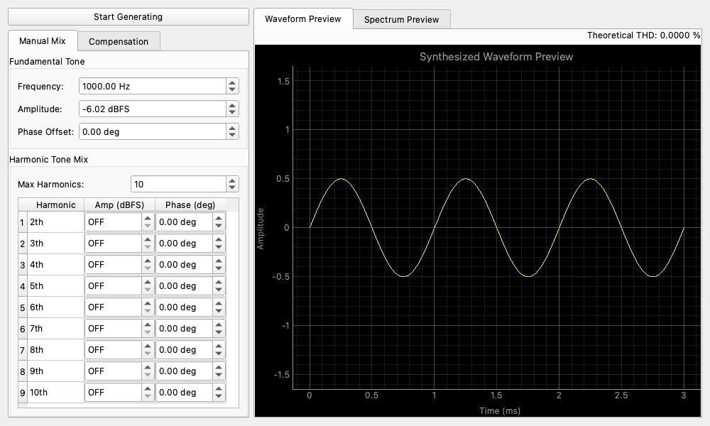

## Overview

The Arbitrary Harmonic Generator is an advanced signal generation module that allows you to synthesize complex waveforms by explicitly defining the fundamental frequency and the precise amplitude and phase of multiple harmonic components (up to the 50th harmonic).

This is particularly useful for generating test signals with specific distortion profiles or for creating inverse compensation signals to cancel out existing harmonic distortion in a measurement setup.

## Common Features

This widget supports common features of the Detachable Wrapper. Please refer to the [Detachable Wrapper](https://youtube-at-vach.github.io/MeasureLab/en/widgets/detachable_wrapper/) documentation for details.

## Operation

### Fundamental Settings

* **Frequency (Hz)**: The base frequency of the generated signal.
* **Base Amp (dBFS)**: The amplitude of the fundamental frequency component.

### Harmonic Compensation

The core feature of this module is the ability to adjust individual harmonics.

* **Compensation Adjustments (dB)**: Fine-tune the amplitude of each harmonic relative to the fundamental.
* **Relative to Fundamental (dBr)**: Toggle whether the compensation adjustments are absolute or relative to the fundamental amplitude.
* **Phase Adjustments (deg)**: Adjust the phase offset of each harmonic.
* **Enable/Disable**: You can toggle specific harmonics on or off using checkboxes.

### Preview

The synthesized waveform preview graph also displays the **Theoretical THD (Total Harmonic Distortion)** based on the configured harmonic components.

### Data Management

* **Export/Import**: You can export the current harmonic compensation profile to a JSON file and import it later. This is seamlessly integrated with the [Lock-in Harmonic Analyzer](https://youtube-at-vach.github.io/MeasureLab/en/widgets/lockin_harmonic_analyzer/), allowing you to measure a system's distortion profile and then load that profile into the generator to create a pre-distorted or compensated signal.
