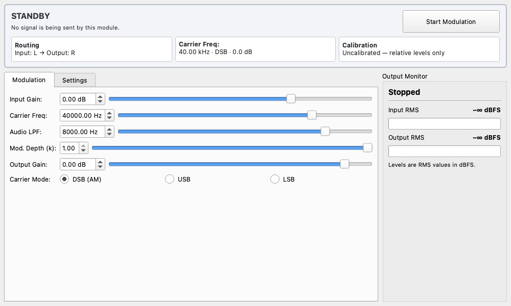

## Overview

The Ultrasound Modulator is a widget that amplitude-modulates (AM) audio signals into the ultrasonic range, making them suitable for playback on ultrasonic reference speakers (typically centered at 40kHz).

When an audible signal is amplitude-modulated onto an ultrasonic carrier wave and emitted, the non-linearity of air causes the sound to self-demodulate in mid-air. This module is used for experiments with such "parametric speakers" that deliver sound only to a highly specific, narrow area, as well as for acoustic measurements in the ultrasonic band.

Key Features:

* **Real-time AM Modulation**: Modulates a carrier wave (default 40kHz) using the input audio signal.
* **Safety Features**: Keeps the actual output state, routing, carrier conditions, and calibration status visible, and latches warnings for invalid signals and output above 0 dBFS.
* **Flexible Routing**: Supports arbitrary selection of input/output channels (L/R/Stereo).
* **Pre-distortion**: Supports square-root processing to reduce distortion caused by demodulation.

## Common Features

This widget supports common features of the Detachable Wrapper. Please refer to the [Detachable Wrapper](https://youtube-at-vach.github.io/MeasureLab/en/widgets/detachable_wrapper/) documentation for details.

## Basic Operation

### Starting and Stopping Modulation

Click **"Start Modulation"** at the top of the screen to start modulation. While output is active, the same control becomes **"Stop Modulation"**, so output can be stopped from either settings tab.

The persistent status area distinguishes stopped, unavailable, ultrasound output, passthrough output, and limited-output states. Input-to-output routing, carrier frequency and mode, and output calibration status remain visible outside the tabs.

:::caution
Although ultrasound is inaudible, high-intensity emission can be dangerous to hearing and pets. Always start with a low gain and use appropriate protection. A safety confirmation dialog will appear upon starting.
:::

If the carrier or its sidebands exceed Nyquist at the current sample rate, the status changes to **"UNAVAILABLE"** and the start control is disabled. Follow the displayed explanation and adjust the sample rate, carrier frequency, or Audio LPF. The default 40 kHz carrier with 8 kHz bandwidth requires a sample rate above 96 kHz.

### Parameter Settings

Configure signal processing parameters in the **"Modulation"** tab.

* **Input Gain**: Adjusts the gain of the input signal. Use the input level meter to set an appropriate level without clipping.
* **Carrier Freq**: The frequency of the carrier wave. Set this to match the resonant frequency of your ultrasonic transducer (e.g., 40000 Hz).
* **Audio LPF**: The cutoff frequency of the Low Pass Filter applied to the audio signal before modulation. Adjust this to prevent sidebands from exceeding the bandwidth limits.
* **Mod. Depth (k)**: The modulation depth (0.0 to 1.0). 1.0 indicates 100% modulation.
* **Output Gain**: The output gain after modulation. **Operate with caution for safety.**
* **Carrier Mode**: Select the modulation mode.
    * **DSB (AM)**: Standard Amplitude Modulation (Double Sideband).
    * **USB**: Upper Sideband modulation. Used for bandwidth saving or specific experimental purposes.
    * **LSB**: Lower Sideband modulation.

### Routing and Settings

Configure input/output routing in the **"Settings"** tab.

#### Input/Output Channel

Select the input source and output destination.

* **L / R**: Processes as mono.
* **Stereo**: Processes as stereo signals (carrier phase is identical for both).

#### Advanced Options

* **Enable √ Pre-distortion**: Applies square-root processing ($\sqrt{1+km(t)}$) to the signal beforehand to correct distortion that occurs during amplitude demodulation. This is useful for reducing distortion during self-demodulation in parametric speakers.

* **Bypass Modulation**: Outputs the input signal directly without modulation (gain is still applied). Use this for checking settings or as a pass-through output.

## Signal Meters

The **"Output Monitor"** on the right shows input and output RMS levels in dBFS. Use it to verify that a signal is present and that the output is not saturating.

* **Input RMS**: The audio level after input gain and before modulation.
* **Output RMS**: The signal level after digital output limiting.

If the output exceeds 0 dBFS, it is limited to digital full scale and the warning is latched. Lower the gain, then use **"Clear Peak"** to acknowledge the warning. When output is uncalibrated, these are relative digital levels and do not represent the transducer's physical sound pressure or voltage.
