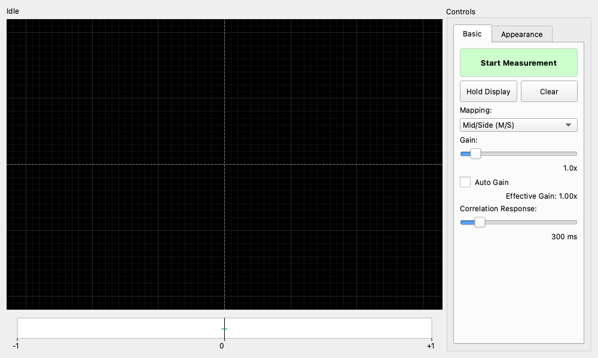

## 概要

ステレオ入力の左右チャンネルをXY平面へ描画し、音像の広がり、左右の偏り、極性反転、モノラル互換性を監視するライブ計器です。XY表示と、-1～+1の時間平滑化された相関係数を併用します。

相関係数はステレオ信号の良し悪しを一つの値で判定するものではありません。負の相関が続く場合はモノラル化によるキャンセルの可能性がありますが、目的に合うかは信号内容と聴感も含めて判断してください。

## 共通機能

このウィジェットはDetachable Wrapperの分離、分割、コンパクト表示に対応しています。詳細は[Detachable Wrapper](https://youtube-at-vach.github.io/MeasureLab/widgets/detachable_wrapper/)を参照してください。

Start、Hold、Clearを含む測定操作は右側の操作パネルにまとめられています。Split表示では、XYスコープと相関表示を操作パネルから独立して配置できます。

コンパクト表示では、監視面積を最大化するためXYスコープだけを余白なしで表示します。相関メーター、取得状態、操作ボタン、詳細設定は通常表示へ戻すと再表示されます。

## XYスコープの読み方

### Mid/Side（M/S）

既定モードです。入力値を次の表示座標へ変換します。

```text
Side = (Right - Left) / 2
Mid  = (Left + Right) / 2
```

- 縦方向の細い形: LとRが近く、モノ成分が強い状態です。
- 横方向の形: Side成分が強く、極性反転やモノラル互換性の問題を調べる必要があります。
- 左上・右上方向: それぞれLeftのみ、Rightのみの入力方向です。
- 傾いた形: 左右のレベル差や位相差を含む可能性があります。

M/S変換は±1 FSの入力が既定表示範囲へ収まるよう、和と差を2で割っています。Gainを上げて表示範囲を超えた場合は、入力クリッピングとは別に`表示範囲外`と表示されます。

### Left/Right（L/R）

X軸へLeft、Y軸へRightをそのまま割り当てるXYオシロスコープ表示です。同相信号は右上がり、逆相信号は右下がりの線になります。Invert X/Yは外部計器と座標方向を合わせるための表示変換で、入力データ自体は変更しません。

### 形状の解釈

円や楕円は左右の振幅と位相関係を示しますが、円形であること自体は「理想的なステレオ」や高音質を意味しません。単一正弦波では、等振幅かつ約90°の位相差で円に近づきます。複雑な音楽信号では周波数成分、時間差、残響、パンニングが重なった形になります。

## 相関メーター

相関は左右の積を各チャンネルのエネルギーで正規化し、既定300 msで時間平滑化します。

- `+1`: 左右が同じ極性・波形です。
- `0`: 左右の線形な相関がほとんどありません。
- `-1`: 左右が同じ波形で片側の極性が反転しています。

三角マーカーが現在値、上下の短いマーカーが直近3秒の最小・最大値です。時間履歴を含む詳細なステレオ解析にはStereo Alignment Monitorを使用してください。

以下の場合は、意味のあるゼロ値と区別するため`—`と理由を表示します。

- 両チャンネルが-80 dBFS RMS未満
- 片側だけがしきい値未満
- モノ入力を内部で左右へ複製している場合
- 入力クリッピング、Audio I/Oエラー、NaNまたはInfを検出した場合

## 基本操作

- **Start / Stop**: オーディオ取得を開始または停止します。Stop後は最終値を保持し、ライブ値ではないことを表示します。
- **Hold Display / Resume Display**: 取得を続けたまま表示だけを固定・再開します。
- **Clear**: Density、相関の最小・最大値、ラッチされた品質警告をリセットします。
- **Mapping**: M/SまたはL/R表示を選びます。
- **Gain**: 表示だけに適用する倍率です。入力信号や相関計算には影響しません。
- **Auto Gain**: XY形状が約90%の表示範囲へ収まるように調整します。範囲超過時は即座に縮小し、拡大はゆっくり追従します。
- **Correlation Response**: 相関表示の時間応答を50～2000 msで調整します。

## Appearance

- **Points**: 各サンプルを点で表示します。
- **Lines**: 周期が安定した信号では両チャンネルの短い共通周期を自動検出し、直近最大3ゲートを古いものほど薄く描きます。2:1や3:2などの比率では図形が閉じる長さを選び、わずかな周波数差は移動する輪郭として表示します。周期を安定して検出できない信号では、直近最大1024サンプルの短い時間トレイルへ自動的に切り替わります。
- **Density**: 新しく取得したサンプルの出現密度を残光表示します。
- **Persistence**: Densityの残光時定数を0.05～5.0秒で設定します。描画FPSには依存しません。
- **Glow**: Density表示だけに適用するぼかし量です。解析データには影響しません。
- **Color Palette**: Green、Fire、Ice、Viridisから、明度が順序を持つ配色を選択します。
- **Show Center Crosshair**: 画面中心を交差する十字線を表示します。既定はONです。
- **Show Direction Guides**: Mono、Anti-phase、Left、Rightの方向案内を表示します。既定はOFFです。
- **Show Axes**: 数値目盛りと軸線を表示します。座標名ラベルは表示しません。既定はOFFです。
- **Show Grid**: プロットのグリッドを表示します。既定はONです。

## 品質表示

入力クリッピング、Audio I/Oエラー、非有限入力は、瞬間的でも品質警告としてラッチされます。Clearまたは次のStartまで残るため、見逃した異常を確認できます。

`Display skipped ... samples`はGUIがDensity用サンプルを保持容量内に取り込めなかった状態で、オーディオデバイスのXRUNとは別です。`Audio I/O error`は取得自体の欠損を示します。
