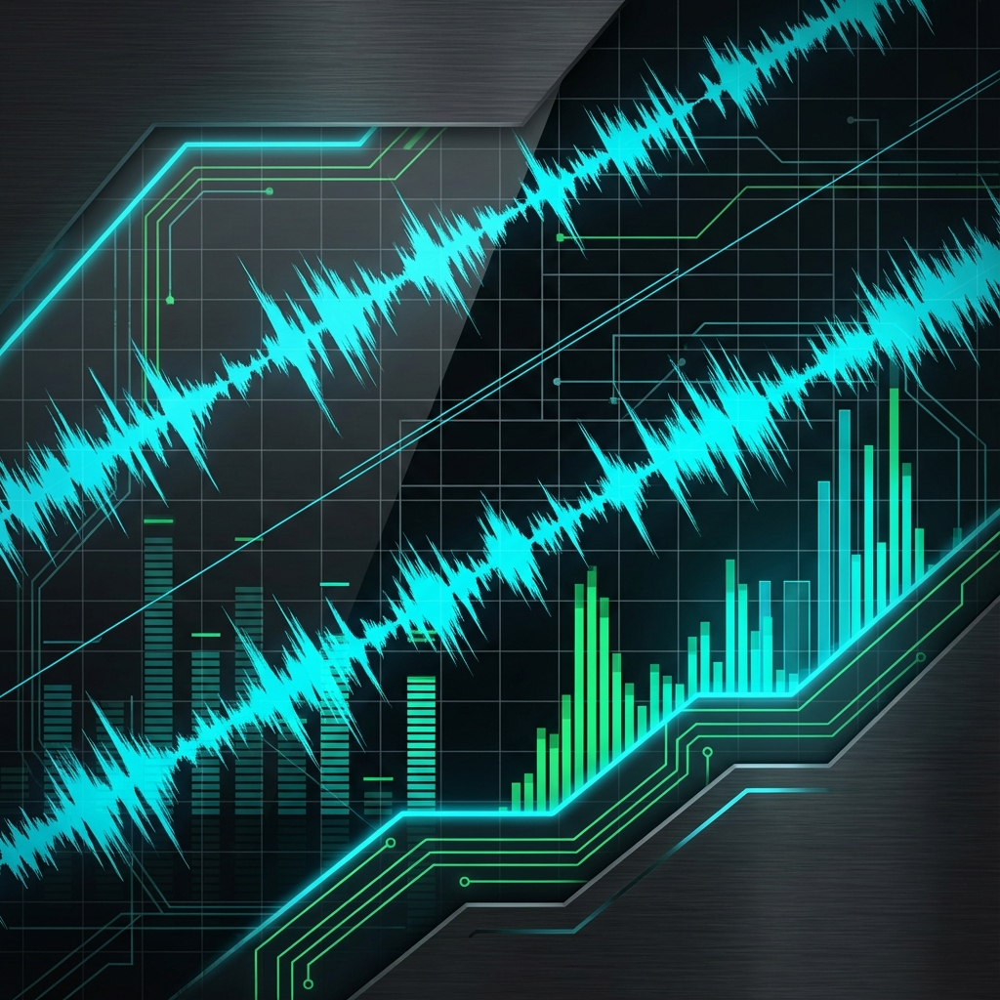

# 測定ツール マニュアル

このドキュメントは、MeasureLab を使って **音声信号や測定対象を観測・評価するための操作方法** をまとめたものです。

本ツールは、専用の測定器（オシロスコープ、スペクトラムアナライザ、歪み率計など）を持っていない環境でも、**日常使いの PC とオーディオインターフェースを「高度な測定器」に変えること** を目的としています。

!!! tip
    **「MeasureLab」は、あなたの PC の中に置かれた「仮想の測定デスク」です。**
    必要な計器（ウィジット）を机の上に並べ、自由に組み合わせて測定を行うことができます。

---

## このマニュアルの読み方

- 初めて使う方は  
  → [クイックスタート](quickstart.md) を先に読んでください
- 特定の機能を使いたい場合は  
  → 各 [**ウィジットの説明**](widget_guide.md) を参照してください
- 実際の測定例を知りたい場合は  
  → [**測定レシピ**](measurement_recipes/index.md) を参照してください

---

## 準備するもの

スムーズに測定を始めるために、以下の準備ができているか確認してください。

### ソフトウェアのインストール

ソフトウェアが起動できる状態になっている必要があります。まだの方や、OSごとの注意点を知りたい方は [**クイックスタート：起動編**](quickstart.md#starting) をご覧ください。

### オーディオインターフェース

PC 内蔵のオーディオ機能も使えますが、本格的な測定には外部のオーディオインターフェースを推奨します。

### 接続ケーブル（ループバック用）

まずは自分自身で音を出して、それを自分で録り直す **「ループバック（折り返し）接続」** で動作確認することをお勧めします。
- 3.5mm や 6.3mm の標準プラグケーブルを、出力（OUT）から入力（IN）へ接続してください。

---

## 困ったときは

操作中に分からないことがあれば、以下のページも活用してください。
- [**トラブルシューティング**](appendix.md#troubleshooting)
- [**付録：このツールの限界と注意点**](appendix.md#limitations)
