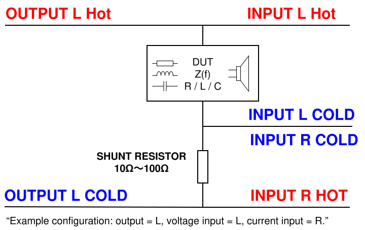

# スピーカーのインピーダンス測定

!!! Warning "未検証のガイド"
    本ガイドは、AIの推測を基に作成したものです。しかし、測定結果の信頼性や本ツールの限界については、必ず [**付録：このツールは「測定器」ではありません**](../appendix.md) をご一読ください。

スピーカーユニットの電気的特性（インピーダンス）を測定する方法を解説します。
インピーダンス曲線を描くことで、スピーカーの最低共振周波数 ($f_0$) や、エンクロージャー（箱）設計に必要なパラメータを知る手がかりが得られます。

## 測定の適用範囲と制限事項

本構成は、スピーカーのような低インピーダンス負荷の測定に最適化されたものではありません。
インピーダンスカーブの形状や共振挙動を観測することは可能ですが、オーディオインターフェースの出力インピーダンスの影響により、絶対値の精度には制限が生じる場合があります。

正確なインピーダンス値や小信号パラメータの算出が必要な場合は、外部の低出力インピーダンスのドライバ段（バッファやパワーアンプなど）を使用してください。

## 目的

* **$f_0$ (最低共振周波数) の特定**: スピーカーが最も効率よく振動する低い周波数を特定します。
* **インピーダンスカーブの確認**: アンプにとっての負荷がどのように変化するかを確認します。
* **断線・故障のチェック**: インピーダンスが異常に高い、または低い場合、ボイスコイルの異常を発見できます。

## 必要なもの

測定には以下の機材が必要です。

* **オーディオインターフェース**: 2入力2出力（ライン入力・出力）があるもの。
* **基準抵抗 (Reference Resistor)**: 10Ω 〜 100Ω 程度の抵抗器 1本。
  * 精度が高いもの（誤差 1%以下）が望ましいですが、通常の 5% 品でも、テスターで実測した値を入力すれば高精度に測定できます。
  * スピーカー測定の場合、**10Ω 〜 47Ω** 程度が使いやすいです。
* **接続ケーブル**: ワニ口クリップなど、測定対象に接続しやすいもの。

## 接続セットアップ (I-V法)

MeasureLab の **Impedance Analyzer** は、電流-電圧法（I-V法）を使用します。
以下のように接続してください。

1. **Output L** からスピーカーのプラス端子へ繋ぎます。
2. スピーカーの後ろ（マイナス端子）に **Ref Resistor（基準抵抗）** を繋ぎ、GNDへ落とします。
3. **Input L** で「スピーカーにかかる電圧」を測ります（スピーカーの両端）。
4. **Input R** で「抵抗にかかる電圧」を測ります（これにより電流が計算できます）。

## 測定手順

### 1. アプリの設定

1. **Impedance Analyzer** ウィジットを開きます。
2. **Settings** パネル（左側）で構成を設定します。
    * **Voltage Ch**: `Left` (Ch 1)
    * **Current Ch**: `Right` (Ch 2)
    * **Ref Resistor**: 使用する抵抗の実測値（例: `10.0`）を入力します。**この値が正確でないと正しい測定ができません。**

### 2. キャリブレーション (推奨)

より正確な測定のために、ケーブルの抵抗分などをキャンセルします。

1. **Open Cal**: スピーカーを外し、ケーブルを開放状態で `Run Open Cal` を実行。
2. **Short Cal**: スピーカーを繋ぐ箇所のクリップ同士をショートさせ、 `Run Short Cal` を実行。
3. **Load Cal** (任意): 正確な抵抗値（例えば 10Ω や 100Ω の精密抵抗）が手元にある場合、それを接続して `Run Load Cal` を実行すると、さらに測定精度が向上します。
4. キャリブレーション後、スピーカーを接続します。

### 3. スイープ測定

周波数ごとの変化を見るために、スイープ測定を行います。

1. **Frequency Response (FRA)** タブを選択します。
2. **Frequency Range**: スピーカーの特性に合わせて設定します（例: `20Hz` 〜 `20000Hz`）。
3. **Points**: 解像度です。`100` 〜 `400` 程度にします。
4. **Start Sweep** をクリックします。

## 結果の解釈

グラフ（Bode Plot）にインピーダンス曲線が表示されます。

### 見るべきポイント

1. **低域の鋭い山 ($f_0$)**:
    * 50Hz 〜 100Hz 付近（ウーファーの場合）や、数百Hz 〜 1kHz 付近（ツイーターの場合）に、インピーダンスが急激に上昇する「山」が見えます。
    * この山の頂点の周波数が **$f_0$ (最低共振周波数)** です。箱に入っていない状態でのスピーカーの基本的な低音再生能力を示します。

2. **ボトムのインピーダンス (公称インピーダンス)**:
    * $f_0$ より少し高い周波数（200Hz 〜 500Hz付近）で、インピーダンスが最も低くなります。
    * これが「4Ω」や「8Ω」などのカタログスペック（公称インピーダンス）に近い値になります。DC抵抗（DCR）より少し高い値になります。

3. **高域の上昇**:
    * 周波数が高くなるにつれて、インピーダンスが徐々に上がっていくのは、ボイスコイルの**インダクタンス成分 ($L$)** によるものです。

### トラブルシューティング

* **グラフがギザギザしている**: 接点不良や外部ノイズの影響が考えられます。音量を少し上げるか、Average設定を増やしてみてください。
* **値がおかしい**: `Ref Resistor` の設定値が実際の抵抗値と合っているか確認してください。

---

この測定ができれば、自作スピーカーのクロスオーバーネットワーク設計や、バスレフポートの調整（箱に入れた状態でのインピーダンス測定で、山が2つに割れる現象を確認する）など、本格的な音響設計の第一歩を踏み出せます。
