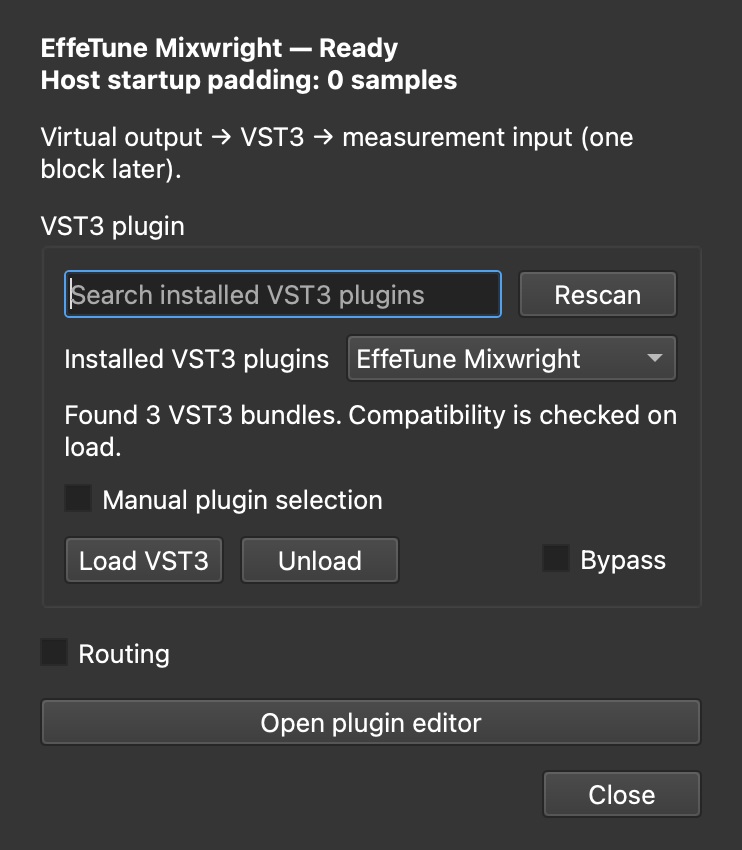

# VST3を測定対象（DUT）として使用する

VST3エフェクトへMeasureLabのテスト信号を入力し、その出力を既存の測定器で観測できます。
「設定 → オーディオ → Virtual / Offline Mode」の仮想デバイス内に挿入します。
実オーディオデバイスやリモート音声接続は不要です。

## 導入

ソースから起動する環境で、通常の依存関係に加えて任意のVSTホスト依存関係を導入します。

```bash
./.venv/bin/python -m pip install -r requirements-vst.txt
```

パッケージとしてインストールする場合は `pip install '.[vst]'` も使用できます。
この追加依存関係がなくても、従来のMeasureLabの機能は利用できます。
配布済みのアプリには追加依存関係が含まれていない場合があります。

## 操作

1. 測定を停止し、設定で「仮想オーディオ」を有効にします。
2. 同じタブでサンプルレートを設定します。ブロックサイズはオーディオ設定で選択します。
3. 「VST3測定対象（DUT）」を開き、「インストール済みVST3」からプラグインを選択します。
   標準フォルダを自動探索します。検索欄で絞り込み、追加インストール後は「再スキャン」で更新できます。
   標準フォルダ以外のパスやバンドル内のプラグイン名を指定する場合は「プラグインを手動で指定」を展開します。
4. 「VST3をロード」を押すと、ロード完了後にプラグイン独自の操作パネルが別ウィンドウで自動的に開きます。
   DAWと同じノブやプリセットなどで設定できます。操作パネルは測定中も開いたまま使用できます。
   測定に使うロード済みプラグインを直接編集するため、変更した設定はそのまま測定に反映されます。
   パネルだけを閉じるにはウィンドウの閉じるボタン、または「プラグイン画面を閉じる」を押します。
   再表示するときは「プラグイン画面を開く」を押します。測定中も開閉できます。
5. 配線を変える場合は「ルーティング」を展開し、モノ／ステレオ、DUTの入力元、左右の測定入力への戻し先を選びます。
6. 起動用のDUTダイアログを閉じ、信号発生器とFFT、オシロスコープ、ネットワークアナライザーなどを使用します。
   プラグインの操作パネルは残るため、測定結果を見ながらノブを調整できます。

VST3の設定はプラグイン独自の操作パネルで行います。汎用パラメータ画面は提供しません。
独自パネルを持たないプラグインやエディターを表示できない環境ではエラーを案内します。

独自パネルの設定変更は測定中も音声へ反映されます。固定した設定を比較する測定では、設定を変えてから再測定してください。
配線・バイパス・ロード／アンロードは測定停止中に操作します。
アンロード・別プラグインへの置き換え・アプリ終了時には、操作パネルも終了します。
バイパスはDUT入力をそのままDUT出力へ通し、配線は維持します。
アンロードすると通常の仮想ループバックに戻ります。
プラグインの自動再ロードやパラメータの永続保存は行わないため、アプリ再起動後は再設定してください。

### 画面例

日本語でルーティングを展開した画面と、英語・ダークテーマの起動画面です。
手動指定とルーティングは初期状態では折りたたまれています。




## 自動探索するフォルダ

ユーザー用フォルダと共有フォルダを、メーカー別サブフォルダも含めて探索します。

| OS | 探索先（上から順） |
| --- | --- |
| Windows | `%LOCALAPPDATA%\Programs\Common\VST3`、`%CommonProgramFiles%\VST3`（通常は `C:\Program Files\Common Files\VST3`） |
| macOS | `~/Library/Audio/Plug-Ins/VST3`、`/Library/Audio/Plug-Ins/VST3`、`/Network/Library/Audio/Plug-Ins/VST3` |
| Linux | `~/.vst3`、`/usr/lib64/vst3`、`/usr/lib/vst3`、`/usr/local/lib64/vst3`、`/usr/local/lib/vst3` |

探索先は [Steinbergの標準配置仕様](https://steinbergmedia.github.io/vst3_dev_portal/pages/Technical%2BDocumentation/Locations%2BFormat/Plugin%2BLocations.html)を参照しています。
Windowsでは実行中プロセスに対応する共通フォルダを使用し、別のビット数のフォルダは追加探索しません。
他のDAW専用フォルダは探索しません。

探索はバックグラウンドで行い、プラグインのコードは実行しません。
一覧は検出したファイル／バンドル単位です。互換性・認証・エフェクト対応はロード時に確認するため、
一覧への表示だけでは使用可能とは限りません。複数のプラグインを含むバンドルは名前を別途入力します。
同名の別ファイルはフォルダ名で区別し、シンボリックリンクで同じ実体を参照する場合は重複を除きます。
存在しないフォルダは無視し、アクセスできないフォルダは探索結果とツールチップで通知します。

## 配線例

ステレオの入出力を直接観測する場合:

```text
MeasureLab出力L → DUT入力1 → DUT出力1 → 測定入力L
MeasureLab出力R → DUT入力2 → DUT出力2 → 測定入力R
```

ネットワークアナライザーで入力と出力を比較する場合:

```text
MeasureLab出力L ─┬→ DUT入力1 → DUT出力1 → 測定入力L（測定）
                └────────────────────→ 測定入力R（参照）
```

DUT入力1を「出力L」、測定入力Lを「DUT出力1」、測定入力Rを「出力L（参照）」にします。
ステレオエフェクトではDUT入力2も目的に応じて「出力L」「出力R」「無音」から選びます。
測定器側の測定／参照チャンネルを、この配線に合わせてください。
出力チャンネル設定がモノの場合、単一の論理出力が配線上のL/R両方に複製されます。
複数の信号発生器が動作している場合は、そのミックスがDUTへの刺激信号になります。

## 時間・精度・対応範囲

- 仮想デバイスの既存コールバック経路を使用し、DUT出力と参照信号は次のブロックで測定器へ渡ります。
- ブロック間と同じ音声設定での測定ストリーム再開始では、プラグインの内部状態と操作パネルを保持します。
  信号発生機の開始・停止ではプラグインの再ロードやパネルの開き直しを行いません。
  測定ストリームの停止中はプラグインの音声処理も停止するため、残響やディレイなどの内部状態は再開始時に引き継がれます。
  配線やバイパスの変更、サンプルレート／ブロックサイズの変更時は内部状態をリセットします。パラメータ値は保持します。
- ホストが起動時に保持したサンプルは、返された音声の前に無音を補完して時間軸を維持します。
  補完したサンプル数はDUTダイアログに表示します。プラグイン固有の遅延を含むため、
  必要に応じて測定器で遅延校正してください。この値だけでVSTの報告遅延全体を表すものではありません。
- Pedalboardへの入出力はfloat32です。MeasureLabの64 bit設定でもDUT処理はfloat32となります。
  振幅のクリップ、追加ディザ、正規化は適用しません。
- macOS／Windows／Linuxの、実行中Pythonと互換性のあるOS・CPUアーキテクチャのVST3エフェクトが対象です。
  VST2、MIDI音源、サイドチェイン、多チャンネルバスは対象外です。
  モノ／ステレオ構成を受け付けないプラグインはエラーになります。
- プラグインは別プロセスでロードし、メインスレッドが独自パネル、専用スレッドが音声処理を担当します。
  パネルの終了通知と音声の応答は別の通信経路を使用します。ロードは30秒、処理応答は1秒でタイムアウトします。
  パネルは時間制限なく表示でき、閉じる操作には5秒のタイムアウトを適用します。
  音声設定や配線などの変更でプラグインをリセットする際には、パネルを一時的に閉じてメインスレッドで処理し、自動で再表示します。
  停止・クラッシュ・不正な出力を検出すると測定入力全体を無音にし、DUTエラーを表示します。
  通常のループバックへ自動的に切り替えることはありません。復帰には再ロードが必要です。
- ホストはタイマー駆動であり、厳密な実時間動作や任意のプラグインとの互換性を保証するものではありません。
  GUI操作が必須の認証画面などを持つプラグインは使用できない場合があります。

DUT選択中は、非線形解析器の仮想モード用デモ生成を使用せず、実際のDUT出力を測定します。
新しい解析モデルやVST再現機能は追加していません。

ホストのAPI・対応範囲は [Pedalboard公式ドキュメント](https://spotify.github.io/pedalboard/reference/pedalboard.html)を参照してください。
Pedalboardのライセンスは [公式ライセンス情報](https://spotify.github.io/pedalboard/license.html)を参照してください。

## 検証

通常のテストでは既知のゲイン、配線、参照信号、無音化、タイムアウト、GUI操作を検証します。
実際のVST3による統合テストは、デスクトップ表示が利用できる環境で、各OSに対応するプラグインのパスを指定して実行します。

```bash
MEASURELAB_TEST_VST3=/path/to/Effect.vst3 ./.venv/bin/python -m pytest -q tests/logic_verification/core/test_vst_dut.py
```

統合テストは音声を通す初期設定のエフェクトを想定し、独自パネルの表示・再表示・終了、
複数のレート／ブロックサイズと仮想音声経路を確認します。
