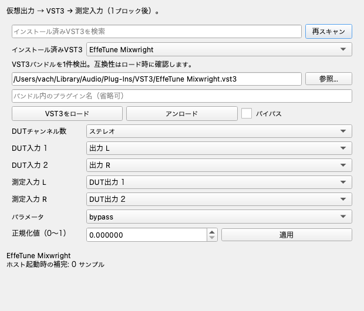
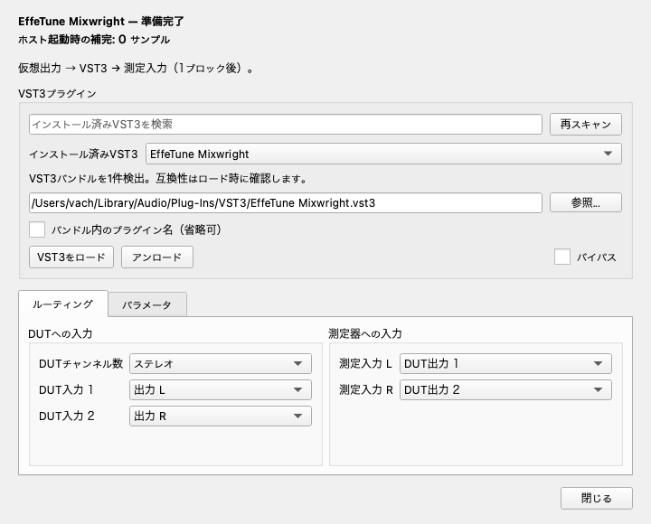
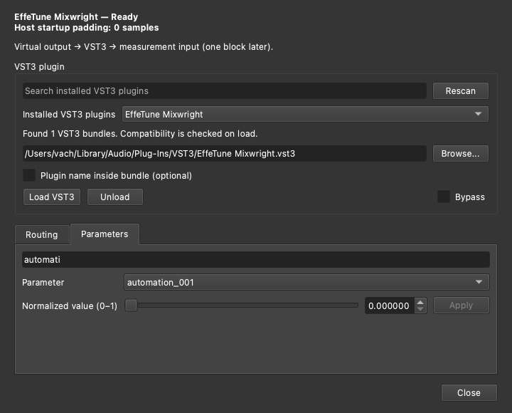
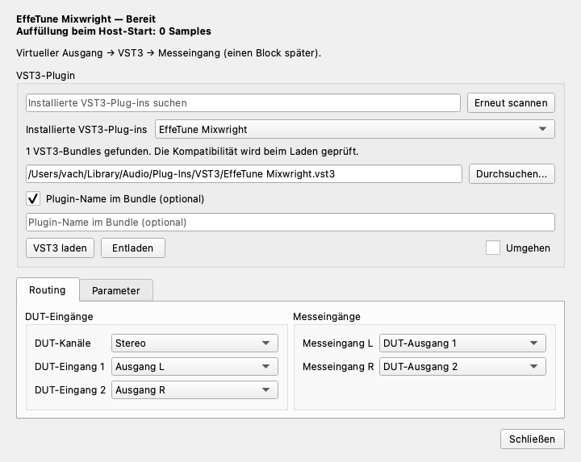

# VST3 DUT GUIレビュー

PR #2105で追加したダイアログを、実ウィジェットのスクリーンショットから見直しました。
画像はmacOSのQtオフスクリーン描画で取得し、アプリのThemeManagerとQt既定フォントを使用しています。
EffeTune Mixwrightを実際にロードした状態です。ネイティブウィンドウの枠は含みません。

## 改善前

プラグイン選択・配線・値の編集が一続きで、ロード状態は画面下部にありました。
未ロードでも値入力が有効で、アンロード後にパラメータ一覧が残る問題もありました。

## 改善後

ロード状態を上部に置き、プラグイン選択と、配線・パラメータのタブに分けました。
配線はDUTへの入力と測定器への入力を左右に配置しています。標準サイズは720×580です。
バンドル内の名前指定は必要な場合に展開でき、常設の「閉じる」ボタンを追加しました。

257個のパラメータを持つ実プラグインで検索を確認しました。
スライダーと数値入力を同期し、変更した値だけ「適用」できるようにしています。
値を選択した際は、スライダーの刻みに合わせて数値入力を丸めません。
検索結果がない場合やアンロード後は値の編集を無効にします。

ダークテーマで検索欄の案内文字が暗い背景に埋もれていたため、テーマのプレースホルダー色を設定しました。
長い翻訳でも追加入力欄と閉じるボタンが収まることを確認しています。

## 操作とサイズの確認

- 実VST3の検出・選択・ロードと、257個のパラメータの表示を確認。
- 日本語・英語・ドイツ語で、未ロード、ロード済み、パラメータ検索、該当なし、追加入力欄を撮影して確認。
- GUIテストで9言語の両タブと追加入力欄の最小サイズが1180×690以内であることを確認。
- 空のパスではロードを無効化し、検索欄・パス欄でEnterを押してもロードされないことを確認。
- スライダー編集ではまだホストを変更せず、適用後にホストが返した値を表示することを確認。
- 測定中は設定変更を無効にし、ロード中のプラグイン名・バイパス状態と測定停止の案内を併記。

画面レビューはmacOSで行っています。Windows・Linuxのネイティブ画面は今回の確認対象に含みません。
