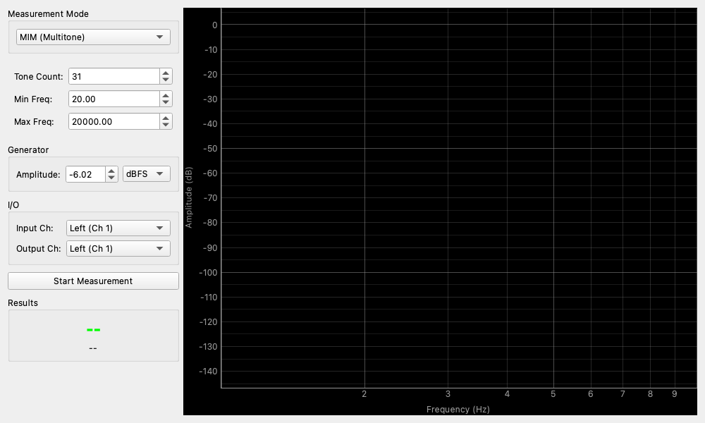

# Advanced Distortion Meter

## Overview

This is an advanced tool for analyzing more complex and practical distortions that are not understandable by standard "THD (Total Harmonic Distortion)" measurements.
Instead of a single pure tone, it uses simultaneous multiple tones or specific combinations of frequencies to evaluate the performance of amplifiers and speakers under conditions closer to actual music playback.

It is suitable for searching for the cause of phenomena such as "having good numbers in standard THD measurement, but the sound is muddy when actually listening."

## Operation

### Starting and Stopping Measurement

1.  In **Measurement Mode**, select the item you want to measure (MIM, SPDR, PIM, Multi-Tone, etc.).
2.  Press the **Start Measurement** button to begin the measurement and output the signal.
3.  During measurement, the graph is updated continuously, and values are displayed in the **Results** field.
4.  Stop with **Stop Measurement**.

### How to Read the Graph

- **Horizontal Axis (Frequency)**: Frequency.
- **Vertical Axis (Amplitude)**: Loudness (dB).
- The yellow line represents the spectrum of the input signal (intensity for each frequency).

### Results

Depending on the measurement mode, the most important indicators are displayed largely here.
- **TD+N / SPDR / PIM**: Main measurement values. Whether a larger (or smaller) value is better depends on the mode (described later).

## Measurement Modes and Settings

Settings are performed in the panel on the left side of the screen.

### Measurement Mode

This is the core function of this tool. The main modes are as follows:

*   **MIM (Multitone Intermodulation Distortion)**
    *   **Overview**: Uses "multitone" signals that sound many tones, such as 31 tones, simultaneously. It measures "Distortion + Noise (TD+N)" when applying a complex load close to a music signal.
    *   **How to interpret**: For **TD+N (dB)**, the "lower (greater negative value)" the value, the higher the performance.
    *   **Settings**:
        *   **Tone Count**: Number of tones to sound. The higher the number, the higher the density.
        *   **Min / Max Freq**: Frequency range to be measured.

*   **SPDR (Spurious Free Dynamic Range)**
    *   **Overview**: When outputting a signal such as 1kHz, it measures how low the "unnecessary components other than the signal (spurious)" are from the signal.
    *   **How to interpret**: For **SPDR (dB)**, the "higher (greater positive value)" the value, the fewer the unnecessary components and the cleaner it is.
    *   **Settings**: Basically fixed at 1kHz.

*   **PIM (Passive Intermodulation / 2-Tone)**
    *   **Overview**: Sounds two tones of different pitches (f1, f2) and measures the "tones that did not exist originally (intermodulation distortion)" produced by mixing those two tones.
    *   **How to interpret**: **PIM (dBc)** represents how low the distortion component is relative to the original signal. The "lower (greater negative value)" the value, the higher the performance.
    *   **Settings**: Specify two frequencies in **Freq 1 / Freq 2** (e.g., 18kHz and 19kHz, or 1.8kHz and 2.1kHz, etc.).

### Generator

Sets the strength of the signal used for measurement.

*   **Amplitude**: Loudness of the signal.
    *   Start from a low value (such as -20dBFS) initially to avoid damaging the measurement target (amplifier, etc.).
*   **Unit**: Can be selected from `dBFS` (digital full scale), `dBV` (1V reference), `dBu` (professional reference), and `Vrms` (voltage).

### I/O (Input/Output)

*   **Input Ch**: Select the input terminal (microphone or line input) used for measurement.
*   **Output Ch**: Select the terminal for outputting the signal (output to speakers or amplifier).

## Usage Examples

### Checking Amplifier Performance (MIM Measurement)

When "distortion rate in the spec sheet is good, but the sound is muddy when listening to intense songs," MIM mode is effective.

1.  Set **Mode** to `MIM`.
2.  Connect to an amplifier and press **Start**.
3.  Look at the **TD+N** value.
    *   In high-end audio equipment, it may reach -80dB to -100dB or less.
    *   At about -40dB, you might feel muddiness in complex songs.
4.  Look at the graph and check if the "valleys" between the many columns (test signals) are deeply submerged. If the valleys are buried, it indicates a lot of some kind of distortion or noise.

### Finding Unknown Noise (Spurious) (SPDR Measurement)

Check if unexpected noise is mixed in, such as power supply noise or interference from digital circuits.

1.  Set **Mode** to `SPDR`.
2.  Press **Start**.
3.  Look for "small mountains popping out" other than the large 1kHz mountain on the graph.
4.  The frequency of the largest noise is displayed in **Max Spur**. You can see things like "Oh, 50Hz of the power supply frequency is appearing."

### Checking Intermodulation at High Frequencies (PIM Measurement)

Check if high sounds are not muddy when mixed in a tweeter or wideband amplifier.

1.  Set **Mode** to `PIM`.
2.  Set **Freq 1 / Freq 2** (e.g., `18000` (18kHz) and `19000` (19kHz), etc.).
3.  Press **Start** and see if a new mountain is created at low frequencies (around 1kHz, etc.) on the graph (difference tone distortion, etc.). If you hear a low sound that should not be sounding, intermodulation distortion is occurring.
