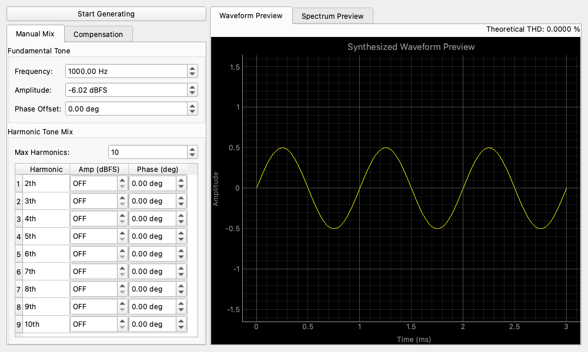

# Arbitrary Harmonic Generator (任意高調波ジェネレータ)

## 概要

Arbitrary Harmonic Generator は、基本周波数と複数（最大50次まで）の高調波成分の振幅および位相を正確に定義することで、複雑な波形を合成できる高度な信号発生モジュールです。

特定の歪みプロファイルを持つテスト信号の生成や、測定系に存在する高調波歪みを打ち消すための逆補償信号の作成などに非常に有用です。

## 操作方法

### 基本設定

* **Frequency (Hz)**: 生成する信号の基本周波数です。
* **Base Amp (dBFS)**: 基本周波数成分の振幅です。

### 高調波補償 (Harmonic Compensation)

このモジュールの核となる機能は、個々の高調波を調整する機能です。

* **Compensation Adjustments (dB)**: 基本波に対する各高調波の振幅を微調整します。
* **Phase Adjustments (deg)**: 各高調波の位相オフセットを調整します。
* **Enable/Disable**: チェックボックスを使用して、特定の高調波のオン/オフを切り替えることができます。

### データ管理

* **Export/Import**: 現在の高調波補償プロファイルを JSON ファイルとしてエクスポートし、後でインポートすることができます。これは [Lock-in Harmonic Analyzer](lockin_harmonic_analyzer.md) とシームレスに統合されており、システムの歪みプロファイルを測定し、そのプロファイルをジェネレータに読み込んで、事前歪み（プレディストーション）または補償された信号を作成することができます。
