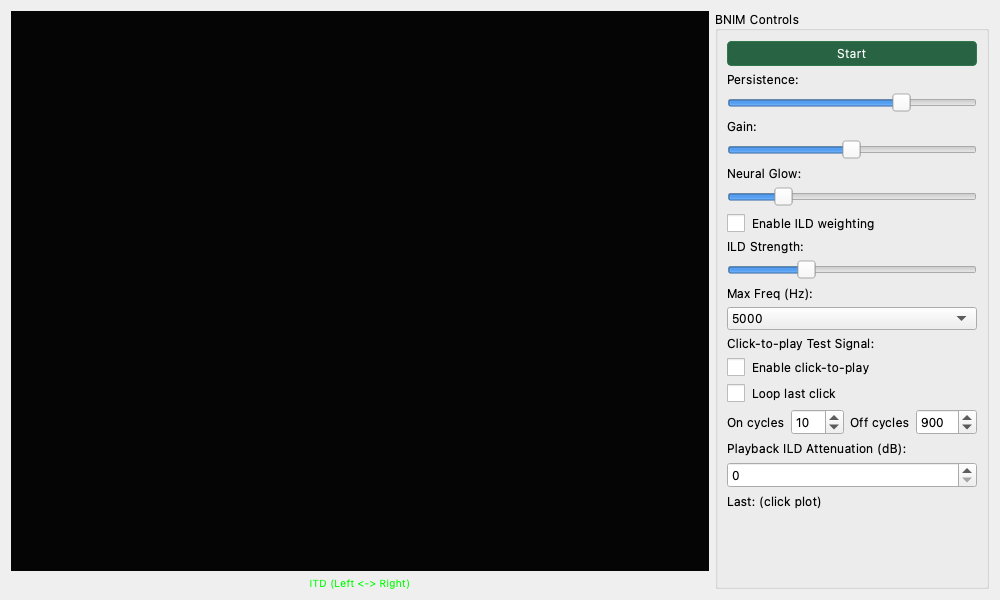

# BNIM Meter (音像定位可視化 / BNIM)

## 概要

人間の「聴覚（脳）」が、左右の耳に入ってくる音のズレをどう処理して「音の方向」を感じ取っているかをシミュレーションして可視化する、ユニークなメーターです。
通常の位相計（リサージュ波形）よりも直感的に、「どの周波数の音が、どの方向（左右）から聞こえているか」をサーモグラフィのようなヒートマップで表示します。
ステレオ音像の定位感や広がりを確認したり、バイノーラル録音のチェックに最適です。

## コンパクトモード (Compact Mode)

Detachable Wrapperの分離ウィンドウ時に「Compact」ボタンを押すことで、イメージマップ表示のみを最大化するコンパクトモードに対応しています。空間の広がりだけを監視したい場合に便利です。

## ☕ コーヒーブレイク：フクロウはどうやってネズミを見つけるの？

真っ暗な森の中で、フクロウはどうやって地上のネズミの正確な位置を特定するのでしょうか？実は、フクロウの左右の耳は「高さ」がわざとズレて付いています。

音源（ネズミの足音）が左右にずれていると、近い方の耳に「ほんの少しだけ早く」音が届きます。これを **ITD (両耳間時間差)** と呼びます。
さらに、頭が障害物になるため、遠い方の耳では音が「少しだけ小さく」なります。これを **ILD (両耳間レベル差)** と呼びます。
フクロウ（そして人間も！）の脳は、このわずかな「時間差」と「音量差」を超高速で計算し、音の方向を立体的に割り出しているのです。BNIMメーターは、まさにこの「脳の計算」を真似して、音の方向をスクリーンに映し出すツールなのです。

## 画面の見方

### メイングラフ

* **横軸 (ITD - Interaural Time Difference)**: 音の到来方向を表します。
    * **中央 (0 ms)**: 正面（センター）に定位している成分です。
    * **左側 (- ms)**: 左耳に先に音が届いている、つまり「左」から聞こえる成分です。
    * **右側 (+ ms)**: 右耳に先に音が届いている、つまり「右」から聞こえる成分です。
* **縦軸 (Frequency)**: 周波数（音の高さ）を表します。上が高い音、下が低い音です。
* **色 (Color)**: その位置・高さでの「定位の強さ」を表します。明るい（黄色～白）ほど、その方向から強く音が聞こえています。

例えば、「ボーカルは真ん中（中央の縦線）」「ハイハットは少し右（右上の輝点）」のように音源の位置関係が見て取れます。

## 操作方法

### 基本操作

1. **Start** ボタンを押すと測定（シミュレーション）を開始します。
2. 音楽やマイク入力を流すと、画面上に緑や黄色の光（ニューロンの興奮パターン）が現れます。
3. **Stop** で停止します。

### BNIM Controls (設定)

#### 表示の調整

* **Persistence (残像)**: 画面の残像の長さを調整します。右にするほど長く残り、全体的な傾向を見るのに適しています。
* **Gain (感度)**: 入力信号に対する反応の感度を調整します。色が暗すぎる場合は上げてください。
* **Neural Glow (光の拡散)**: 光をぼやけさせます。数値を上げると、細かい点を繋げて「かたまり」として見やすくなります。

#### 聴覚モデルの調整

* **Enable ILD weighting (音量差の考慮)**
    * 通常、このメーターは「時間のズレ (ITD)」だけで方向を計算しますが、このチェックを入れると「音量のズレ (ILD)」も加味します。
    * 高音域では人間は時間差よりも音量差で方向を感じ取るため、これをONにするとより実際の聴こえ方に近い表示になります。
    * **ILD Strength**: 音量差の影響度を調整します。

* **Max Freq**: 分析する周波数の上限を設定します（1000Hz ～ 10000Hz）。定位感は中低域が特に重要なため、デフォルトの5000Hz程度が一般的です。

### Click-to-play Test Signal (クリック試聴機能)

グラフ上をクリックすることで、その場所（周波数と方向）に対応するテスト音を実際に鳴らすことができます。「この位置に光があるけど、これはどんな音？」を確認したり、自分の耳の聴こえ方をテストするのに使えます。

* **Enable click-to-play**: この機能を有効にします。グラフ上をマウスでクリックまたはドラッグすると、その座標に応じた「プッ、プッ」というバースト信号（断続音）が再生されます。
    * **横方向**: 音の左右の遅延（ITD）が変化し、音が左右に動いて聞こえます。
    * **縦方向**: 音の高さが変化します。
* **Loop last click**: クリックを離した後も、最後に触った位置で音を鳴らし続けます。
* **On/Off cycles**: テスト音の鳴る長さと休む長さを調整します。
* **Playback ILD**: テスト音に人工的な音量差（ILD）を加えます。

## 使用例

### ミックスの定位確認

楽曲のミックスダウン時に、各楽器が狙った位置に配置されているかを確認できます。

* ボーカルやベースがしっかりセンター（中央の線）に定まっているか？
* コーラスやリバーブ成分が左右にきれいに広がっているか？
* 意図せず左右にフラフラしている帯域がないか？

### 位相ズレの発見

* もし、「音は聞こえるのに、画面中央が暗く、左右の両端ばかりが光る」場合、**逆相（Out of Phase）** になっている可能性があります。左右のスピーカーケーブルの極性が合っているか確認してください。

### バイノーラル効果の教育・学習

* **Click-to-play** 機能を使ってグラフをドラッグしてみてください。
* 「横に動かすと（時間差を変えると）、音が頭の中を左右に移動する」という体験ができます。
* 高周波（上の方）で操作した際、時間差だけでは方向感が分かりにくくなることや、ILD（音量差）を加えると急に方向感がつく現象など、人間の耳の不思議さを体験できます。
