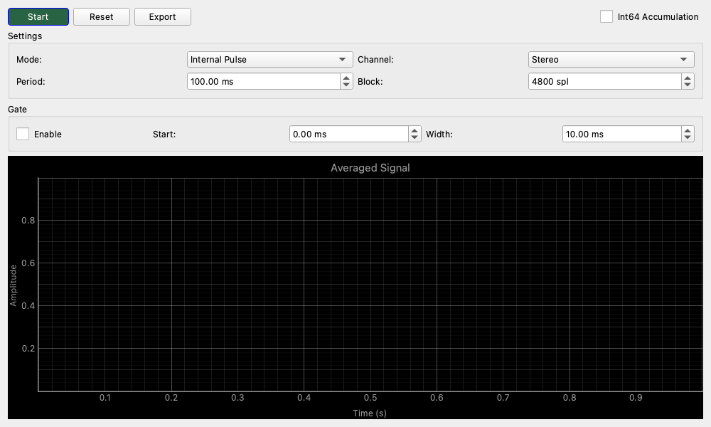

# Boxcar Averager

## 概要
周期的な信号を何度も重ね合わせて平均化（アベレージング）することで、ランダムノイズを除去し、埋もれていた微細な波形を鮮明に浮かび上がらせるツールです。
「ボックスカー積分器」とも呼ばれ、微小信号の測定や、システムのインパルス応答・ステップ応答を高精度に観測するために使用されます。

このウィジットは、自らテスト信号を出力して同期する「Internalモード」と、外部からのトリガー信号に同期する「Externalモード」の両方を備えています。

## 操作方法

### 測定の開始とリセット
- **Start / Stop ボタン**: 測定（積算）の開始と停止を切り替えます。
- **Reset ボタン**: これまでの積算データをクリアし、ゼロから平均化をやり直します。設定を変更した直後や、測定対象を動かした後に押してください。

### グラフの表示
- **横軸 (Time)**: 1周期分の時間を表します。
- **縦軸 (Amplitude)**: 平均化された信号の振幅です。
- **N=...**: タイトル部分に現在の積算回数（平均化された回数）が表示されます。回数が増えるほどノイズが減り、波形が滑らかになります。

## 設定項目

### 基本設定 (Controls)

* **Mode (同期モード)**
    * **Internal Pulse / Step / Impulse**: 内部でテスト信号（パルス、ステップ波形、インパルス）を生成し、それを基準に同期します。出力端子から信号が出ます。
    * **Internal PRBS/MLS**: 疑似ランダム信号を使用します（特殊な測定用）。
    * **External Reference**: 外部から入力される基準信号（矩形波など）をトリガーとして、もう片方のチャンネルの信号を平均化します。

* **Period (周期)**
    * 1回の平均化を行う時間の長さをミリ秒(ms)で指定します。
    * 測定対象の応答が十分に収まる長さに設定してください。短すぎると残響が次の周期に重なってしまいます（エイリアシング）。

* **Channel (測定チャンネル)**
    * 測定したい入力チャンネルを選択します（Stereo / Left / Right）。

### ゲート設定 (Gate)
分析する時間範囲を限定する機能です。特定の反射音だけを取り出したり、処理負荷を下げたりする場合に使います。

* **Gate チェックボックス**: 機能をON/OFFします。
* **Start**: 周期の開始点（t=0）から、実際に記録を開始するまでの遅延時間を設定します。
* **Width**: 記録する幅（長さ）を設定します。

### 外部トリガー設定 (External Sync)
Modeを `External Reference` にしたときのみ表示されます。

* **Ref (参照チャンネル)**: トリガーとして使用するチャンネル（Left または Right）を選びます。通常、こちらにはクリーンな同期信号を入力します。
* **Edge (エッジ)**: **Rising**（立ち上がり）でトリガーするか、**Falling**（立ち下がり）でトリガーするかを選びます。
* **Lvl (レベル)**: トリガー判定を行う電圧レベル(閾値)を設定します。

## 使用例 (Usage Examples)

### アンプやエフェクターのステップ応答を見る (Step Response)
オーディオ機器に急激な信号変化を与えたときの追従性（立ち上がり特性やダンピング）を測定します。

1.  オーディオインターフェースの出力と測定対象の入力を接続し、出力を入力に戻します（ループバック接続）。
2.  **Mode** を `Internal Step` に設定します。
3.  **Period** を `100 ms` 程度に設定します。
4.  **Start** を押し、グラフを見ます。
5.  ノイズでギザギザしていた波形が、積算回数(N)が増えるにつれて綺麗な階段状の波形になっていく様子が観察できます。

### 微小信号の検出 (Noise Reduction)
ノイズに埋もれてオシロスコープでは見えないような小さな繰り返し信号を観測します。

1.  **Mode** を `External Reference` に設定します。
2.  Ch2(Right)に測定システムからの同期信号（トリガー）を入れ、Ch1(Left)に微小なセンサー信号などを入れます。
3.  **Ref** を `Right` に設定し、**Lvl** を適切に調整します。
4.  **Start** を押すと、同期信号のタイミングに合わせてCh1が重ね書きされ、ランダムなノイズだけが相殺されて消えていきます。
