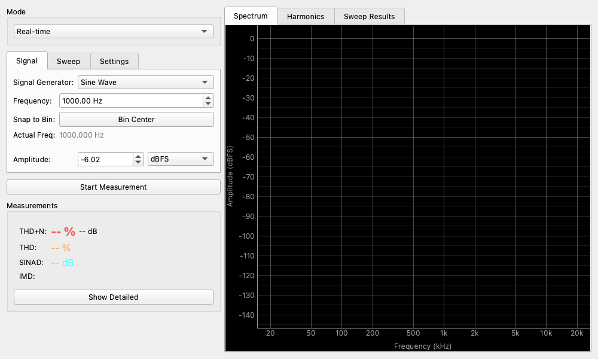

# Distortion Analyzer (歪み率・THD測定)

## 概要

オーディオ機器の「性能」を数値で測るための最も基本的なツールです。
アンプやDACなどが、元の信号をどれくらい正確に出力できているか（どれくらい歪んでしまっているか）を測定します。
健康診断でいう「血液検査」のようなもので、機器の基礎体力を知ることができます。

## ☕ コーヒーブレイク：「歪み（ひずみ）」ってなに？

もしあなたが「まん丸な満月の写真」をコピー機にかけたとき、出てきたコピーが「少し楕円形」になっていたり、周りに「余分な星」が印刷されていたらどうでしょう？元の満月とは少し違う形になっていますよね。これが「歪み（ひずみ）」です。

オーディオの世界でも同じです。アンプに「綺麗でツルンとした波の音（ピーという音）」を入れたのに、出てきた音が少しトゲトゲしていたり、元の音には無かったはずの「キーン」という高い音が混ざって聞こえたりすることがあります。これは、機器が音を増幅する過程で「余分な音（倍音）」を付け足してしまった結果です。
Distortion Analyzer（歪み率計）は、この「元のまん丸な音から、どれくらい形が崩れてしまったか」を精密に測るツールなのです。目には見えない音の不純物を、まるで顕微鏡のように探し出します。

## 主な指標の意味

このツールでは以下の数値を測定します。

* **THD (全高調波歪率)**
    * 純粋な信号に対して「どれくらい余分な倍音（高調波）が混ざったか」を表します。
    * 数値が小さいほど、原音に忠実できれいな音です。
* **THD+N (全高調波歪率 ＋ ノイズ)**
    * 歪みだけでなく「シャー」というノイズも含めた、トータルの汚れ具合です。
    * 現実的な性能指標として最もよく使われます。
* **SINAD (Signal-to-Noise and Distortion ratio)**
    * THD+Nを「逆数にしてdB表示」したものです。
    * 数値が大きいほど高性能です。（例：SINAD 100dB は THD+N 0.001% に相当）
* **IMD (混変調歪率)**
    * 2つの異なる音を混ぜた時に発生する濁りを測ります。オーケストラのようにたくさんの音が重なる「複雑な音楽」を再生したときに、どれくらい音がクリアに聞こえるかに近い指標です。

## 操作方法

### 測定の開始と停止

1. **Signal Generator** で測定に使う信号（通常は Sine Wave）を選びます。
2. **Start Measurement** ボタンを押すと信号が出力され、解析が始まります。
3. リアルタイムで数値（THD+Nなど）が表示されます。
4. **Stop Measurement** で停止します。

### 測定モード

#### Real-time (リアルタイム測定)

現在の瞬間の性能を測定し続けます。

* **用途**: 機器の調整をしたり、ボリューム位置による歪みの変化を見たりするのに適しています。
* **Meters**: 左側に大きく数値が表示されます。THD+Nなどのパーセンテージ表示は、値の大きさに応じて小数点以下の桁数が自動的に調整されます（動的精度）。測定限界（THD+NがTHDより低くなるなど）に近い場合、数値の横に「LO」と表示されることがあります。
    * **Show Detailed** ボタンを押すと、以下の詳細情報が追加表示されます。
    * **Input level**: 入力信号のレベル（dBFS）。
    * **Window**: 使用されている窓関数（通常は Blackman-Harris）。
    * **ENOB (Effective Number of Bits)**: SINADから換算された有効ビット数（入力レベルが十分高い場合のみ計算されます）。
* **Spectrum**: グラフタブで、歪み成分（基本波の2倍、3倍の周波数の山）を目視できます。
* **Harmonics**: 歪み成分の内訳（2次歪みが多いのか、3次歪みが多いのか）を棒グラフで確認できます。

#### Frequency Sweep (周波数スイープ)

低い音から高い音まで、ピアノの鍵盤を左から右へなぞるように周波数を連続的に変化させて測定します。

* **用途**: 「低音は得意だが高音で歪む」といった、周波数（音の高さ）ごとの「苦手な音域」を見つけるのに使います。
* **設定**: Start（開始周波数）と End（終了周波数）、Steps（測定ポイント数）を設定します。
* **Sweep Results**: 結果はグラフにプロットされます。Y軸の単位は `dB` または `Percent (%)` から選択でき、パーセント表示時は自動的におおよそ対数スケールで表示されます。

#### Amplitude Sweep (振幅スイープ)

音量を小～大へ変化させて測定します。

* **用途**: アンプの最大出力（どこまで上げると歪み始めるか＝クリップポイント）を探るのに最適です。
* **設定**: Start（開始音量）と End（終了音量）を dBFS 単位で設定します。
* **Sweep Results**: 結果はグラフにプロットされます。Y軸の単位は `dB` または `Percent (%)` から選択でき、パーセント表示時は自動的におおよそ対数スケールで表示されます。

## 設定項目

### Generator (信号発生器)

測定に使うテスト信号の設定です。

* **Signal Generator**:
    * **Sine Wave**: 基本的な正弦波です。THD測定に使います。
    * **SMPTE / CCIF**: IMD測定用の特殊なペア信号です。
    * **AES17 Dynamic Range (-60dBFS)**: -60dBFSの1kHzトーンを使用し、ダイナミックレンジを測定するための専用モードです。
* **Frequency**: 正弦波の周波数です。標準は `1000 Hz` です。
* **Bin Center (ビンセンター)**: チェックを入れると、現在のFFT設定（バッファサイズ）でスペクトル漏れが発生しない「FFTビンの中心周波数」に自動的にスナップします。正確な歪み率測定を行いたい場合に有効です。
* **Actual Freq**: ビンセンター機能が有効な場合に、実際に生成されている正確な周波数を表示します。
* **Amplitude**: 信号の強さです。以下の単位を選択できます。
    * **dBFS**: デジタルフルスケール基準。
    * **dBV**: 1Vrms基準。
    * **dBu**: 0.775Vrms基準。
    * **Vrms**: 電圧実効値。
    * アンプ測定時は、いきなり最大音量にせず、低い値から徐々に上げてください。
* **Signal Generator Mode**: 外部のCDプレーヤーなどを音源にする場合は `Off (External Source)` を選びます。

### Settings

* **Filter (フィルター)**
    * **None (20Hz-20kHz)**: 標準帯域。
    * **AES17 20kHz Standard LP**: AES17規格で定められた急峻な20kHzローパスフィルター。
    * **A-Weighting**: 人間の聴覚特性に合わせた重み付け（A特性）。
    * **C-Weighting**: 平坦に近い聴覚特性（C特性）。

* **Input Ch / Output Ch**
    * 測定に使用するオーディオチャンネル（Left または Right）を選択します。

* **Averaging (平均化)**
    * **Avg Count**: 数値を安定させるために、何回分の測定を平均するかを設定します。
    * 数値を上げると表示が安定しますが、変化への反応は遅くなります。

## 使用例

### アンプの最大パワーを調べる

手持ちのアンプが「何ワットまで綺麗に出せるか」を調べます。

1. **Mode** を `Real-time` にします。
2. **Amplitude** を低めからスタートし、徐々に上げていきます。
3. **THD+N** の値を見ます。通常は 0.01% ～ 0.1% 程度で推移します。
4. ある音量を超えた瞬間、数値が `1.0%` や `10%` に急激に跳ね上がります。ここが「クリップ（限界）」です。
5. その手前の電圧を読み取れば、実効出力（W）を計算できます。

### 真空管アンプの音色の秘密を見る

真空管アンプやエフェクターの歪みの質を調べます。

1. 機器を接続し、音を出します。
2. **Harmonics** タブを開きます。
3. 棒グラフを見ます。
    * **2nd (2次)** が高い: 温かみのある、心地よい歪みと言われます。
    * **3rd (3次)** が高い: 硬く、エッジの効いた歪みです。
