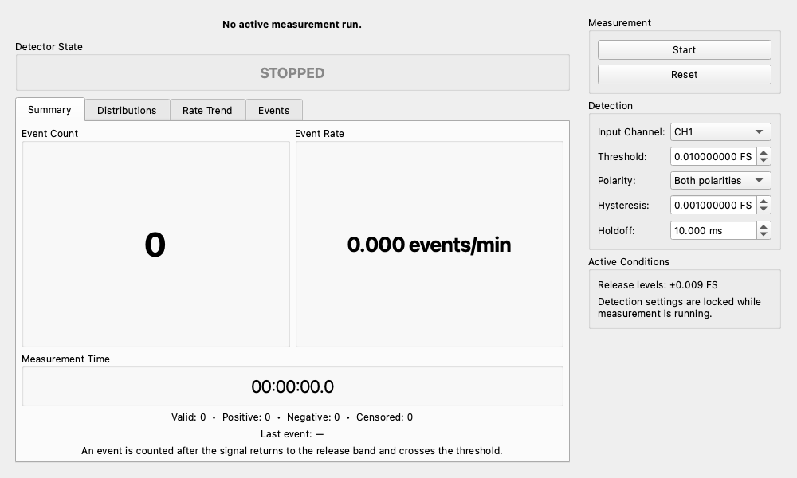

# Event Detector（異常イベント検出）



Event Detectorは、全入力サンプルを連続監視し、閾値イベントの回数、振幅、継続時間、間隔、発生レートを記録するウィジェットです。JFETやオペアンプのポップコーンノイズ、RTN（Random Telegraph Noise）、接点不良によるクリックなど、まれに発生する現象の定量化に使用します。

## 他の時間領域ウィジェットとの違い

| ウィジェット | 主な目的 |
| :--- | :--- |
| Oscilloscope | 短い波形の形状を詳細に観察する。 |
| Raw Time Series | 間引いた長時間波形を目視で観察する。 |
| Transient Analyzer | トリガ収録した単発波形をCWTなどで解析する。 |
| Event Detector | 全入力サンプルを監視し、まれな閾値イベントを記録・集計する。 |

Event Detectorは波形表示を持ちません。波形の形状を確認したい場合は、Raw Time SeriesまたはOscilloscopeを併用してください。

## 検出設定

### Input Channel

検出対象をCH1またはCH2から選択します。選択したチャンネルが入力データに存在しない場合は、別チャンネルへ暗黙に切り替えず、現在のRunを無効として表示します。

### Threshold

イベント開始を判定する閾値です。クリッピングレベルより小さい正のFS（Full Scale）ピーク値を指定します。

### Polarity

- `Positive`: 正方向の閾値交差だけを検出します。
- `Negative`: 負方向の閾値交差だけを検出します。
- `Both polarities`: 正負の両方を検出します。信号が解除帯域へ戻らず正負を反転した場合は、1つの両極性イベントとして扱います。

### Hysteresis

閾値付近の小さな揺れを複数イベントとして数えないための幅です。

正極性の場合、信号が`+Threshold`を横切るとイベントが開始し、`Threshold - Hysteresis`以下へ戻ると終了します。負極性では符号を反転した条件を使用します。両極性では信号の絶対値が解除レベル以下へ戻ると終了します。

HysteresisはThresholdより小さい値に設定してください。

### Holdoff

イベント終了後、次のイベント検出を禁止する時間です。リンギングや接点バウンスによる再カウントを抑制します。Holdoff終了後も信号が解除帯域へ戻るまでは再アームされません。

## Runとイベント記録

`Start`または測定中の`Reset`ごとに新しいRunが作成されます。Runには識別子、UTC開始・終了時刻、サンプルレート、入力チャンネル、デバイス、閾値、ヒステリシス、解除レベル、極性、Holdoff、校正状態と測定品質が保存されます。検出条件は測定中にロックされます。

イベントには次の情報がサンプル精度で保存されます。

- 開始・終了サンプルと時刻
- トリガ極性、最大絶対ピークの極性、符号付きピーク値
- 正側ピークと負側ピーク（観測された側のみ）
- 継続時間、開始間隔、前の有効イベントからの静穏時間
- 完了状態（有効、停止時打ち切り、データ欠落による打ち切り、設定変更による打ち切り）

測定開始時点ですでに閾値を超えている信号はカウントされません。最初に解除帯域へ戻った後の新しい交差から検出します。

## 表示タブ

### Summary

- `Event Count`: Run内で観測したイベント開始回数です。終了前に停止した打ち切りイベントも開始回数には含まれます。
- `Event Rate`: Event Countを実際の経過時間で正規化した1分あたりの発生回数です。
- `Measurement Time`: 受信済みサンプル数から計算した測定時間です。
- 有効イベント数、最大ピーク極性ごとの正・負イベント数、打ち切り数、最後のイベントを表示します。

Event Rateは次式で計算されます。

```text
Event Rate = Event Count × 60 / Measurement Time [seconds]
```

データ欠落、クリッピング、収録設定変更、記録上限超過を検出したRunでは、全体のEvent Rateを`INVALID`と表示します。

### Distributions

有効に完了したイベントだけを対象に、次の指標を選んで統計とヒストグラムを表示します。

- `Peak Amplitude`: 符号を除いた最大ピーク振幅。入力感度が校正済みならVpeak、未校正ならFS peakで表示します。
- `Duration`: 閾値交差から解除帯域へ戻るまでの時間。
- `Interarrival Time`: 連続性が確認できる前イベントとの開始時刻差。
- `Quiet Time`: 前の有効イベントの終了から現在イベントの開始までの時間。

統計はサンプル数、最小値、中央値、平均値、標本標準偏差、P95、P99、最大値です。データ欠落や設定変更をまたぐ間隔は計算しません。

### Rate Trend

1秒、10秒、1分、10分、1時間の固定時間ビンで発生レートの推移を表示します。現在進行中のビンは、経過済み時間で正規化して「未完了」と表示します。データ欠落を含むビンは無効として線を切り、欠落をまたいだ見かけのレートを表示しません。

### Events

直近500件のイベントを表形式で表示します。CSVまたはJSONでは、保持されている全イベントとRun条件をエクスポートできます。

- JSONは`measurelab.event_detector`スキーマ名とバージョンを含みます。
- CSVは先頭にRun条件をコメント行として記録し、その後にイベント表を記録します。
- ピークは常にFS値を保持し、校正済みの場合は表示単位へ換算した値も併記します。

## 基本的な測定手順

1. DUTを低雑音プリアンプなどを介してオーディオインターフェースへ接続します。
2. Raw Time SeriesまたはOscilloscopeで通常ノイズと異常イベントのレベルを確認します。
3. Event Detectorで入力チャンネル、Threshold、Polarity、Hysteresis、Holdoffを設定します。
4. `Start`を押し、状態が解除待ちから待機へ移ることを確認します。
5. 所定時間が経過したら`Stop`を押し、Summary、Distributions、Rate Trendを確認します。
6. 必要に応じてEventsタブからCSVまたはJSONを保存します。
7. DUTを交換し、同じゲイン、閾値、サンプルレート、測定時間で繰り返します。

## 測定品質と注意点

- イベントがオーディオブロックをまたいでも1回だけカウントされます。
- `CLIPPING`は入力がFSへ到達し、ピーク振幅が正しくない可能性を示します。
- `I/O BUFFER ERROR`は入力サンプルを失った可能性を示します。欠落時に進行中だったイベントは打ち切りとして保存されます。
- 収録中にサンプルレートまたはチャンネル構成が変わったRunは無効です。新しい条件で測定を再開してください。
- イベント記録は直近10,000件を保持します。古い記録が破棄された場合は、統計とエクスポートが不完全であることを警告します。
- DCや非常に低い周波数を測定できるかどうかは、オーディオインターフェースの入力結合方式に依存します。

## 現在の制限

自動Pass/Fail判定はまだ実装されていません。判定条件、最小測定時間、最小イベント数、無効Runの扱いを定義した後の拡張対象です。
