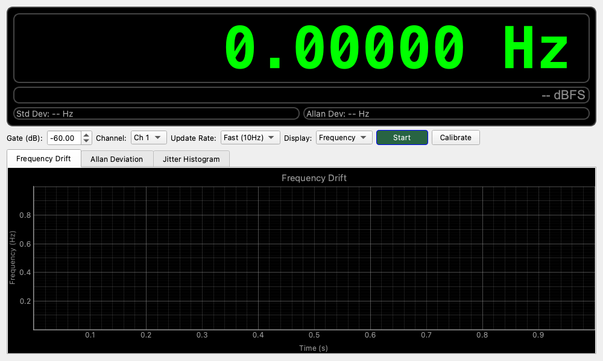

# Frequency Counter (周波数カウンター)

## 概要

入力信号の周波数を高精度に測定・表示するツールです。
単に「今の周波数」を表示するだけでなく、周波数のふらつき（ジッター）や、時間経過による変動（ドリフト）を詳細に解析できます。
水晶発振器の安定度測定や、楽器のチューニング、回転数の計測などに利用できます。

## 操作方法

### 測定の開始と停止

- **Start / Stop ボタン**: 測定の開始と停止を切り替えます。
    * 測定中はメインディスプレイの数値が更新され、グラフに履歴が記録されます。

### メインディスプレイの見方

画面上部に大きく表示されている数字が測定結果です。視認性の高いLED風のデザインになっています。
- **緑色の数字**: 現在の周波数 (または周期) です。
- **右下のdB表示**: 現在の信号レベル (dBFS) です。信号が小さすぎる（Gate設定以下）場合は測定されません。

## 画面構成と機能

### 表示モード

用途に合わせて、数字の表示形式を切り替えられます。
- **Frequency**: 周波数 (Hz) で表示します。通常はこちらを使います。
- **Period**: 周期 (s, ms, µs, ns) で表示します。1回の波にかかる時間を知りたい場合に使います。

### 統計情報

ディスプレイの下に、測定の安定性を示す指標がリアルタイムで表示されます。
- **Std Dev**: 標準偏差。周波数のばらつき具合を示します。値が小さいほど安定しています。
- **Allan Dev**: アラン偏差。オシレーターの評価などに使われる、短期的な安定度を示す指標です。

### グラフによる分析 (タブ切り替え)

画面下部のタブを切り替えることで、異なる視点からデータを分析できます。

1.  **Frequency Drift (周波数変動)**
    * 横軸を時間として、周波数がどう変化したかを記録します。
    * 機器のウォームアップによる周波数ドリフト（熱による変化）などを観察するのに最適です。

2.  **Allan Deviation (アラン偏差)**
    * 高度な安定度解析用です。
    * 「1秒間でのふらつき」「10秒間でのふらつき」など、積算時間（Tau）を変えたときの安定度を両対数グラフで表示します。
    * 右下がりのグラフになっていれば、時間をかけて平均化するほど精度が上がることを意味します。

3.  **Jitter Histogram (ヒストグラム)**
    * 周波数のばらつきを度数分布（ヒストグラム）で表示します。
    * 測定値が平均値を中心にどのように分布しているか（正規分布しているか、特定の周波数に偏っていないか）を確認できます。
    * **Baseline設定**: 分布の中心を「平均値(Mean)」にするか、任意の「基準値(Reference)」にするか選べます。
    * **X-axis設定**: 横軸の単位を「Hz/s (Native)」にするか、偏差率「ppm」にするか選べます。

## 設定項目

* **Gate (dB)**
    * 測定を行う信号レベルの「しきい値」を設定します。
    * 入力信号がない時やノイズだけの時に、デタラメな数値が表示されるのを防ぎます（例: -60dB）。

* **Channel**
    * 測定する音声チャンネル (Ch 1 / Ch 2) を選択します。

* **Update Rate**
    * 測定と表示の更新頻度を設定します。
    * **Fast (10Hz)**: 素早く反応します。回路の調整時などに便利です。
    * **Slow (2Hz)**: ゆっくり更新します。バッファを多く使うため、より安定した高精度な測定が可能です。

* **Calibrate (校正)**
    * リファレンス信号（基準となる正確な信号）を使って、測定値を補正する機能です。
    * PCのオーディオインターフェースのクロックには誤差があるため、厳密な測定が必要な場合は、既知の周波数（例: 10MHzのルビジウム発振器やGPS標準など）を入力し、この機能で補正係数を設定します。

## 使用例

### 発振回路の安定度確認

自作したアナログシンセサイザーや発振回路が、温度変化でどれくらい周波数がズレるか（ドリフト）を確認します。
1.  信号を入力し、**Start** を押します。
2.  **Frequency Drift** タブを開きます。
3.  数分〜数十分放置して、グラフの動きを見ます。
4.  電源投入直後に周波数が大きく動き、やがて安定していく様子（ウォームアップ特性）が観察できます。

### 精密な周波数合わせ

1.  **Update Rate** を **Fast** に設定します。
2.  **Jitter Histogram** タブを見ます。
3.  ヒストグラムの山が鋭くなるように（ばらつきを減らす）、また山が目標の中心に来るように回路を調整します。
4.  単位を **ppm** に切り替えると、許容誤差（例: ±20ppm以内）に入っているかどうかの判定がしやすくなります。
