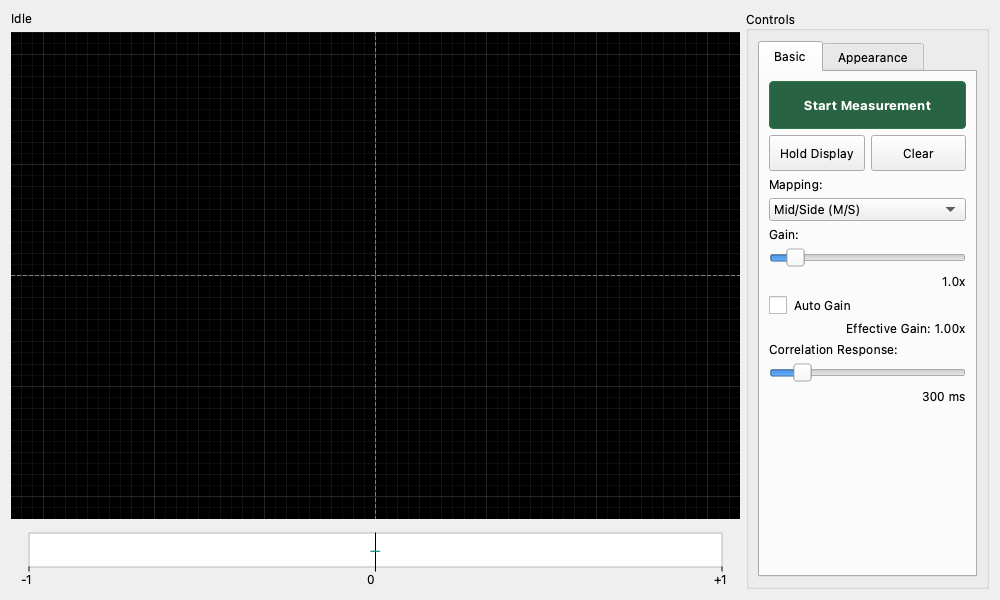

# Goniometer

## Overview

This is a tool for visualizing the "spread" and "phase" of stereo audio.
It plots the relationship between the left and right channels (L/R) as a Lissajous figure, and is used to check the localization of the sound image, stereo width, and mono compatibility.
It is an essential tool for discovering phase cancellation problems in mixdown and mastering.

## How to Read the Screen

### Main Display (Lissajous Waveform)

The shape of the waveform spreading from the center represents the stereo image of the sound.

* **Vertically stretching line**: Represents mono components (L and R are the same). If it is a completely vertical straight line, it is a mono sound source.
* **Horizontally spreading line**: Represents out-of-phase components (L and R are opposite). If this is strong, there is a risk that the sound will disappear (phase cancellation) during mono playback.
* **Circular/soft spreading**: Represents a rich stereo feel.
* **45-degree (upper right) line**: Only the right channel is sounding.
* **135-degree (upper left) line**: Only the left channel is sounding.

### Correlation Meter

The bar at the bottom of the screen represents the correlation coefficient (-1 to +1) of the left and right channels.

* **+1 (right end, green)**: Complete correlation (mono). The phases match.
* **0 (center)**: No correlation. Left and right are completely independent, or there is a 90-degree phase difference. General stereo music moves back and forth between 0 and +1.
* **-1 (left end, red)**: Inverse correlation. Left and right waveforms are inverted. If this state continues for a long time, suspect a cable connection error or phase trouble due to excessive effects.

## Operation and Settings

### Basic Operation

* **Start / Stop**: Switches between starting and stopping the analysis.

### Display Controls

* **Display Mode**: You can choose the waveform drawing method.
  * **Line**: Draws with a simple line. CPU load is low, making it suitable for seeing instantaneous movements.
  * **Phosphor**: Simulates the afterimage (phosphorescence) of an analog oscilloscope. Since the "density" and "frequency" of the sound are expressed in color, it is easier to grasp the overall trend.
* **Color Palette**: You can change the graph color (Green / Fire / Ice / Rainbow).
* **Persistence**: Adjusts the length of the afterimage. When lengthened, past sounds remain on the screen, making it easier to see the average distribution of the sound image.
* **Glow**: Blurs the lines and makes them glow, improving visibility.
* **Smooth Lines**: Interpolates the jaggedness of the lines to make them smooth.

### Signal Controls

* **Mapping**: Changes how the axes are taken.
  * **Mid/Side (M/S)**: Standard goniometer display. The vertical axis corresponds to Mid (mono component) and the horizontal axis to Side (stereo component).
  * **Left/Right (L/R)**: Display as an XY oscilloscope. The X-axis is left and the Y-axis is right (or vice versa).
* **Gain**: Adjusts the display size of the input signal.
  * **Auto Gain**: When checked, the size is automatically adjusted so that the waveform fits on the screen.
* **Invert X / Y**: Inverts the X-axis or Y-axis. Used to match the coordinate system with other measuring instruments when used as an oscilloscope in "L/R" mode.

## Usage Examples

### Finding Phase Trouble

If a phenomenon occurs in which the mixed sound source "has spread when listening with speakers, but the vocals disappear when listening on a smartphone or radio (mono)," the phase may be inverted.

1. Look at the **Correlation Meter**.
2. If the needle is always swinging toward the **-1 (red)** side, the phase is inverted.
3. Check if the "Phase Invert" button is pressed on any of the tracks, or if effects such as a stereo imager are over-applied.

### Checking Stereo Width

1. Set **Display Mode** to **Phosphor** and slightly increase **Persistence**.
2. Look at the spreading of the waveform.
    * **Thin vertical line**: Stereo feel is narrow (close to mono).
    * **Close to a perfect circle**: Ideal stereo feel.
    * **Horizontally squashed ellipse**: Stereo feel is too strong (there is a possibility of a hole in the middle).

### Checking Microphone Setting (XY method, etc.)

When recording with stereo microphones, you can check if the microphone angle and distance are appropriate.

1. Set **Mapping** to **L/R**.
2. Confirm that when the sound is heard from the right, it stretches in the X-axis (or Y-axis) direction, and when heard from the left, it stretches in the Y-axis (or X-axis) direction.
3. If the phase is correct, the center sound will be a 45-degree line (upper right). If it is a 135-degree line (upper left), there is a possibility that one of the microphone cables is out of phase.
