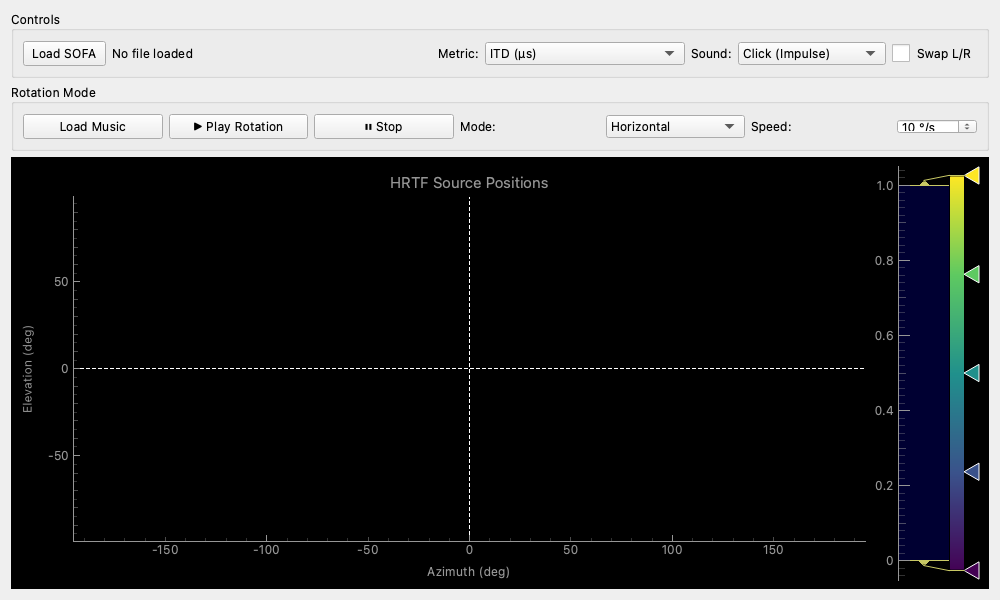

# HRTF Player

## Overview

A tool for visualizing data from **SOFA files** containing HRTF (Head-Related Transfer Function) and auditioning it by listening to actual sounds.
It is useful in spatial audio (3D audio) production and research for intuitively understanding HRTF data characteristics or testing if they match your own ears.

## Features and UI

### Main Plot (Heatmap)

The graph occupying most of the screen displays HRTF characteristics based on the sound source position (Azimuth and Elevation).

*   **X-axis (Azimuth)**: Horizontal angle. 0° is the front, -90° is left, 90° is right, and 180/-180° is directly behind.
*   **Y-axis (Elevation)**: Vertical angle. 0° is horizontal, 90° is directly above, and -90° is directly below.
*   **Color**: Represents the value of the selected metric (such as ITD or ILD).
*   **Click Interaction**: Clicking anywhere on the graph plays a test sound with the HRTF corresponding to that position (one-shot audition).

### Controls (Basic Operations)

*   **Load SOFA**: Load a SOFA file (`.sofa`, `.nc`) you want to analyze or audition.
*   **Metric**: Select the analytical data to display on the heatmap.
    *   **ITD (µs)**: Interaural Time Difference. Displays the time difference between sound reaching the left and right ears.
    *   **ILD (dB)**: Interaural Level Difference. Displays the difference in sound level between left and right ears due to head shadowing.
    *   **High-band Energy**: Strength of high-frequency components (8kHz to 16kHz). Provides clues for perceiving "above and below" sound positioning.
    *   **Envelope Peak**: Peak time of the delay. Similar to ITD, but looks at characteristics closer to group delay.
*   **Sound**: Choose the type of test sound used for click auditions.
    *   **Click**: A brief impulse sound. Useful for sharply confirming reflections and localization.
    *   **White Noise**: 50ms white noise. A "hissing" sound that makes it easy to check changes in frequency response.
    *   **Band Noise**: 8kHz–16kHz band noise. Specialized for confirming high-frequency localization (up/down).
*   **Swap L/R**: Swaps the left and right output channels.

### Rotation Mode (Continuous Playback / Rotation)

Allows loading a music file and simulating a sound source rotating around you.

*   **Load Music**: Load a music file (`.wav`, `.mp3`, etc.) for auditioning.
*   **Play Rotation / Stop**: Starts and stops rotation playback.
*   **Mode**: Select the rotation pattern.
    *   **Horizontal**: Rotates horizontally around you.
    *   **Vertical**: Rotates vertically (up and down).
    *   **Manual**: No automatic rotation. You can move the sound source position in real-time by dragging on the graph with your mouse.
*   **Speed**: Sets the speed of automatic rotation (degrees per second).

## Usage Examples

### Checking HRTF Data Characteristics

When you obtain a new SOFA file, use this to verify if the data was measured correctly.
1.  Set **Metric** to **ITD**.
2.  Observe the graph to see if the color changes smoothly from left (-90°) to right (90°).
3.  Switch to **High-band Energy**.
4.  If colors change in a striped pattern along the median plane (Azimuth 0°) as Elevation changes (spectral cues), it indicates that up/down localization information is included.

### Selecting an HRTF That Suits You

Use this when looking for a suitable HRTF from a general-purpose database rather than a personalized profile.
1.  Load music, set **Mode** to **Horizontal**, and play.
2.  Listen with your eyes closed and check if the sound feels like it's "rotating outside your head" rather than "playing inside your head."
3.  Switch to **Vertical** and confirm if the sound clearly moves up and down.
4.  If an HRTF doesn't suit your ears, vertical movement may only sound like a change in tone, or the sound might localize inside your head.
